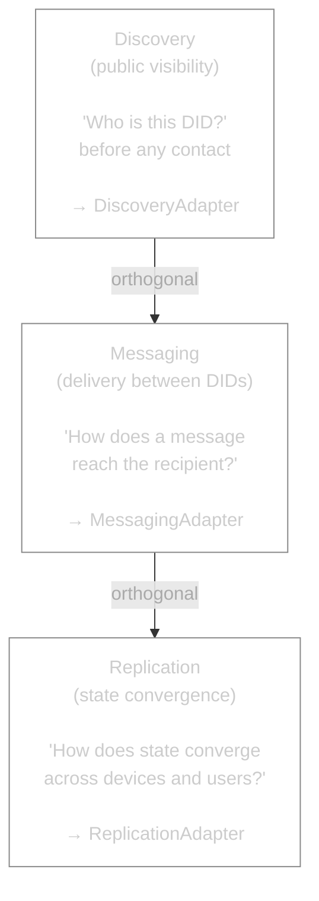
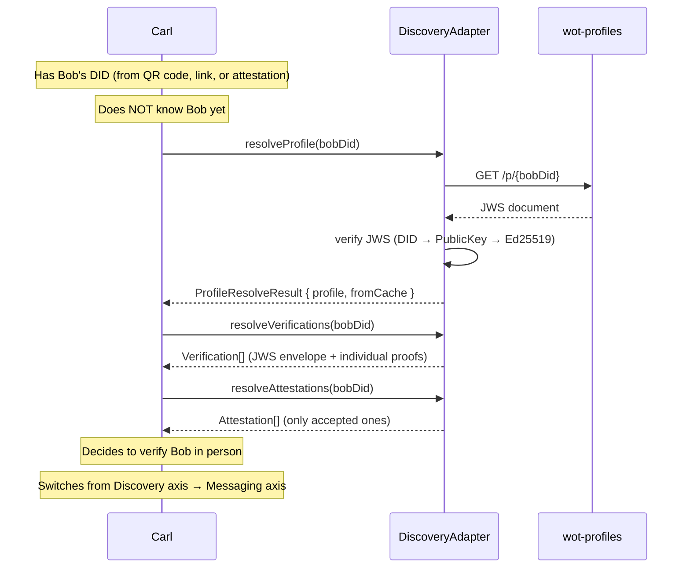
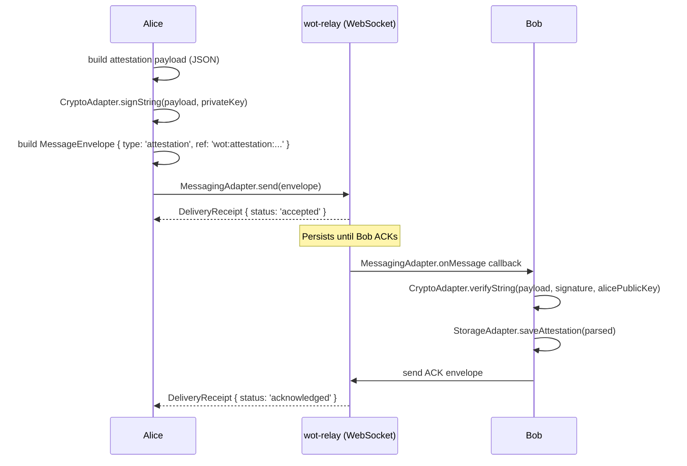
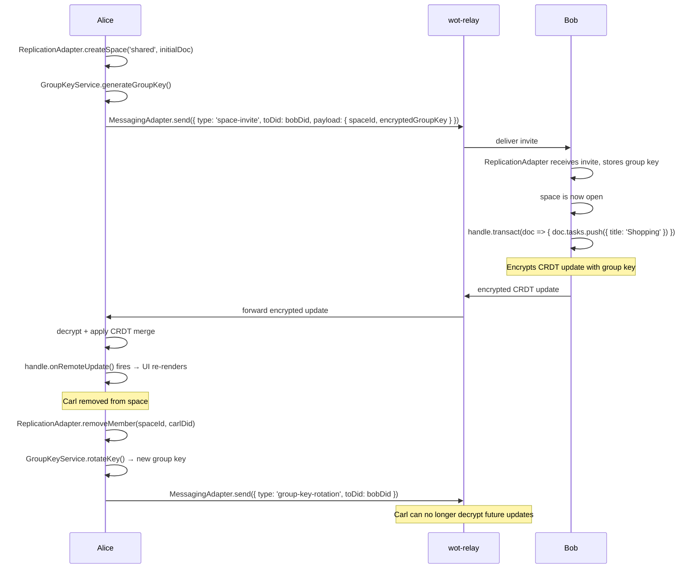

# 7-Adapter Architecture

> Formal specification for the Web of Trust adapter interfaces
>
> Created: 2026-02-08 | Updated: 2026-03-16
> Based on [Framework Evaluation v2](../protocols/framework-evaluation.md)
> Implementation status: [CURRENT_IMPLEMENTATION.md](../CURRENT_IMPLEMENTATION.md)

## Motivation

The v1 architecture had 3 adapters (StorageAdapter, ReactiveStorageAdapter, CryptoAdapter).
These covered local persistence and cryptography, but not:

- **Cross-user messaging** — delivering attestations, verifications, and items between DIDs
- **CRDT replication** — shared spaces (kanban, calendar) with multiple users
- **Capability-based authorization** — who can read, write, or delegate what?
- **Public discovery** — how do I find information about a DID before I know them?

### Core Insight: Three Orthogonal Axes



| Axis | When | Visibility | Security |
| --- | --- | --- | --- |
| **Discovery** | Before contact | Public, anonymous | Signed (JWS), not encrypted |
| **Messaging** | Between known DIDs | Private (1:1) | E2EE (X25519) |
| **Replication** | Within a group | Group members | Group key E2EE (AES-256-GCM) |

---

## Overview: 7 Adapters

```
┌──────────────────────────────────────────────────────────────────────────┐
│                         WoT Domain Layer                                  │
│  Identity, Contact, Verification, Attestation, Item, Space                │
├──────────────────────────────────────────────────────────────────────────┤
│                                                                          │
│  Local:                                                                  │
│  ┌───────────────────┐  ┌───────────────────┐  ┌────────────────────┐   │
│  │  StorageAdapter    │  │  CryptoAdapter    │  │  ReactiveStorage-  │   │
│  │  (local           │  │  (signing,        │  │  Adapter           │   │
│  │   persistence)    │  │   encryption,     │  │  (live queries,    │   │
│  │                   │  │   DID, mnemonic)  │  │   subscribable)    │   │
│  └───────────────────┘  └───────────────────┘  └────────────────────┘   │
│                                                                          │
│  Network:                                                                │
│  ┌───────────────────┐  ┌───────────────────┐  ┌────────────────────┐   │
│  │  DiscoveryAdapter  │  │  MessagingAdapter  │  │  Replication-      │   │
│  │  (public profile  │  │  (cross-user       │  │  Adapter           │   │
│  │   lookup)         │  │   delivery)        │  │  (CRDT sync +      │   │
│  │                   │  │                    │  │   spaces)          │   │
│  └───────────────────┘  └───────────────────┘  └────────────────────┘   │
│                                                                          │
│  Cross-cutting:                                                          │
│  ┌────────────────────────────────────────────────────────────────┐      │
│  │  AuthorizationAdapter (UCAN-inspired capabilities)              │      │
│  └────────────────────────────────────────────────────────────────┘      │
│                                                                          │
└──────────────────────────────────────────────────────────────────────────┘

Relationship lifecycle in the Web of Trust:

  Discovery          →       Messaging         →       Replication
  "Who are you?"             "Let us verify"            "Let us collaborate"
  (public,                   (1:1, post-contact)        (group, CRDT)
   pre-contact)
```

---

## Phase Status

| Phase | Description | Status |
| --- | --- | --- |
| **Phase 1** | Identity + Verification: StorageAdapter, CryptoAdapter, MessagingAdapter, DiscoveryAdapter | ✅ Done |
| **Phase 2** | Attestation Delivery + Encryption: Item-keys, symmetric crypto, AuthorizationAdapter | ✅ Done |
| **Phase 3** | Replication / Spaces: YjsReplicationAdapter + AutomergeReplicationAdapter | ✅ Done |
| **Phase 4** | Federation / Matrix: MessagingAdapter → Matrix, distributed discovery | ⏸ Deferred |

---

## 1. StorageAdapter

Local persistence for all WoT entities. Follows the recipient principle: verifications and
attestations are stored at the recipient, not the sender.

**File:** `packages/wot-core/src/adapters/interfaces/StorageAdapter.ts`

**Implementations:**

- `YjsStorageAdapter` (Demo App) — backed by `YjsPersonalDocManager`, default
- `AutomergeStorageAdapter` (Demo App) — backed by `PersonalDocManager`, option via `VITE_CRDT=automerge`

**Status:** Done

```typescript
interface StorageAdapter {
  // Identity (local, never synced)
  createIdentity(did: string, profile: Profile): Promise<Identity>
  getIdentity(): Promise<Identity | null>
  updateIdentity(identity: Identity): Promise<void>

  // Contacts (derived from verifications)
  addContact(contact: Contact): Promise<void>
  getContacts(): Promise<Contact[]>
  getContact(did: string): Promise<Contact | null>
  updateContact(contact: Contact): Promise<void>
  removeContact(did: string): Promise<void>

  // Verifications
  // Both incoming (to=me) and outgoing (from=me) are stored locally.
  // Recipient principle: the signed verification is sent to the recipient.
  saveVerification(verification: Verification): Promise<void>
  getReceivedVerifications(): Promise<Verification[]>    // to=me (others verified me)
  getAllVerifications(): Promise<Verification[]>          // from=me OR to=me
  getVerification(id: string): Promise<Verification | null>

  // Attestations (recipient principle: I receive attestations about me)
  saveAttestation(attestation: Attestation): Promise<void>
  getReceivedAttestations(): Promise<Attestation[]>
  getAttestation(id: string): Promise<Attestation | null>

  // Attestation Metadata (local, not signed, not synced)
  getAttestationMetadata(attestationId: string): Promise<AttestationMetadata | null>
  setAttestationAccepted(attestationId: string, accepted: boolean): Promise<void>

  // Lifecycle
  init(): Promise<void>
  clear(): Promise<void>
}
```

---

## 2. ReactiveStorageAdapter

Reactive extension for storage backends with live query support. Maps to React's
`useSyncExternalStore` pattern via the `Subscribable<T>` primitive.

A single adapter class can implement both `StorageAdapter` and `ReactiveStorageAdapter`.

**File:** `packages/wot-core/src/adapters/interfaces/ReactiveStorageAdapter.ts`

**Implementations:** Same as `StorageAdapter` (`YjsStorageAdapter`, `AutomergeStorageAdapter`)

**Status:** Done

```typescript
interface Subscribable<T> {
  subscribe(callback: (value: T) => void): () => void  // returns unsubscribe
  getValue(): T
}

interface ReactiveStorageAdapter {
  watchIdentity(): Subscribable<Identity | null>
  watchContacts(): Subscribable<Contact[]>
  watchReceivedVerifications(): Subscribable<Verification[]>  // to=me
  watchAllVerifications(): Subscribable<Verification[]>       // from=me OR to=me
  watchAllAttestations(): Subscribable<Attestation[]>         // from=me OR to=me
  watchReceivedAttestations(): Subscribable<Attestation[]>    // to=me
}
```

---

## 3. CryptoAdapter

All cryptographic operations. Framework-agnostic.

Note: Mnemonic generation/derivation and DID creation are handled by `WotIdentity` directly, not
the `CryptoAdapter`. The adapter focuses on key operations needed by services and other adapters.

**File:** `packages/wot-core/src/adapters/interfaces/CryptoAdapter.ts`

**Implementations:** `WebCryptoAdapter` (noble/ed25519 + Web Crypto API)

**Status:** Done

```typescript
interface EncryptedPayload {
  ciphertext: Uint8Array
  nonce: Uint8Array
  ephemeralPublicKey?: Uint8Array
}

interface CryptoAdapter {
  // Key Management
  generateKeyPair(): Promise<KeyPair>
  exportKeyPair(keyPair: KeyPair): Promise<{ publicKey: string; privateKey: string }>
  importKeyPair(exported: { publicKey: string; privateKey: string }): Promise<KeyPair>
  exportPublicKey(publicKey: CryptoKey): Promise<string>
  importPublicKey(exported: string): Promise<CryptoKey>

  // DID (did:key with Ed25519)
  createDid(publicKey: CryptoKey): Promise<string>
  didToPublicKey(did: string): Promise<CryptoKey>

  // Signing (Ed25519)
  sign(data: Uint8Array, privateKey: CryptoKey): Promise<Uint8Array>
  verify(data: Uint8Array, signature: Uint8Array, publicKey: CryptoKey): Promise<boolean>
  signString(data: string, privateKey: CryptoKey): Promise<string>
  verifyString(data: string, signature: string, publicKey: CryptoKey): Promise<boolean>

  // Symmetric Encryption (AES-256-GCM — for group spaces and item keys)
  generateSymmetricKey(): Promise<Uint8Array>   // 32 bytes
  encryptSymmetric(plaintext: Uint8Array, key: Uint8Array): Promise<{ ciphertext: Uint8Array; nonce: Uint8Array }>
  decryptSymmetric(ciphertext: Uint8Array, nonce: Uint8Array, key: Uint8Array): Promise<Uint8Array>

  // Utilities
  generateNonce(): string
  hashData(data: Uint8Array): Promise<Uint8Array>
}
```

> The asymmetric `encrypt`/`decrypt` (X25519 ECIES) used for 1:1 item-key delivery lives in
> `WotIdentity` and `WebCryptoAdapter` directly. The symmetric operations above are used for
> group spaces and selective item sharing.

---

## ResourceRef: Standardized Pointer Format

Messages contain no state — only pointers (triggers). Capabilities address resources. Both need
a consistent URI format.

**File:** `packages/wot-core/src/types/resource-ref.ts`

```typescript
// ResourceRef is a branded URI string with the "wot:" scheme
type ResourceRef = string & { readonly __brand: 'ResourceRef' }

// Format: wot:<type>:<id>[/<sub-path>]
//
// Examples:
//   wot:attestation:abc-123
//   wot:verification:def-456
//   wot:space:wg-calendar
//   wot:space:wg-calendar/item/event-789
//   wot:contact:did:key:z6Mk...
//
// Rules:
// - Always "wot:" prefix
// - <type> is a known entity type
// - <id> is the entity ID or space ID
// - Sub-paths for items within spaces
// - Capabilities can use wildcards: wot:space:abc/*

type ResourceType =
  | 'attestation'
  | 'verification'
  | 'contact'
  | 'space'
  | 'item'

// Helpers (implemented in wot-core)
function createResourceRef(type: ResourceType, id: string, subPath?: string): ResourceRef
function parseResourceRef(ref: ResourceRef): { type: ResourceType; id: string; subPath?: string }
```

---

## 4. MessagingAdapter

Cross-user delivery between DIDs. Responsible for:

- Attestation/verification delivery (recipient principle)
- Item-key delivery (selective visibility)
- Contact requests
- Space invitations and group key rotation
- Arbitrary DID-to-DID messages

**Design principles:**

- Addressing via DIDs (not server IDs, not pubkeys)
- Messages as signed envelopes (signature separate from payload)
- Multi-stage delivery receipts: `accepted → delivered → acknowledged`
- Offline queue: messages wait for the recipient
- Transport resolution separated from messaging concerns

**File:** `packages/wot-core/src/adapters/interfaces/MessagingAdapter.ts`

**Implementations:**

- `WebSocketMessagingAdapter` — WebSocket client, heartbeat (ping/pong), message buffer for early messages
- `OutboxMessagingAdapter` — Decorator, queues messages until relay is reachable
- `InMemoryMessagingAdapter` — Shared bus for tests

**Status:** Done

```typescript
// Message types used by WoT
type MessageType =
  | 'verification'         // "I verify you" (QR code exchange)
  | 'attestation'          // "I attest X about you" (recipient principle)
  | 'contact-request'      // "I want to add you as a contact"
  | 'item-key'             // "Here is the key for item X" (selective sharing)
  | 'space-invite'         // "Join this space" (with group key)
  | 'group-key-rotation'   // "New group key for space X"
  | 'ack'                  // "Message processed" (application-level)
  | 'content'              // Generic payload

// Standardized envelope format for all messages.
// Signature is separate from payload → independently verifiable.
interface MessageEnvelope {
  v: 1                     // Protocol version
  id: string               // UUID
  type: MessageType
  fromDid: string
  toDid: string
  createdAt: string        // ISO 8601
  encoding: 'json' | 'cbor' | 'base64'
  payload: string          // Encoded payload (per encoding)
  signature: string        // Ed25519 signature over canonical fields
  ref?: ResourceRef        // Optional pointer to the resource
}

// Multi-stage delivery receipts:
// - accepted:     Relay has queued the message
// - delivered:    Recipient device received it
// - acknowledged: Recipient app processed it (e.g. attestation saved)
interface DeliveryReceipt {
  messageId: string
  status: 'accepted' | 'delivered' | 'acknowledged' | 'failed'
  timestamp: string
  reason?: string          // On 'failed': error reason
}

type MessagingState = 'disconnected' | 'connecting' | 'connected' | 'error'

interface MessagingAdapter {
  // Connection lifecycle
  connect(myDid: string): Promise<void>
  disconnect(): Promise<void>
  getState(): MessagingState

  // Sending — takes an envelope, returns receipt
  send(envelope: MessageEnvelope): Promise<DeliveryReceipt>

  // Receiving — callback may be async (ACK is deferred until callback resolves)
  onMessage(callback: (envelope: MessageEnvelope) => void | Promise<void>): () => void

  // Receipt updates (async: delivered/acknowledged come later)
  onReceipt(callback: (receipt: DeliveryReceipt) => void): () => void

  // Transport resolution (how to find the recipient?)
  // Separate from DID concept: this is about transport addresses,
  // not DID resolution. In Matrix migration this becomes Room IDs.
  registerTransport(did: string, transportAddress: string): Promise<void>
  resolveTransport(did: string): Promise<string | null>
}
```

### Current Implementation: Custom WebSocket Relay

```
Client A ──WebSocket──→ Relay Server ←──WebSocket── Client B
                           │
                           ├── DID → WebSocket mapping
                           ├── Offline queue (messages wait)
                           ├── Delivery ACK (persisted until client ACK)
                           └── No payload access (E2EE)

Relay is:
- Blind (payload is E2E encrypted)
- Self-hostable (Node.js + SQLite)
- Live: wss://relay.utopia-lab.org
```

### Target Implementation: Matrix (Phase 4, Deferred)

```
Client A ──HTTPS──→ Homeserver A ←──Federation──→ Homeserver B ←── Client B
                        │                              │
                        └──── DID-mapped rooms ────────┘

Advantages over custom WS:
- Megolm for group E2EE (audited)
- Federation (no single point of failure)
- Bridges to Signal, Slack, etc.
- Key verification (emoji / QR cross-signing)
```

---

## 5. ReplicationAdapter

CRDT sync for multi-device and multi-user spaces.

**Scope:**

- Personal space: sync own data across devices
- Shared spaces: collaborative data (kanban, calendar, map) in groups

**Design principles:**

- Spaces as containers for collaborative data
- `SpaceHandle<T>` as the access API (abstracts the CRDT engine)
- Membership management (who is in which space?)
- State converges automatically (CRDTs)
- Independent of messaging (orthogonal axis)
- Events when remote state arrives (UI knows when to re-render)

**Boundary with StorageAdapter:**

- `StorageAdapter` = local persistence (contacts, verifications, attestations, identity)
- `ReplicationAdapter` = CRDT state + sync (space data: kanban tasks, events, etc.)

**File:** `packages/wot-core/src/adapters/interfaces/ReplicationAdapter.ts`

**Implementations:**

- `YjsReplicationAdapter` — Yjs + `EncryptedSyncService` + `GroupKeyService`, **default**
- `AutomergeReplicationAdapter` — Automerge + `EncryptedSyncService` + `GroupKeyService`, option

**Status:** Done (both adapters)

```typescript
type ReplicationState = 'idle' | 'syncing' | 'error'

interface TransactOptions {
  /** Use debounced vault push instead of immediate. For streaming input (e.g. text editing). */
  stream?: boolean
}

// SpaceHandle abstracts access to the CRDT state of a space.
// Typed via generic T — the concrete doc schema.
interface SpaceHandle<T = unknown> {
  readonly id: string
  info(): SpaceInfo

  /** Get the current document state (read-only snapshot). */
  getDoc(): T

  /** Apply a transactional change. Encrypts + broadcasts to members. */
  transact(fn: (doc: T) => void, options?: TransactOptions): void

  /** Fires when remote changes arrive and are applied. */
  onRemoteUpdate(callback: () => void): () => void

  /** Close this handle (unsubscribe from updates). */
  close(): void
}

interface SpaceInfo {
  id: string
  type: 'personal' | 'shared'
  members: string[]          // Member DIDs
  createdAt: string
  name?: string
  description?: string
}

interface SpaceMemberChange {
  spaceId: string
  did: string
  action: 'added' | 'removed'
}

interface ReplicationAdapter {
  // Lifecycle
  start(): Promise<void>
  stop(): Promise<void>
  getState(): ReplicationState

  // Space Management
  createSpace<T>(type: 'personal' | 'shared', initialDoc: T, meta?: { name?: string; description?: string }): Promise<SpaceInfo>
  getSpaces(): Promise<SpaceInfo[]>
  getSpace(spaceId: string): Promise<SpaceInfo | null>
  watchSpaces(): Subscribable<SpaceInfo[]>

  // Space Access — opens a typed handle for reading/writing
  openSpace<T>(spaceId: string): Promise<SpaceHandle<T>>

  // Membership
  addMember(spaceId: string, memberDid: string, memberEncryptionPublicKey: Uint8Array): Promise<void>
  removeMember(spaceId: string, memberDid: string): Promise<void>
  onMemberChange(callback: (change: SpaceMemberChange) => void): () => void

  // Sync
  requestSync(spaceId: string): Promise<void>

  // Key info (for testing/debugging)
  getKeyGeneration(spaceId: string): number
}
```

**Encryption model:** Encrypt-then-sync. CRDT updates are encrypted with the space's group key
*before* being sent to the relay. The relay only ever sees ciphertext. Inspired by
Keyhive/NextGraph.

**CRDT choice:**

| CRDT | Language | Bundle | Mobile init (163KB) | Status |
| --- | --- | --- | --- | --- |
| **Yjs** | Pure JS | 69KB | ~85ms | Default |
| Automerge | Rust→WASM | 1.7MB | ~6.4s | Option (`VITE_CRDT=automerge`) |

---

## 6. AuthorizationAdapter

UCAN-inspired capability system. Responsible for:

- Who can do what in which space?
- Delegatable, attenuatable permissions
- Read/Write/Delete/Delegate granularity

**Design principles:**

- Capabilities are signed tokens (JWS, like UCANs)
- Every delegation can only restrict, never expand (attenuation)
- Proof chains: Alice → Bob → Carl (verifiable)
- Offline-verifiable (no central authority)
- Inspired by Willow/Meadowcap and UCAN
- Resources addressed via `ResourceRef`
- Expiration is mandatory (no eternal tokens)
- `SignFn` pattern: the private key stays encapsulated in `WotIdentity`

**Files:**

- Interface: `packages/wot-core/src/adapters/interfaces/AuthorizationAdapter.ts`
- Primitives: `packages/wot-core/src/crypto/capabilities.ts`

**Implementations:**

- `InMemoryAuthorizationAdapter` — for tests and POC

**Status:** Done

```typescript
// From crypto/capabilities.ts — the protocol layer
type Permission = 'read' | 'write' | 'delete' | 'delegate'

interface Capability {
  id: string
  issuer: string          // DID of the granter
  audience: string        // DID of the recipient
  resource: ResourceRef   // wot:<type>:<id>[/<sub-path>]
  permissions: Permission[]
  expiration: string      // ISO 8601 — mandatory
  proof?: string          // JWS of the parent capability (for delegation chains)
}

type CapabilityJws = string  // Capability encoded as JWS (signed by issuer)

type CapabilityVerificationResult =
  | { valid: true; capability: Capability; chain: Capability[] }
  | { valid: false; error: string }

// SignFn — provided by WotIdentity.signJws.bind(identity)
// Private key never leaves WotIdentity.
type SignFn = (payload: unknown) => Promise<string>

// AuthorizationAdapter — stateful layer for capability management
// (storage, queries, revocation). Crypto primitives live in capabilities.ts.
interface AuthorizationAdapter {
  // Granting
  grant(
    resource: ResourceRef,
    toDid: string,
    permissions: Permission[],
    expiration: string,       // ISO 8601 — required
  ): Promise<CapabilityJws>

  // Delegation (attenuation: can only restrict)
  delegate(
    parentCapabilityJws: CapabilityJws,
    toDid: string,
    permissions: Permission[],  // Must be subset of parent
    expiration?: string,        // Must be <= parent expiration
  ): Promise<CapabilityJws>

  // Verification — signature, expiration, chain, and revocation
  verify(capabilityJws: CapabilityJws): Promise<CapabilityVerificationResult>

  // Access check — convenience method, searches stored capabilities
  canAccess(
    did: string,
    resource: ResourceRef,
    permission: Permission,
  ): Promise<boolean>

  // Revocation — only the issuer can revoke
  revoke(capabilityId: string): Promise<void>
  isRevoked(capabilityId: string): Promise<boolean>

  // Storage / Queries
  store(capabilityJws: CapabilityJws): Promise<void>
  getMyCapabilities(resource?: ResourceRef): Promise<CapabilityJws[]>
  getGrantedCapabilities(resource?: ResourceRef): Promise<CapabilityJws[]>
}
```

**Delegation example:**

```
1. Alice creates space "wg-calendar"
   → Alice automatically holds: { resource: "wot:space:wg-calendar", permissions: [read, write, delete, delegate] }

2. Alice grants Bob write access:
   grant("wot:space:wg-calendar", bob.did, [read, write], expiration)
   → Bob can read and write, but NOT delegate or delete

3. Bob tries to invite Carl:
   delegate(bobsCapability, carl.did, [read])
   → ERROR: Bob does not have the 'delegate' permission

4. Alice grants Bob the delegate permission:
   grant("wot:space:wg-calendar", bob.did, [read, write, delegate], expiration)

5. Bob delegates to Carl (attenuation):
   delegate(bobsCapability, carl.did, [read])
   → Carl can ONLY read (Bob cannot grant more than he has)

Proof chain: Alice → Bob → Carl
Every step is signed and offline-verifiable.
```

**Revocation strategy:**

```
Stages:
1. POC:     Expiration only (no active revoke needed)
2. Phase 2: Revocation list per space (in CRDT state)
3. Phase 3: Bloom filter for efficient checks across many spaces
4. Phase 4: CRL-like gossip via MessagingAdapter
```

---

## 7. DiscoveryAdapter

Public discovery — how do I find information about a DID?

This adapter solves a problem the other six do not address:
**All other adapters assume you already know the other party.**
The DiscoveryAdapter is the entry point — it answers the question
"Who is this DID?" *before* any contact exists.

**Why a dedicated adapter?**

Discovery is a fundamentally separate concern:

- It is not messaging (no recipient, no delivery)
- It is not CRDT/sync (no merge, no conflicts)
- It is not local storage (data is public)
- It has its own security properties (signed, not encrypted)

**Design principles:**

- Addressing via DIDs
- All data is Ed25519-signed (JWS) — integrity without confidentiality
- The owner controls what is public (recipient principle)
- Anonymously readable — no login required to fetch
- No authentication — the cryptographic signature IS the authorization
- Server is a dumb cache — truth lives locally

**File:** `packages/wot-core/src/adapters/interfaces/DiscoveryAdapter.ts`

**Implementations:**

- `HttpDiscoveryAdapter` — HTTP REST against wot-profiles server
- `OfflineFirstDiscoveryAdapter` — Cache wrapper with dirty flags + local fallback

**Status:** Done

```typescript
interface PublicVerificationsData {
  did: string
  verifications: Verification[]    // Each with its own proof (Ed25519)
  updatedAt: string
}

interface PublicAttestationsData {
  did: string
  attestations: Attestation[]      // Accepted only, each with its own proof
  updatedAt: string
}

interface ProfileSummary {
  did: string
  name: string | null
  verificationCount: number
  attestationCount: number
}

interface ProfileResolveResult {
  profile: PublicProfile | null
  fromCache: boolean
}

interface DiscoveryAdapter {
  // Publish own public data (signed as JWS)
  publishProfile(data: PublicProfile, identity: WotIdentity): Promise<void>
  publishVerifications(data: PublicVerificationsData, identity: WotIdentity): Promise<void>
  publishAttestations(data: PublicAttestationsData, identity: WotIdentity): Promise<void>

  // Resolve public data for a DID (verifies JWS signature)
  resolveProfile(did: string): Promise<ProfileResolveResult>
  resolveVerifications(did: string): Promise<Verification[]>
  resolveAttestations(did: string): Promise<Attestation[]>

  // Optional: batch summary for multiple DIDs (unsigned, server-derived counts)
  resolveSummaries?(dids: string[]): Promise<ProfileSummary[]>
}
```

**Dual verification:**

Each published document has two signature layers:

1. **JWS envelope:** "Bob published this list" — signed by the DID owner
2. **Individual proofs:** "Alice signed this attestation/verification" — signed by the creator

The client can verify both independently.

**Current implementation: `HttpDiscoveryAdapter` (wot-profiles)**

```
Client ──fetch()──→ wot-profiles (HTTP + SQLite)

PUT /p/{did}      Save profile JWS
GET /p/{did}      Fetch profile JWS
PUT /p/{did}/v    Save verifications JWS
GET /p/{did}/v    Fetch verifications JWS
PUT /p/{did}/a    Save attestations JWS
GET /p/{did}/a    Fetch attestations JWS
GET /p/batch      Batch profile summaries

Server checks:
1. JWS signature valid
2. DID in payload = DID in URL
→ No account system, no auth tokens
Live: https://profiles.utopia-lab.org
```

**Possible alternative implementations:**

| Implementation | Centralized | Decentralized | Offline | Complexity |
| --- | --- | --- | --- | --- |
| HTTP (current) | Yes | No | No | Low |
| Automerge Auto-Groups | No | Yes | Yes | Medium |
| IPFS/IPNS | No | Yes | Partial | High |
| Nostr (kind:0) | Relays | Partial | No | Medium |

---

## Adapter Interactions

### Flow: Fetch a Public Profile (Discovery)



### Flow: Publish Own Profile

```
1. StorageAdapter.getIdentity()           → local profile
2. StorageAdapter.getReceivedVerifications() → verifications about me
3. StorageAdapter.getReceivedAttestations()  → all attestations
   + StorageAdapter.getAttestationMetadata(id) → filter accepted only

4. DiscoveryAdapter.publishProfile(profileData, identity)
   → identity.signJws(profileData) → JWS
   → upload to wot-profiles

5. DiscoveryAdapter.publishVerifications(vData, identity)
   → verifications published as JWS

6. DiscoveryAdapter.publishAttestations(aData, identity)
   → accepted attestations published as JWS

Re-publish triggers:
- Profile changed (name, bio, avatar)
- New verification received (ReactiveStorageAdapter)
- Attestation accepted/rejected (manual)
```

### Flow: Attestation Delivery



### Flow: Selective Item Sharing

```
Alice shares a calendar event with Bob and Carl, but NOT with Dora.

1. CryptoAdapter.generateSymmetricKey()
   → AES-256-GCM item key (32 bytes)

2. CryptoAdapter.encryptSymmetric(eventData, itemKey)
   → { ciphertext, nonce }

3. StorageAdapter.saveItem(encryptedEvent)
   → stored locally

4. For each recipient (Bob, Carl):
   a. Encrypt item key asymmetrically for recipient
   b. MessagingAdapter.send({
        type: 'item-key',
        fromDid: aliceDid, toDid: recipientDid,
        payload: encryptedItemKey,
        ref: 'wot:item:<event-id>'
      })

5. [At Bob] MessagingAdapter.onMessage → receives item-key envelope
6. [At Bob] Decrypt item key with Bob's private key
7. [At Bob] CryptoAdapter.decryptSymmetric(ciphertext, nonce, itemKey)
   → plaintext calendar event

Dora has no item key → cannot decrypt the event.
```

### Flow: Shared Group Space



---

## Related Documents

- [CURRENT_IMPLEMENTATION.md](../CURRENT_IMPLEMENTATION.md) — implementation status, test counts, file structure
- [Framework Evaluation v2](../protocols/framework-evaluation.md) — why no single framework suffices
- [Encryption](../concepts/encryption.md) — item key model, E2EE details
- [Vault Sync Architecture](../concepts/vault-sync-architektur.md) — vault sync patterns
- [Entities](entities.md) — data model
- [Social Recovery](../concepts/social-recovery.md) — Shamir Secret Sharing
