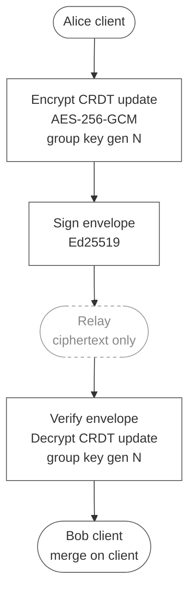
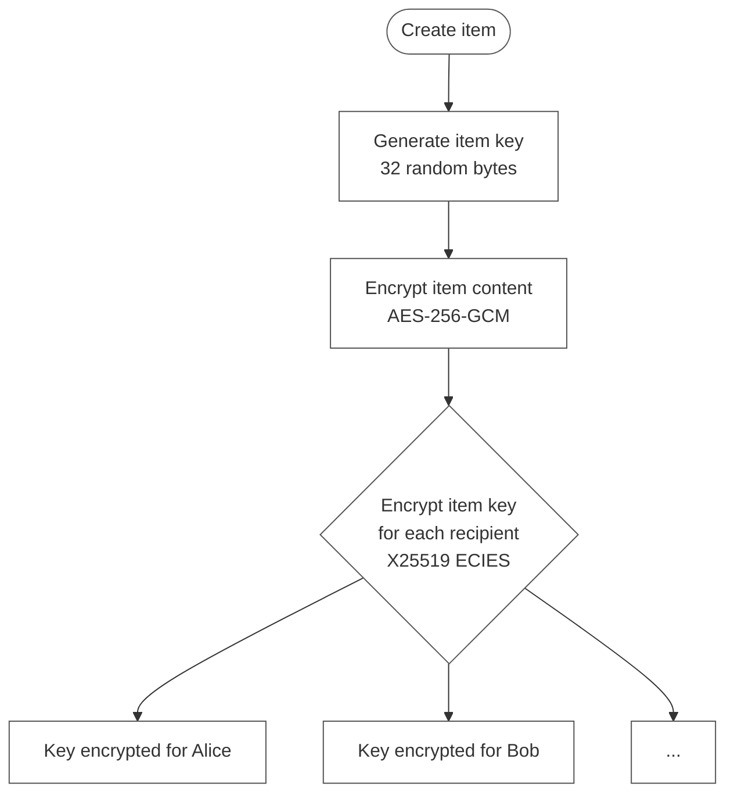
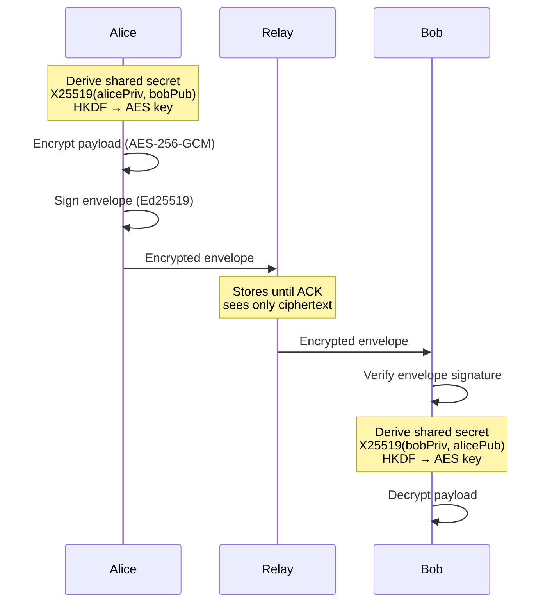
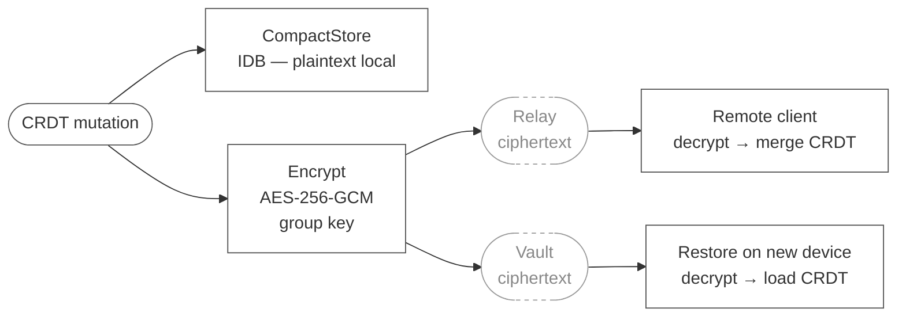
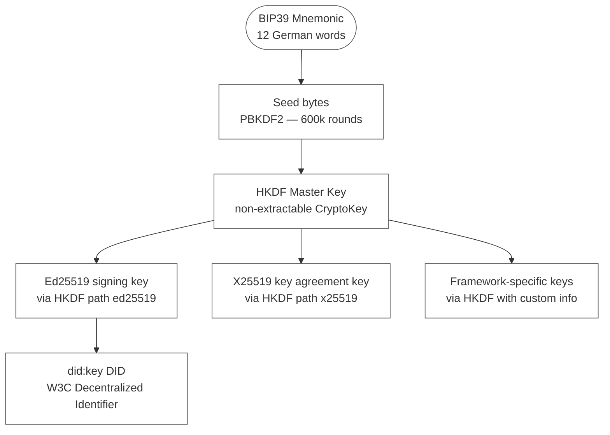
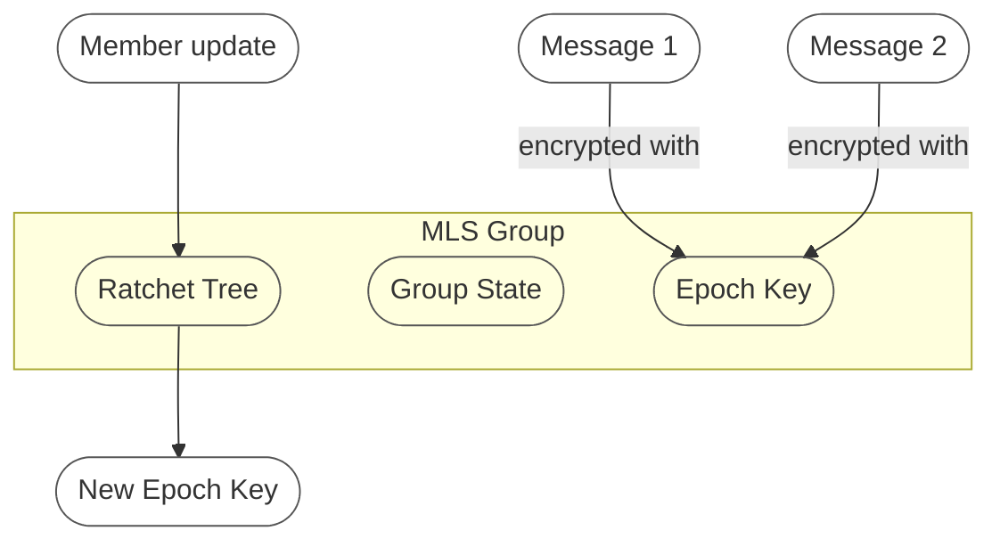
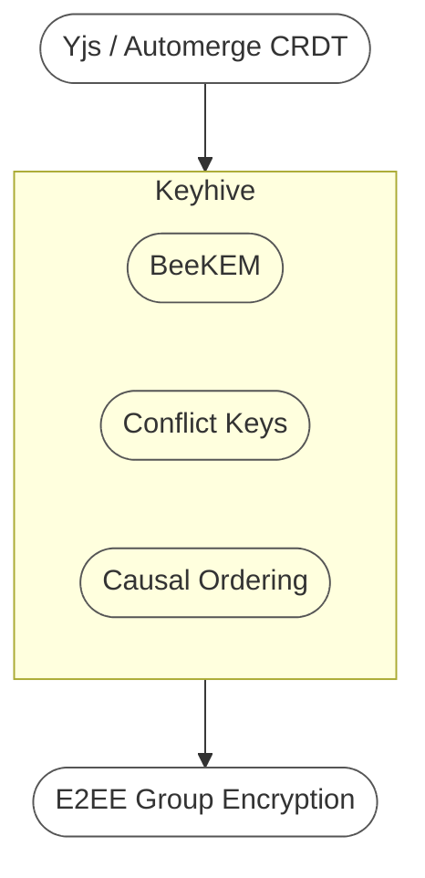

# Encryption

> End-to-End Encryption in the Web of Trust

The encryption system is fully implemented. All decisions documented here are final for the current
implementation phase. Research on future alternatives is preserved in the last section.

---

## Overview

Three sharing patterns exist in the system, each with its own encryption strategy:

| Pattern | Use Case | Encryption |
| --- | --- | --- |
| **Group Spaces** | Collaborative CRDT documents | AES-256-GCM per Space (GroupKeyService) |
| **Selective Sharing** | Item-level access control | Item Keys (planned, not yet user-facing) |
| **1:1 Delivery** | Attestations, verifications | X25519 ECIES (EncryptedSyncService) |

All patterns follow **encrypt-then-sync**: data is encrypted on the client before leaving the
device. The relay only ever sees ciphertext. Merge of CRDT updates happens on the client after
decryption. This design is inspired by Keyhive/NextGraph.

---

## Cryptographic Primitives

| Purpose | Algorithm | Implementation |
| --- | --- | --- |
| **Signing** | Ed25519 | `@noble/ed25519` (WebCrypto Ed25519 has browser compat issues) |
| **Key Agreement** | X25519 ECDH | `WebCrypto API` (`crypto.subtle`) |
| **Symmetric Encryption** | AES-256-GCM | `WebCrypto API` (`crypto.subtle`) |
| **Key Derivation** | HKDF-SHA256 | `WebCrypto API` (`crypto.subtle`) |
| **Seed Derivation** | PBKDF2 (600k iterations) | `WebCrypto API` — seed storage |
| **Hashing** | SHA-256 | `WebCrypto API` |

No libsodium. The browser runtime (`crypto.subtle`) handles all symmetric and asymmetric key
operations except Ed25519 signing, where `@noble/ed25519` is used due to inconsistent browser
support for `{ name: "Ed25519" }` in `SubtleCrypto.sign`.

---

## Pattern 1: Group Spaces — AES-256-GCM

### How it works

Every Space has a shared symmetric key (the *group key*). All members hold this key. CRDT updates
are encrypted with the key before being sent to the relay and decrypted on the receiving client.
Old keys are never deleted — they are retained by generation so that historical messages remain
decryptable after a rotation.



### GroupKeyService

`packages/wot-core/src/services/GroupKeyService.ts`

In-memory key store, CRDT-agnostic. Persistence is handled by the StorageAdapter (keys are stored
in the PersonalDoc under `groupKeys`).

```typescript
// One key per space, identified by (spaceId, generation)
createKey(spaceId): Promise<Uint8Array>       // 32 random bytes, generation 0
rotateKey(spaceId): Promise<Uint8Array>        // new generation, old keys retained
getCurrentKey(spaceId): Uint8Array | null
getKeyByGeneration(spaceId, generation): Uint8Array | null
importKey(spaceId, key, generation): void      // used when receiving an invite
```

Key rotation is triggered when a member is removed from a Space. The current generation number is
included in every `EncryptedChange` so the receiver knows which key to use.

### EncryptedSyncService

`packages/wot-core/src/services/EncryptedSyncService.ts`

Stateless encrypt/decrypt operations on raw CRDT change bytes. CRDT-agnostic — works with both
Yjs and Automerge update buffers.

```typescript
interface EncryptedChange {
  ciphertext: Uint8Array
  nonce:      Uint8Array   // 12 bytes, random per message
  spaceId:    string
  generation: number
  fromDid:    string
}

EncryptedSyncService.encryptChange(data, groupKey, spaceId, generation, fromDid)
EncryptedSyncService.decryptChange(change, groupKey)
```

Internally uses `crypto.subtle` (AES-GCM, 12-byte IV, standard 128-bit auth tag).

### Key Distribution

When a Space is created:

1. Creator generates a 32-byte random group key (generation 0)
2. Key is stored in the PersonalDoc (`groupKeys[spaceId:0]`)
3. On invite: key is encrypted with the invitee's X25519 public key (ECIES) and delivered via the
   relay as a `group-key-invite` message
4. Invitee decrypts, imports the key, and can then decrypt all Space updates

---

## Pattern 2: Selective Sharing — Item Keys (Planned)

This pattern is specified and partially designed but is not yet user-facing in the current demo.

### Per-item key encryption

Each item has its own symmetric encryption key (the *item key*). The item key is encrypted
separately for each recipient using X25519 ECIES and attached alongside the encrypted content.



### Trade-offs

| Advantage | Disadvantage |
| --- | --- |
| Simple and proven (PGP, age) | O(N) overhead per item |
| No server-side ordering | No forward secrecy |
| Offline-compatible | No post-compromise security |
| Fine-grained access control | At 100 recipients = 100 key encryptions |

This pattern covers the "Selective Sharing" axis in the three-pattern architecture. Implementation
is deferred — Group Spaces and 1:1 Delivery are complete first.

---

## Pattern 3: 1:1 Delivery — X25519 ECIES

Used for attestations, verifications, and any direct message between two DIDs.

### ECIES key exchange

The sender performs an X25519 Diffie-Hellman key exchange with the recipient's public key (derived
from their `did:key`), derives a symmetric key via HKDF, and encrypts with AES-256-GCM. No shared
state required — entirely offline-capable.



The relay persists messages until the recipient sends an explicit ACK (delivery ACK protocol).
On reconnect, unacknowledged messages are redelivered.

---

## Envelope Authentication

`packages/wot-core/src/crypto/envelope-auth.ts`

Every message sent through the relay is wrapped in an authenticated envelope. The Ed25519 signature
covers a canonical pipe-delimited string of all envelope fields:

```
{v}|{id}|{type}|{fromDid}|{toDid}|{createdAt}|{payload}
```

This prevents spoofing: only the holder of the private key corresponding to `fromDid` can produce a
valid signature. Verification extracts the Ed25519 public key directly from the `did:key` in
`fromDid` — no key lookup server needed.

```typescript
signEnvelope(envelope, signFn): Promise<MessageEnvelope>
verifyEnvelope(envelope): Promise<boolean>   // derives pubkey from fromDid
```

The `signFn` follows the `SignFn` pattern — it receives a string, returns a base64url-encoded
signature, and the private key never leaves `WotIdentity`.

---

## Profile Signing — JWS (Ed25519)

Profiles published to `wot-profiles` are signed as JSON Web Signatures (JWS). The Ed25519 private
key in `WotIdentity` signs the profile payload via `WotIdentity.signJws()`. Any verifier can check
the signature using the public key extracted from the author's `did:key` DID — no PKI, no
certificate authority.

```typescript
// WotIdentity
signJws(payload: object): Promise<string>     // compact JWS serialization

// ProfileService
signProfile(profile, identity): Promise<SignedProfile>
verifyProfile(signedProfile): Promise<boolean>
```

The `wot-profiles` server performs standalone JWS verification on PUT — it has no dependency on
`wot-core`.

---

## Encrypt-then-Sync Pattern



Key properties of this design:

- **Local storage is plaintext** — the CompactStore in IndexedDB stores the CRDT state unencrypted.
  The device itself is the trust boundary.
- **Relay sees no plaintext** — the WebSocket relay only routes encrypted envelopes.
- **Vault sees no plaintext** — the `wot-vault` service stores encrypted bytes; it has no group key.
- **Merge happens on the client** — the relay is append-only; CRDT merge is a local operation after
  decryption. This is what makes the design CRDT-agnostic.
- **No debounce on real-time sync** — only vault persistence uses a 5-second debounce. Relay sync
  is immediate.

---

## Identity Key Derivation



The master key never leaves `WotIdentity`. All signing and ECIES operations are exposed as
async functions that accept data and return results — the raw key material is never accessible to
calling code. This follows the `SignFn` pattern used throughout the adapter layer.

Encrypted seed storage in IndexedDB: PBKDF2 (600k iterations, SHA-256) + AES-GCM. The passphrase
is the only secret the user must remember; the mnemonic is the recovery path.

---

## Future Alternatives

These were evaluated during architecture design. They remain relevant for future phases.

### MLS (RFC 9420)

[Messaging Layer Security](https://datatracker.ietf.org/doc/rfc9420/) is the IETF standard for
secure group messaging. It provides O(log N) key updates via TreeKEM, forward secrecy, and
post-compromise security.



| Property | Description |
| --- | --- |
| **TreeKEM** | Ratchet tree for O(log N) key updates |
| **Forward Secrecy** | Old messages safe after key compromise |
| **Post-Compromise Security** | Group "heals" after compromise |
| **Total Ordering required** | Needs a Delivery Service for message ordering |

**Why not now:** MLS requires total ordering of group state changes. This conflicts with offline-first
CRDT operation where members may diverge for extended periods. Concurrent offline updates are
problematic in the MLS state machine.

Available libraries: [OpenMLS](https://github.com/openmls/openmls) (Rust/WASM),
[mls-rs](https://github.com/awslabs/mls-rs) (Rust/AWS).

### Keyhive / BeeKEM (Ink & Switch)

[Keyhive](https://www.inkandswitch.com/keyhive/notebook/) is an Ink & Switch research project
designing E2EE natively for local-first CRDT applications.



| Aspect | MLS / TreeKEM | Keyhive / BeeKEM |
| --- | --- | --- |
| **Ordering** | Total ordering (server) | Causal ordering (CRDT) |
| **Concurrent updates** | Problematic | Resolved via "Conflict Keys" |
| **Offline** | Partial | Native ("arbitrarily long disconnection") |
| **Forward Secrecy** | Yes | No (by design — CRDT needs history) |
| **Post-Compromise Security** | Yes | Yes |
| **Scaling** | O(log N) | O(log N) |
| **CRDT-native** | No | Yes |

**Current status:** Pre-alpha (`0.0.0-alpha.54z`), actively developed. WASM SDK exists. Earliest
production-ready estimate: end of 2026 / 2027. The current AES-256-GCM group key approach is
intentionally designed to be replaceable by Keyhive when it matures — both use the same
encrypt-then-sync pattern at the CRDT layer.

### Comparison Matrix

| Criterion | Group Keys (current) | Item Keys (planned) | MLS | Keyhive/BeeKEM |
| --- | --- | --- | --- | --- |
| **Complexity** | Low | Low | Medium | High |
| **Production-ready** | Yes | Yes | Yes (libs) | No |
| **Standard** | No (proven) | No (proven) | RFC 9420 | No |
| **Forward Secrecy** | On rotation | No | Yes | No (by design) |
| **Post-Compromise Security** | On rotation | No | Yes | Yes |
| **Scaling** | O(1) per update | O(N) per item | O(log N) | O(log N) |
| **Server ordering required** | No | No | Yes | No |
| **CRDT-native** | Yes | Yes | No | Yes |
| **Offline-first** | Yes | Yes | Partial | Yes |
| **History for new members** | Yes (via invite snapshot) | Yes | Configurable | Yes |

---

## Related Documents

- [CURRENT_IMPLEMENTATION.md](../CURRENT_IMPLEMENTATION.md) — implementation status overview
- [adapter-architektur-v2.md](../protokolle/adapter-architektur-v2.md) — 7-adapter specification
- [vault-sync-architektur.md](../konzepte/vault-sync-architektur.md) — vault sync patterns
- [RFC 9420 — MLS](https://datatracker.ietf.org/doc/rfc9420/)
- [Keyhive Notebook](https://www.inkandswitch.com/keyhive/notebook/)
