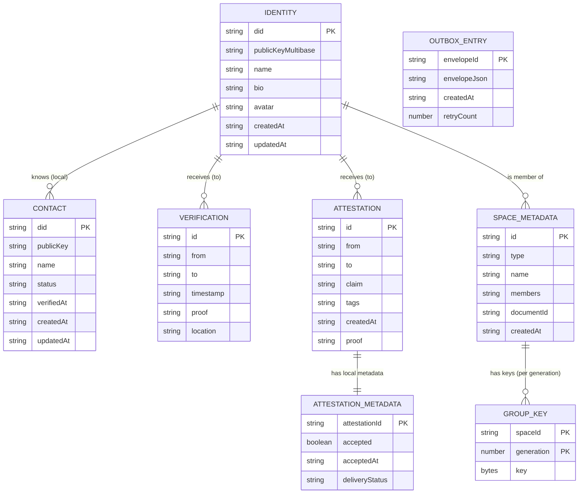
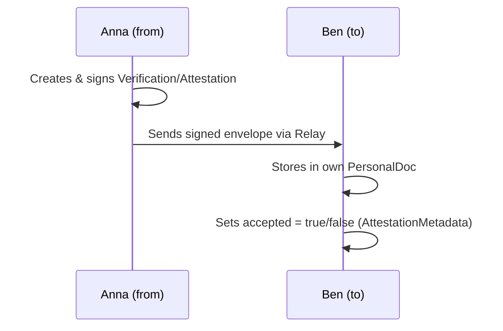
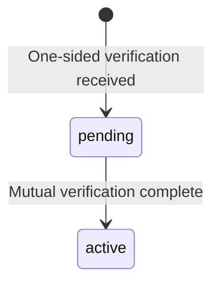
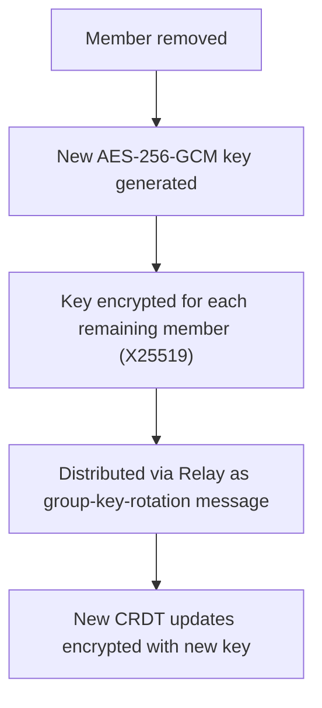
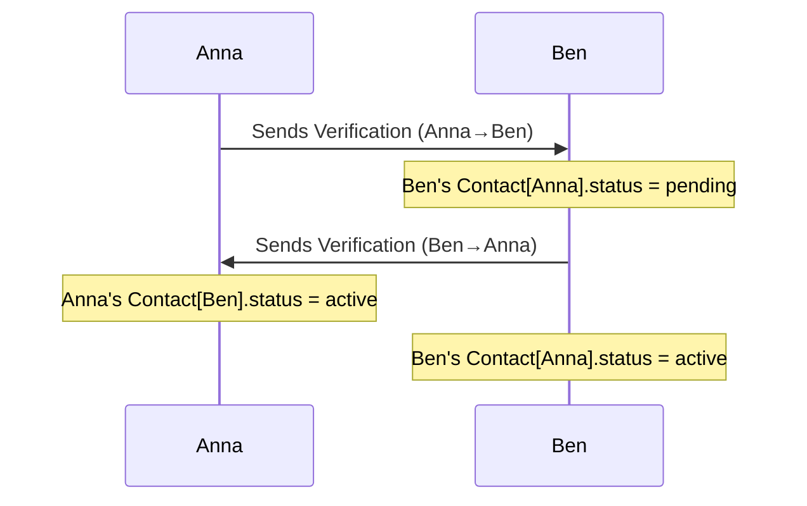
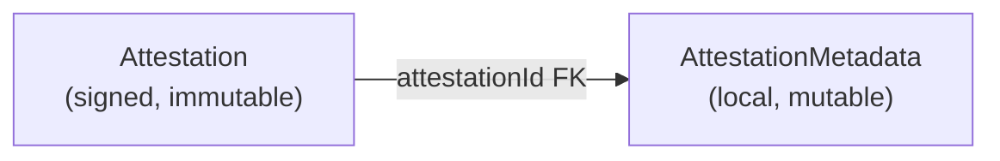
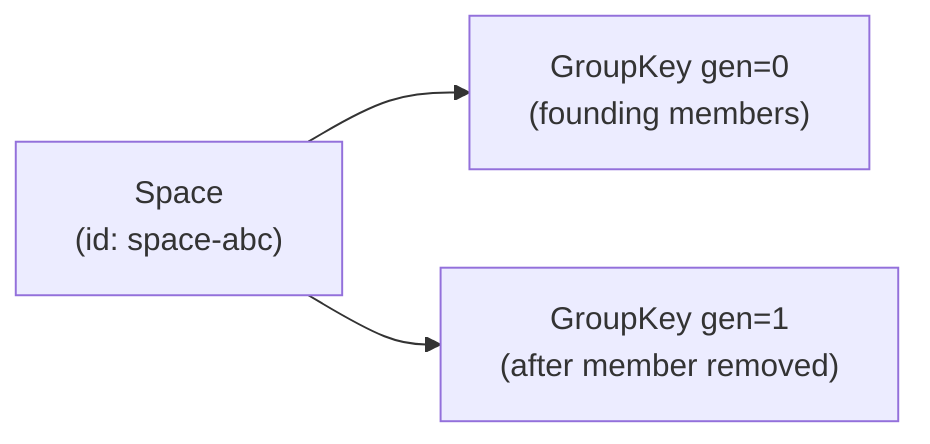

# Entities

> Complete data model of the Web of Trust.
>
> **Scope:** This document covers the domain entities — what they are, how they relate,
> and where they live. For adapter interfaces and service APIs, see
> [CURRENT_IMPLEMENTATION.md](../CURRENT_IMPLEMENTATION.md).
>
> **Note on JSON schemas:** The JSON examples below are documentation artifacts.
> They are not programmatically validated at runtime.

---

## Implemented vs. Planned

| Entity | Status |
| --- | --- |
| Identity | Implemented |
| Contact | Implemented |
| Verification | Implemented |
| Attestation | Implemented |
| AttestationMetadata | Implemented |
| SpaceMetadata | Implemented |
| GroupKey | Implemented |
| OutboxEntry | Implemented |
| Item | **Planned — not yet implemented** |
| Item_Key | **Planned — not yet implemented** |
| Group (explicit) | **Planned — not yet implemented** |
| Auto-Group | **Planned — not yet implemented** |

---

## ER Diagram (Implemented Entities)



---

## The Receiver Principle

> **Core principle:** Verifications and attestations are stored at the **receiver** (`to`),
> not at the creator (`from`).

### Why?

1. **Data sovereignty** — The receiver controls what is stored about them
2. **No write conflicts** — Each user only writes to their own data store
3. **Gift semantics** — An attestation is a gift; the recipient receives and holds it

### How it works



### Field semantics

| Field | Meaning |
| --- | --- |
| `from` | Who signed? (creator, holds the private key) |
| `to` | Who stores? (receiver, controls acceptance) |
| `proof` | Ed25519 signature by `from` — proves authenticity |

### What the creator retains

The creator (`from`) keeps the receiver's **public key** in their local contact record —
needed for E2E encryption. The verification and attestation documents themselves live
exclusively at the receiver.

---

## Storage: PersonalDoc (CRDT)

All personal data is stored inside a single **CRDT document** — not in SQL tables.
The document is a collection of named maps.

### PersonalDoc structure

```typescript
PersonalDoc {
  profile:             ProfileDoc | null
  contacts:            Record<did, ContactDoc>
  verifications:       Record<id, VerificationDoc>
  attestations:        Record<id, AttestationDoc>
  attestationMetadata: Record<id, AttestationMetadataDoc>
  outbox:              Record<id, OutboxEntryDoc>
  spaces:              Record<id, SpaceMetadataDoc>
  groupKeys:           Record<"spaceId:generation", GroupKeyDoc>
}
```

### Two CRDT backends (same schema)

| Backend | Package | Default? |
| --- | --- | --- |
| **YjsPersonalDocManager** | `packages/adapter-yjs` | Yes (since 2026-03-15) |
| **PersonalDocManager** | `packages/adapter-automerge` | Optional (`VITE_CRDT=automerge`) |

Both use the same `PersonalDoc` type. The Yjs version uses `Y.Map` for each
sub-collection; mutations go through a proxy-based API.

### Persistence chain

```text
App mutation
  → CRDT mutate (Y.Map / Automerge change)
  → CompactStore (IndexedDB snapshot, immediate)
  → Relay (encrypted CRDT update, immediate)
  → Vault (encrypted snapshot, 5 s debounce)
```

---

## Identity

The user's own digital identity. Exists exactly once per device/installation.

### Identity: implementation

`packages/wot-core/src/identity/WotIdentity.ts`

- **BIP39 mnemonic** — 12 German words (128-bit entropy)
- **HKDF master key** — Non-extractable `CryptoKey`, hardware-isolated when available
- **Ed25519** — Signing via `@noble/ed25519`
- **X25519** — Key agreement (separate HKDF path)
- **did:key** — DID derived deterministically from the Ed25519 public key

### Identity: key storage

The private key is a **non-extractable `CryptoKey`** object held in memory. It is never
stored as plain bytes. Persistence uses the BIP39 seed, which is stored encrypted:

```text
BIP39 seed
  →  PBKDF2 (600 000 iterations) + passphrase
  →  AES-GCM ciphertext
  →  IndexedDB ("wot-seed-storage")
```

On unlock, the seed is decrypted and the HKDF master key is re-derived in memory.
The master key never leaves the application.

### Identity: multi-device

Same BIP39 seed → same `did:key` → same identity on every device. No login token,
no server coordination.

### Identity: JSON schema

```json
{
  "did": "did:key:z6Mkf5rGMoatrSj1f4CyvuHBeXJELe9RPdzo2PKGNCKVtZxP",
  "profile": {
    "name": "Anna Müller",
    "bio": "Active in Sonnenberg Community Garden",
    "avatar": "data:image/jpeg;base64,..."
  },
  "createdAt": "2025-01-01T10:00:00Z",
  "updatedAt": "2025-01-08T12:00:00Z"
}
```

### Identity: fields

| Field | Type | Required | Description |
| --- | --- | --- | --- |
| `did` | `did:key` | Yes | Decentralized identifier, derived from public key |
| `profile.name` | String | Yes | Display name (1–100 characters) |
| `profile.bio` | String | No | Description (max 500 characters) |
| `profile.avatar` | String | No | Base64 or URL |
| `createdAt` | ISO 8601 | Yes | Creation timestamp |
| `updatedAt` | ISO 8601 | Yes | Last modification timestamp |

### Identity: invariants

- `did` is derived deterministically from the Ed25519 public key
- The private key is a non-extractable `CryptoKey` — never stored as raw bytes
- The private key can only be reconstructed from the BIP39 seed

---

## Contact

A local record of another user with whom a verification exists.

### Contact: storage

Contacts are stored **explicitly** in the `contacts` Y.Map of the PersonalDoc.
They are not derived from verifications at read time — they are written directly
when the verification handshake completes.

### Contact: JSON schema

```json
{
  "did": "did:key:z6MkhaXgBZDvotDkL5257faiztiGiC2QtKLGpbnnEGta2doK",
  "publicKey": "z6MkhaXgBZDvotDkL5257faiztiGiC2QtKLGpbnnEGta2doK",
  "name": "Ben Schmidt",
  "status": "active",
  "verifiedAt": "2025-01-05T10:05:00Z",
  "createdAt": "2025-01-05T10:05:00Z",
  "updatedAt": "2025-01-05T10:05:00Z"
}
```

### Contact: fields

| Field | Type | Required | Description |
| --- | --- | --- | --- |
| `did` | `did:key` | Yes | Contact's DID (map key) |
| `publicKey` | Multibase string | Yes | Ed25519 public key, used for E2E encryption |
| `name` | String | No | Display name (cached from profile) |
| `avatar` | String | No | Avatar URL/data (cached) |
| `bio` | String | No | Bio (cached) |
| `status` | `pending` \| `active` | Yes | Verification state |
| `verifiedAt` | ISO 8601 | No | When mutual verification completed |
| `createdAt` | ISO 8601 | Yes | When contact was first created locally |
| `updatedAt` | ISO 8601 | Yes | Last local update |

### Contact: status transitions



| Status | Meaning |
| --- | --- |
| `pending` | Only one direction has been verified |
| `active` | Both sides have verified each other |

---

## Verification

A cryptographically signed statement: "I have met and verified this person."

A Verification is structurally a special case of Attestation, but is treated separately
because it drives the contact status (`pending → active`).

### Verification: receiver principle

- Anna creates a Verification for Ben → stored **at Ben**
- Ben creates a Verification for Anna → stored **at Anna**
- Both see only the verification they received

### Verification: JSON schema

```json
{
  "id": "urn:uuid:550e8400-e29b-41d4-a716-446655440000",
  "from": "did:key:z6Mkf5rGMoatrSj1f4CyvuHBeXJELe9RPdzo2PKGNCKVtZxP",
  "to": "did:key:z6MkhaXgBZDvotDkL5257faiztiGiC2QtKLGpbnnEGta2doK",
  "timestamp": "2025-01-05T10:05:00Z",
  "location": { "latitude": 48.137, "longitude": 11.576, "accuracy": 10 },
  "proof": {
    "type": "Ed25519Signature2020",
    "verificationMethod": "did:key:z6Mkf5rGMoatrSj1f...",
    "proofValue": "z5vgFc..."
  }
}
```

### Verification: fields

| Field | Type | Description |
| --- | --- | --- |
| `id` | URN UUID | Unique identifier |
| `from` | `did:key` | Who signed (signature creator) |
| `to` | `did:key` | Who is verified (storage location) |
| `timestamp` | ISO 8601 | When verified |
| `location` | GeoLocation | Optional — latitude/longitude/accuracy |
| `proof` | Object | Ed25519 signature by `from` |

### Verification: properties

- **Immutable** — Never modified after creation
- **Unidirectional** — A→B and B→A are separate documents
- **Mutual** — Contact becomes `active` only when both directions exist
- **Always visible** — Cannot be hidden (controls contact status)

---

## Attestation

A signed statement about a contact.

### Attestation: receiver principle

- Anna writes an attestation for Ben → stored **at Ben**
- Ben controls acceptance via `AttestationMetadata`
- Others see Ben's accepted attestations when they view his public profile

### Attestation: JSON schema

```json
{
  "id": "urn:uuid:789e0123-e89b-12d3-a456-426614174000",
  "from": "did:key:z6Mkf5rGMoatrSj1f4CyvuHBeXJELe9RPdzo2PKGNCKVtZxP",
  "to": "did:key:z6MkhaXgBZDvotDkL5257faiztiGiC2QtKLGpbnnEGta2doK",
  "claim": "Helped for 3 hours in the community garden",
  "tags": ["garden", "community", "helping"],
  "context": "Sonnenberg community garden workday",
  "createdAt": "2025-01-08T14:00:00Z",
  "proof": {
    "type": "Ed25519Signature2020",
    "verificationMethod": "did:key:z6Mkf5rGMoatrSj1f...",
    "proofValue": "z3vFx..."
  }
}
```

### Attestation: fields

| Field | Type | Required | Description |
| --- | --- | --- | --- |
| `id` | URN UUID | Yes | Unique identifier |
| `from` | `did:key` | Yes | Who attested (signature creator) |
| `to` | `did:key` | Yes | Who receives the attestation (storage location) |
| `claim` | String | Yes | Free-text statement (5–500 characters) |
| `tags` | Array | No | Keywords (max 5) |
| `context` | String | No | Optional context or occasion |
| `createdAt` | ISO 8601 | Yes | Creation timestamp |
| `proof` | Object | Yes | Ed25519 signature by `from` |

### Attestation: invariants

- `from` and `to` must differ (no self-attestation)
- `claim`, `tags`, and `proof` are immutable after creation
- Acceptance is controlled via `AttestationMetadata`, not via a field on the `Attestation` itself

---

## AttestationMetadata

Local, unsigned metadata about an attestation. Controlled entirely by the receiver.
Not included in the proof; not synced to other devices by default.

### AttestationMetadata: separation from Attestation

The `Attestation` document is signed by the sender and must remain immutable.
The receiver's preferences (accepted/rejected, delivery tracking) are stored separately
in `AttestationMetadata` so the signed document is never mutated.

### AttestationMetadata: JSON schema

```json
{
  "attestationId": "urn:uuid:789e0123-e89b-12d3-a456-426614174000",
  "accepted": true,
  "acceptedAt": "2025-01-08T15:00:00Z",
  "deliveryStatus": "acknowledged"
}
```

### AttestationMetadata: fields

| Field | Type | Description |
| --- | --- | --- |
| `attestationId` | URN UUID | Foreign key to `Attestation.id` |
| `accepted` | Boolean | Whether the receiver has accepted the attestation |
| `acceptedAt` | ISO 8601 | When it was accepted (optional) |
| `deliveryStatus` | String | Relay delivery tracking: `accepted` / `delivered` / `acknowledged` / `failed` |

### AttestationMetadata: visibility rule

| `accepted` | Who sees the attestation? |
| --- | --- |
| `true` | All users who fetch the receiver's public profile |
| `false` | Only the receiver locally |

> The receiver can toggle `accepted` at any time. The sender's signature remains
> valid regardless.

---

## SpaceMetadata

Metadata describing a group space. Stored in the PersonalDoc of every member.

A **Space** is an encrypted CRDT document shared among a set of members.
The CRDT document itself is stored separately (in the ReplicationAdapter's storage).
`SpaceMetadata` holds the references and member info needed to rejoin the space.

### SpaceMetadata: JSON schema

```json
{
  "info": {
    "id": "space-abc123",
    "type": "shared",
    "name": "Community Garden",
    "description": "Coordination space for the Sonnenberg garden",
    "appTag": "wot-demo",
    "members": [
      "did:key:z6Mkf5rGMoatrSj1f...",
      "did:key:z6MkhaXgBZDvotDkL..."
    ],
    "createdAt": "2025-01-02T10:00:00Z"
  },
  "documentId": "automerge:AbCdEf...",
  "documentUrl": "automerge:AbCdEf...",
  "memberEncryptionKeys": {
    "did:key:z6Mkf5rGMoatrSj1f...": [1, 2, 3]
  }
}
```

### SpaceMetadata: fields

| Field | Type | Description |
| --- | --- | --- |
| `info.id` | String | Space identifier |
| `info.type` | `personal` \| `shared` | Personal = single-user, Shared = group |
| `info.name` | String | Human-readable name |
| `info.members` | DID[] | All member DIDs |
| `info.appTag` | String | Optional — isolates spaces per app |
| `documentId` | String | CRDT document reference |
| `memberEncryptionKeys` | Record | X25519 public keys per member DID (for group key distribution) |

---

## GroupKey

A symmetric AES-256-GCM key used to encrypt CRDT updates for a Space.

Keys are versioned by **generation**. When a member is removed, a new key is
generated (key rotation), and all subsequent CRDT updates are encrypted with
the new key. Removed members retain access to older generations but cannot
read new content.

### GroupKey: JSON schema

```json
{
  "spaceId": "space-abc123",
  "generation": 2,
  "key": [1, 2, 3]
}
```

### GroupKey: fields

| Field | Type | Description |
| --- | --- | --- |
| `spaceId` | String | Which space this key belongs to |
| `generation` | Number | Key generation (increments on rotation) |
| `key` | Uint8Array | Raw symmetric key bytes |

### GroupKey: rotation



---

## OutboxEntry

A queued outgoing message for delivery when the relay is unreachable.

The `OutboxMessagingAdapter` wraps any `MessagingAdapter` and buffers envelopes
here until a connection is established. The outbox is persisted so messages
survive app restarts.

### OutboxEntry: JSON schema

```json
{
  "envelopeJson": "{\"v\":1,\"id\":\"...\",\"type\":\"attestation\",...}",
  "createdAt": "2025-01-08T14:00:00Z",
  "retryCount": 0
}
```

### OutboxEntry: fields

| Field | Type | Description |
| --- | --- | --- |
| `envelopeJson` | String | Serialized `MessageEnvelope` |
| `createdAt` | ISO 8601 | When first queued |
| `retryCount` | Number | Failed send attempts (used for backoff) |

---

## Relationships

### Verification → Contact status



### Attestation → AttestationMetadata



### Space → GroupKey generations



---

## Planned Entities (Not Yet Implemented)

The following entities are specified for future phases but have no current implementation.

### Item

A content entry owned by a user. Intended to support calendar items, map markers,
project entries, and notes with configurable sharing (private, all contacts, specific groups,
selective recipients).

```json
{
  "id": "urn:uuid:abc12345-e89b-12d3-a456-426614174000",
  "type": "CalendarItem",
  "title": "Garden Meeting",
  "encryptedContent": "base64...",
  "visibility": "contacts",
  "ownerDid": "did:key:z6Mkf5rGMoatrSj1f...",
  "createdAt": "2025-01-08T10:00:00Z",
  "updatedAt": "2025-01-08T10:00:00Z",
  "deleted": false
}
```

Planned item types: `CalendarItem`, `MapItem`, `ProjectItem`, `NoteItem`.

### Item_Key

An item's symmetric encryption key, individually encrypted for each authorized recipient
using their X25519 public key.

```json
{
  "itemId": "urn:uuid:abc12345-e89b-12d3-a456-426614174000",
  "recipientDid": "did:key:z6MkhaXgBZDvotDkL...",
  "encryptedKey": "base64..."
}
```

Each recipient gets their own `Item_Key` entry. The item content itself is encrypted
once with a symmetric key; only the key copies differ per recipient.

### Group (explicit)

A named group created by a user, with explicit member and admin management.
Separate from spaces: Groups would control *who can see items*, while Spaces are
CRDT collaboration documents.

```json
{
  "did": "did:key:z6MkgYGF3thn8k1Fv4p4dWXKtsXCnLH7q9yw4QgNPULDmDKB",
  "name": "Sonnenberg Community Garden",
  "members": ["did:key:z6Mkf5rGMoatrSj1f...", "..."],
  "admins": ["did:key:z6Mkf5rGMoatrSj1f..."],
  "createdAt": "2025-01-02T10:00:00Z"
}
```

### Auto-Group

An implicit group that automatically contains all `active` contacts. Used as the
default audience for `visibility: "contacts"` items. A user always has exactly one
Auto-Group; membership updates automatically when contact status changes.

The Auto-Group concept also supports an `excludedMembers` list — a contact can be
excluded from the Auto-Group without changing its `active` status or requiring
explicit group management.
