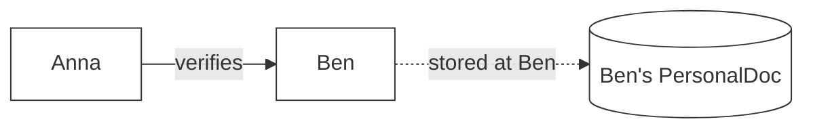
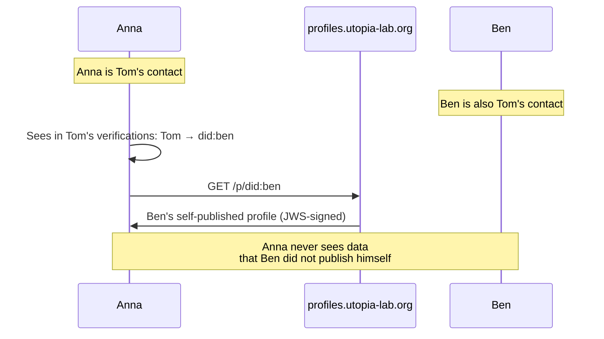
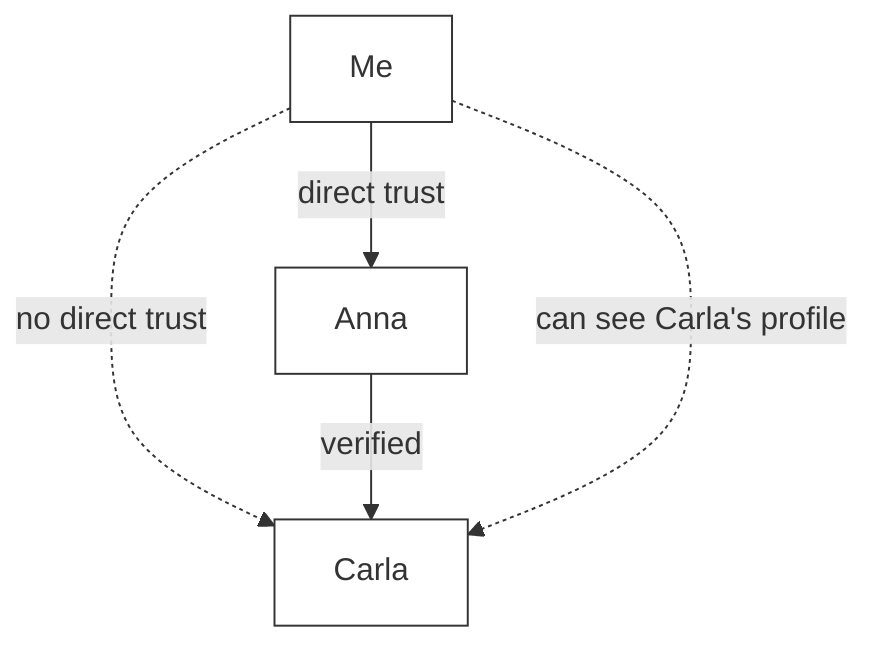
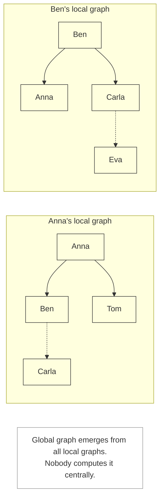

# Graph and Visibility

> How the network emerges from local perspectives

## Core Principle

The Web of Trust is a decentralized graph. There is no central server that "knows the graph". Instead:

- Every participant has their own **local graph**
- This graph contains only what has flowed to them through trust connections
- The "global graph" exists implicitly as the sum of all local graphs
- Nobody sees or computes the global graph

```
┌─────────────────────────────────────────────────────────────┐
│                                                             │
│  The global graph exists — but nobody sees it.             │
│                                                             │
│  What I see: my local slice.                               │
│  The more connections I have, the larger my graph.         │
│                                                             │
└─────────────────────────────────────────────────────────────┘
```

---

## Data Sovereignty

### I only share my own data

A fundamental principle: **no redistribution of other people's data.**

| What I share | What I do NOT share |
| --- | --- |
| My profile | Other people's profiles |
| My events, places, offers/requests | Other people's content |
| Received verifications (others → me) | Verifications between third parties |
| Received attestations (others → me) | Attestations between third parties |

### Receiver Principle

Verifications and attestations are stored at the **receiver**:

- Anna verifies Ben → stored at **Ben**
- Ben attests Anna → stored at **Anna**

**Consequence:** My profile shows who has verified **me** and what has been said **about me** — not who I have verified.



**Important:** Contacts are stored explicitly in `PersonalDoc.contacts` — they are not derived from verifications. When I verify someone, they are added as a contact entry. The sender also stores the **public key** for E2E encryption.

### Profiles are self-published

When I want to know who `did:key:z6Mk...` is:

1. I have the DID (from a contact's verifications, or from a QR scan)
2. I query the **public profile** server
3. The person has published their own profile
4. I see only what they have chosen to share

Public profiles are served by `https://profiles.utopia-lab.org` — a live HTTP service. Profiles are JWS-signed by the owner and verified on retrieval.



---

## The Local Graph

### Nodes

Every node is an identity represented by a DID.

| Node Type | Description |
| --- | --- |
| Own identity | My DID, my profile |
| Direct contact | DID of a person I have mutually verified |
| Indirect contact | DID from the verifications of one of my contacts |

### Edges

| Edge Type | Direction | Meaning |
| --- | --- | --- |
| Verification | A → B | "A met B in person and verified them" |
| Attestation | A → B | "A makes a claim about B" |

A verification becomes "active" only when both directions exist (mutual verification).

### What I see

```
My local graph
│
├── My identity
│   └── My received verifications: [Anna→Me, Ben→Me, Tom→Me]
│
├── My direct contacts (mutually verified, stored in PersonalDoc.contacts)
│   ├── Anna
│   │   └── Anna's received verifications: [Carla→Anna, David→Anna, ...]
│   ├── Ben
│   │   └── Ben's received verifications: [Carla→Ben, Eva→Ben, ...]
│   └── Tom
│       └── Tom's received verifications: [Eva→Tom, Frank→Tom, ...]
│
└── Indirect contacts (DIDs from my contacts' verifications)
    ├── did:carla (has verified Anna and Ben)
    ├── did:david (has verified Anna)
    ├── did:eva (has verified Ben and Tom)
    └── did:frank (has verified Tom)
```

**Note:** I can see the received verifications of my contacts. From this I can infer:

- Who has verified them (directly visible in their profile)
- Whom they have verified (indirectly: that information is at the respective receiver)

Example: I know Anna and Ben. I see in Carla's profile: `Anna → Carla` and `Ben → Carla`. This means: "2 of my contacts have verified Carla."

---

## Trust vs. Visibility

### Trust is direct

I trust only people I have **personally** met and verified. There is no transitive trust ("friend of a friend").

### Visibility is shared

My contacts share their verifications with me. This lets me see who they have verified — without me trusting those people myself.



```
┌─────────────────────────────────────────────────────────────┐
│                                                             │
│  Trust ≠ Visibility                                        │
│                                                             │
│  Trust:      Me → Anna ✓                                   │
│              Me → Carla ✗ (never met)                      │
│                                                             │
│  Visibility: I see Anna's verification: Anna → Carla        │
│              I can view Carla's public profile.            │
│              But I do not trust Carla.                     │
│                                                             │
└─────────────────────────────────────────────────────────────┘
```

---

## Use Cases

### "Mutual contacts"

When I meet a new person (e.g. Carla), the app can show:

> "2 mutual contacts: Anna, Ben"

**Calculation:**
```
My contacts ∩ Carla's contacts = [Anna, Ben]
```

This is information, not trust. Trust only arises when I verify Carla myself.

### "Who knows this person?"

When I look up `did:carla`:

```
Which of my contacts have a verification for did:carla?
→ Anna, Ben
```

### "Attestations from trusted sources"

When I view Carla's attestations:

```
All attestations for did:carla
├── From my direct contacts (trusted)
│   └── Anna: "Carla helped at the community garden"
└── From others (less trusted)
    └── David: "Carla is reliable"
```

---

## Supported Queries

The local graph must support the following queries:

| Query | Description | Data Source |
| --- | --- | --- |
| My contacts | All DIDs stored in PersonalDoc.contacts | PersonalDoc.contacts |
| Who verified X? | DIDs from X's received verifications | X's profile (verifications) |
| Mutual contacts | Intersection: who is in my contacts ∩ who verified Y | My contacts + Y's profile |
| Attestations for X | All attestations at X | X's profile (attestations) |
| Attestations from X | All attestations signed by X | Profiles of all recipients |
| Who knows X? | Which of my contacts have verified X? | X's profile filtered by my contacts |

> **Note:** "Attestations from X" is more expensive because they are stored at the respective recipients. This query requires scanning the profiles of known contacts.

### No deep traversals

The system deliberately does **not** support queries such as:

- "Shortest path to person X across multiple hops"
- "All people within distance N"
- "Transitive trust scores"

**Rationale:**

- Deep traversals require global knowledge
- Each participant sees only their local graph
- Transitive trust is conceptually not desired

---

## The Emergent Global Graph



---

## Consistency with the Implementation

### PersonalDoc

This document is consistent with the PersonalDoc data model:

- **`PersonalDoc.contacts`** — explicitly stored contact entries (not derived)
- **`PersonalDoc.verifications`** — received verifications (others → me)
- **`PersonalDoc.attestations`** — received attestations (others → me)

The receiver principle is enforced by the data model: verifications and attestations are written into the receiver's PersonalDoc via the Relay.

### Privacy

Consistent with the privacy architecture:

- "Only required data is collected"
- "No address book upload" — we share only self-created verifications
- "Contact graph partially derivable" — but only through shared data

### Sync Protocol

Consistent with the four-way architecture:

- Verifications are synced like other data (Relay, Vault, wot-profiles)
- CRDTs for conflict-free merging
- Server sees only encrypted data

---

## Summary

```
┌─────────────────────────────────────────────────────────────┐
│                                                             │
│  1. Everyone has their own local graph                     │
│                                                             │
│  2. I only share my own data                               │
│                                                             │
│  3. Contacts are stored explicitly in PersonalDoc          │
│                                                             │
│  4. Profiles are self-published (profiles.utopia-lab.org)  │
│                                                             │
│  5. Trust is direct (not transitive)                       │
│                                                             │
│  6. Visibility emerges through shared verifications        │
│                                                             │
│  7. The global graph is emergent — nobody sees it          │
│                                                             │
└─────────────────────────────────────────────────────────────┘
```

---

## See Also

- [Entities](entities.md) — Data structures
- [Verification Flow](../flows/02-verification-user-flow.md) — How contacts are created
- [Sync Protocol](../architecture/sync-protocol.md) — How data is synchronized
- [Current Implementation](../CURRENT_IMPLEMENTATION.md) — Implementation status
