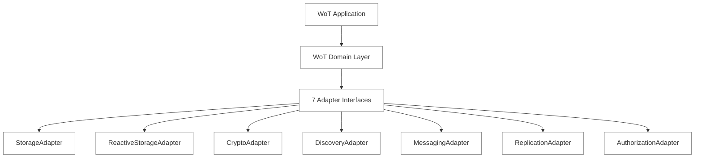
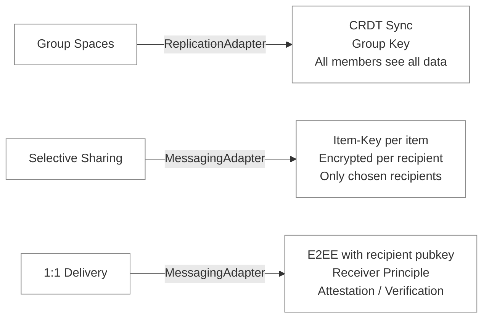

# Architecture Overview

> Framework-agnostic architecture of the Web of Trust
>
> Updated: 2026-03-16 (v2: 7-Adapter Architecture + Four-Way Persistence + Yjs Default)

## Core Principle: Framework Agnosticism

The Web of Trust is built to be **framework-agnostic**. All domain logic is independent of the concrete storage engine, cryptography library, messaging transport, or CRDT implementation. This is enforced through a strict adapter interface layer.

**Why?**

- No single framework covers all WoT requirements
- CRDT sync, peer messaging, and capability authorization are orthogonal concerns
- The technology landscape for decentralized systems is still evolving
- Adapter boundaries make unit testing trivial (swap any adapter for a NoOp or InMemory variant)

---

## Layer Model



The **Domain Layer** contains all business logic: Identity, Contact, Verification, Attestation, Item, Group, Space. It only ever calls adapter interfaces — never concrete implementations.

---

## The Seven Adapters

Interface definitions live in `packages/wot-core/src/adapters/interfaces/`.

### 1. StorageAdapter

Local persistence for all domain entities: Identity, Contacts, Verifications, Attestations, Spaces, Group Keys.

**Implementations:**

- `YjsStorageAdapter` — default, uses `YjsPersonalDocManager` (Y.Doc, pure JavaScript)
- `AutomergeStorageAdapter` — option, uses `PersonalDocManager` (Automerge, Rust→WASM)

### 2. ReactiveStorageAdapter

Live queries that react to data changes. Uses a `Subscribable<T>` pattern (`useState` + `useEffect`). Includes `watchIdentity()` for reactive identity observation.

**Implementations:** Provided by the same class as StorageAdapter in both CRDT variants.

### 3. CryptoAdapter

Key generation, signing, verification, encryption, DID conversion.

- Ed25519 signing and verification
- X25519 key agreement (ECDH)
- AES-256-GCM symmetric encryption
- HKDF key derivation
- did:key creation and resolution

**Implementation:** `WebCryptoAdapter` — WebCrypto API + @noble/ed25519

### 4. DiscoveryAdapter

Publish and retrieve public profiles. Everything signed (JWS), nothing encrypted. Readable anonymously; the holder controls what is published.

**Implementations:**

- `HttpDiscoveryAdapter` — HTTP REST against `wot-profiles` server
- `OfflineFirstDiscoveryAdapter` — cache wrapper with dirty-flag tracking, delegates to `HttpDiscoveryAdapter`

### 5. MessagingAdapter

Cross-user message delivery between DIDs. Used for attestation delivery, verification exchange, item-key delivery, and CRDT sync bootstrapping.

**Implementations:**

- `WebSocketMessagingAdapter` — WebSocket client, ping/pong heartbeat (15s/5s), early-message buffer (CRDT-agnostic)
- `OutboxMessagingAdapter` — decorator that queues messages when the relay is unreachable and flushes on reconnect (FIFO)
- `InMemoryMessagingAdapter` — shared-bus pattern for unit tests

The `OutboxMessagingAdapter` wraps any inner adapter and ensures critical messages (attestations, verifications) are never lost. Fire-and-forget types like `profile-update` can bypass the outbox via `skipTypes`.

### 6. ReplicationAdapter

CRDT-based group spaces with end-to-end encryption. Manages space membership and key rotation. Exposes a `SpaceHandle<T>` interface: `getDoc()`, `transact()`, `onRemoteUpdate()`, `close()`.

**Implementations:**

- `YjsReplicationAdapter` — default; Yjs Y.Doc + `EncryptedSyncService` + `GroupKeyService`
- `AutomergeReplicationAdapter` — option; same services, Automerge CRDT

### 7. AuthorizationAdapter

UCAN-inspired capability tokens: signed, delegatable, attenuatable, offline-verifiable. Permissions at `read / write / delete / delegate` granularity.

**Implementations:**

- `InMemoryAuthorizationAdapter` — for tests and POC (creator = admin)
- `crypto/capabilities.ts` — create, verify, delegate, extract; uses a `SignFn` pattern so the private key never leaves `WotIdentity`

---

## Three Sharing Patterns

The architecture supports three fundamentally different ways to share data:



---

## The Receiver Principle

The central design principle: **data is stored at the recipient.**

When Anna sends an attestation to Ben, it is stored in Ben's data — not Anna's. When Ben verifies Anna, that verification lives in Anna's document. Consequences:

- Each person controls their own storage
- No write conflicts (everyone only writes to their own data)
- CRDT conflict resolution is simpler
- Privacy: you decide what is visible about you

A verification is two separate documents, each with one signature, stored at the respective recipient:

```
Anna verifies Ben  →  stored at Ben   (signed by Anna)
Ben verifies Anna  →  stored at Anna  (signed by Ben)
```

An attestation is a signed claim delivered to its subject. The `accepted` flag is local metadata controlled only by the recipient — it is not part of the signed payload.

---

## Four-Way Persistence

Every personal document and group space is persisted through four independent layers:

| Layer | Transport | Purpose | Debounce |
| --- | --- | --- | --- |
| **CompactStore** | IndexedDB | Local snapshot — survives page reload | None (immediate) |
| **Relay** | WebSocket | Real-time sync to other devices | None (immediate) |
| **Vault** | HTTP | Encrypted cloud backup | 5 seconds |
| **wot-profiles** | HTTP | Discovery — public profile | On publish |

The Relay and CompactStore receive every change immediately. The Vault receives a debounced full snapshot. This architecture is CRDT-agnostic: each layer stores or forwards raw bytes (encrypted where applicable).

For detailed sync patterns (peer sync, vault snapshot, space invite), see [sync.md](./sync.md).

---

## Identity

Every user is identified by a `did:key` derived deterministically from a BIP39 mnemonic (12 German words, 128 bits of entropy). The same seed on a new device produces the same DID and the same keys — no server, no login token.

- **Ed25519** — signing
- **X25519** — key agreement (separate HKDF derivation path)
- **HKDF** — framework key derivation (non-extractable master key)
- **AES-256-GCM** — symmetric encryption of stored seed (PBKDF2, 600k iterations)

Multi-device: import the same mnemonic. The Relay and Vault handle state merge.

---

## CRDT Choice

**Yjs is the default CRDT since 2026-03-15.** Automerge remains available via `VITE_CRDT=automerge`.

| | Yjs (default) | Automerge (option) |
| --- | --- | --- |
| Implementation | Pure JavaScript | Rust → WASM |
| Mobile init (163 KB doc) | ~85 ms | ~6.4 s |
| Bundle size | 69 KB | 1.7 MB |
| Garbage collection | Built-in | Manual compaction |

The switch from Automerge to Yjs was driven by WASM performance on mobile: Automerge caused 30+ second UI freezes on Android. The adapter boundary made the migration possible without touching any domain logic.

Benchmark results are available live at `/benchmark`.

---

## Infrastructure Packages

Three standalone server packages complement the core:

**wot-relay** — WebSocket relay server. DID-based message routing, delivery ACK (messages persisted until client ACKs), multi-device (multiple connections per DID), heartbeat. Live: `wss://relay.utopia-lab.org`

**wot-vault** — Encrypted document store. Append-only change log + snapshots. Auth via signed capability tokens. HTTP REST. Live: used internally by demo app.

**wot-profiles** — Public profile server. HTTP REST (`GET /p/{did}`, `PUT /p/{did}`, `GET /p/batch`). JWS verification built-in, no wot-core dependency. Live: `https://profiles.utopia-lab.org`

---

## Further Reading

- [Adapter Specification](./adapters.md) — full interface definitions for all 7 adapters
- [Sync Patterns](./sync.md) — peer sync, vault snapshot, space invite
- [Encryption](./encryption.md) — E2EE, group keys, envelope signing
- [Entities](./entities.md) — domain data model in detail
- [DID Key](./did-key.md) — why did:key and how it works
- [Framework Evaluation](../research/framework-evaluation.md) — 16 evaluated frameworks
- [Vault Sync Concepts](../concepts/vault-sync.md) — Automerge.save() semantics, history overhead
- [Current Implementation](../CURRENT_IMPLEMENTATION.md) — what is actually built today
