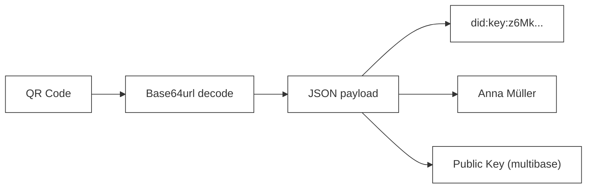
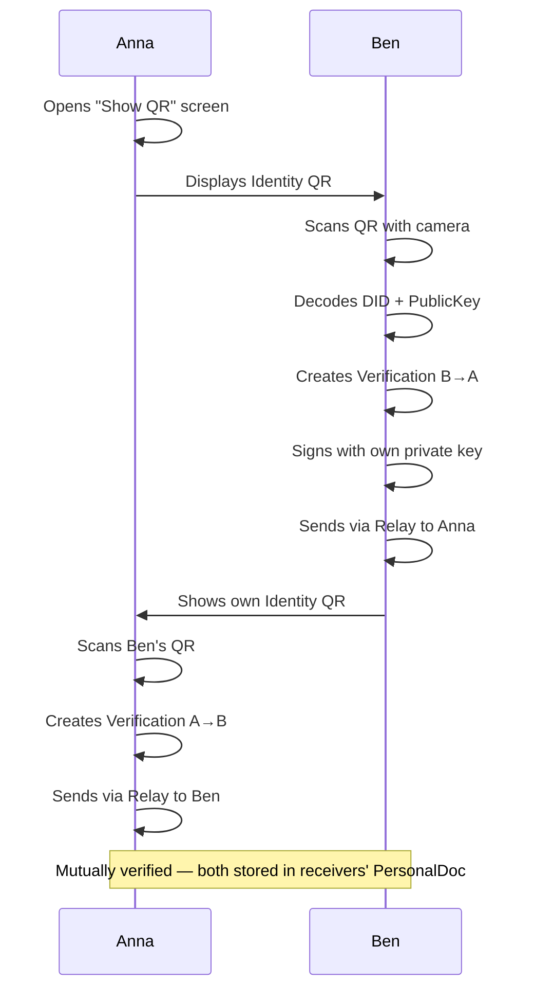
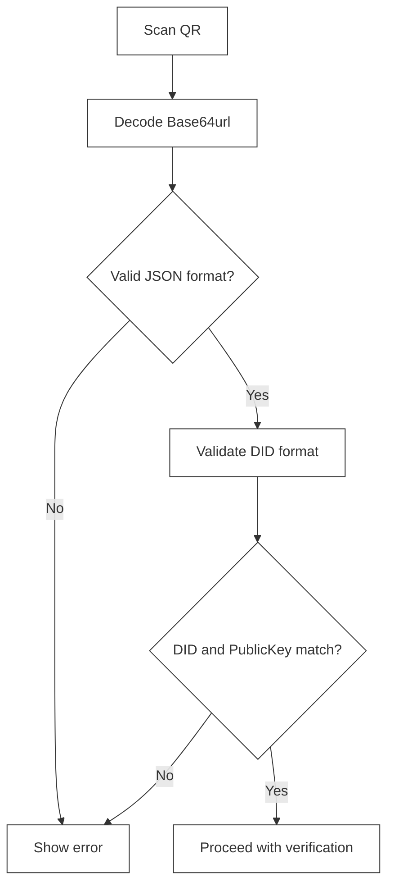

# QR Code Formats

> QR code structures for verification and contact exchange

## Overview

QR codes are used in the Web of Trust for direct in-person exchange between participants.

| Type | Purpose | Status |
| --- | --- | --- |
| **Identity QR** | Share own identity | Implemented |
| **Invite QR** | Invite to a group space | Planned — not yet implemented |
| **Deep Link QR** | App link / profile shortcut | Planned — not yet implemented |

---

## Identity QR

### Purpose

Shares the user's own identity with another person to initiate mutual verification.

### Format

The QR code encodes a JSON object as a Base64url string, embedded in a URL:

```
https://web-of-trust.de/verify#<base64url-encoded-json>
```

### Encoded Payload

```json
{
  "type": "identity",
  "version": 1,
  "did": "did:key:z6MkhaXgBZDvotDkL5257faiztiGiC2QtKLGpbnnEGta2doK",
  "name": "Anna Müller",
  "publicKey": "z6MkhaXgBZDvotDkL5257faiztiGiC2QtKLGpbnnEGta2doK"
}
```

**Fields:**

| Field | Description |
| --- | --- |
| `type` | Always `"identity"` |
| `version` | Schema version (currently `1`) |
| `did` | The `did:key` identifier of the person |
| `name` | Display name (optional, shown during verification) |
| `publicKey` | Multibase-encoded Ed25519 public key (same as the key embedded in the DID) |

### Structure



### Verification Flow



### Security Notes

The public key in the QR payload is redundant with the DID (the `did:key` method encodes the key directly in the DID string). Both are included for convenience — the app validates that they match before proceeding.

---

## Invite QR

> **Planned — not yet implemented.**
>
> Group invitations currently use the MessagingAdapter (Relay) directly. A QR-based invite flow is planned for a future release.

### Intended Purpose

Allow a group admin to invite a new member by showing a QR code in person — without requiring the invitee to already be a contact.

### Planned Format

```json
{
  "type": "invite",
  "version": 1,
  "group": {
    "id": "<space-id>",
    "name": "Community Garden"
  },
  "inviter": {
    "did": "did:key:z6Mkf5rGMoatrSj1f4CyvuHBeXJELe9RPdzo2PKGNCKVtZxP",
    "name": "Anna Müller"
  },
  "token": "<signed-capability-token>",
  "expiresAt": "2026-04-01T10:00:00Z"
}
```

The `token` would be a signed capability (see `crypto/capabilities.ts`) proving that the inviter has the right to add members, and encoding an expiry.

---

## Deep Link QR

> **Planned — not yet implemented.**
>
> Deep links for marketing or onboarding are not yet in use. The app is web-only at this stage.

### Deep Link Purpose

Link directly to a public profile or trigger a specific action when scanned on a device that already has the app open.

### Deep Link Format

```
https://web-of-trust.de/open?action=<action>&params=<params>
```

**Examples:**

View a public profile:
```
https://web-of-trust.de/open?action=profile&did=did:key:z6Mk...
```

---

## QR Code Generation

### Size and Error Correction

| Content Length | QR Version | Recommended Size | Error Correction |
| --- | --- | --- | --- |
| < 100 chars | 3–5 | 200×200 px | Level M (15%) |
| 100–300 chars | 6–10 | 300×300 px | Level M (15%) |
| > 300 chars | 11+ | 400×400 px | Level L (7%) |

### Best Practices

```
┌─────────────────────────────────────────────────────────────┐
│                                                             │
│  QR Code Best Practices:                                   │
│                                                             │
│  ✅ High contrast (black on white)                         │
│  ✅ Quiet zone around QR (min. 4 modules)                  │
│  ✅ Error correction Level M or higher                     │
│  ✅ Keep URLs short                                        │
│                                                             │
│  ❌ No logos overlaid on QR (reduces readability)          │
│  ❌ No colored QR codes                                    │
│  ❌ No QR codes that are too small                        │
│                                                             │
└─────────────────────────────────────────────────────────────┘
```

---

## Security Considerations

### What is in the QR code

| Included | Not included |
| --- | --- |
| DID (public) | Private key |
| Public key (public) | Encrypted data |
| Display name (public) | Session tokens |

### Validation on Scan



### Checks performed

1. **Format:** Must be a valid URL starting with `https://web-of-trust.de/`
2. **DID format:** Must be a valid `did:key:z6Mk...` string
3. **PublicKey:** Must match the key embedded in the DID (derivable)
4. **Type field:** Must be a known type (`identity`, `invite`)

---

## URL Encoding

If a name or other string parameter is included in a URL (rather than a JSON payload), standard percent-encoding applies:

| Character | Encoded |
| --- | --- |
| Space | `%20` |
| Umlaut ä | `%C3%A4` |
| `:` | `%3A` |
| `/` | `%2F` |

---

## See Also

- [Verification Flow](../flows/02-verification-user-flow.md) — How QR codes are used during verification
- [Onboarding Flow](../flows/01-onboarding-user-flow.md) — QR at first launch
- [Current Implementation](../CURRENT_IMPLEMENTATION.md) — Implementation status
