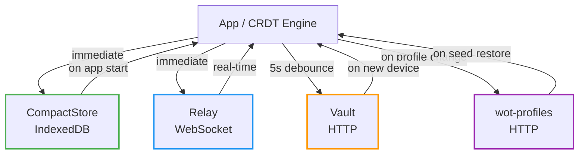
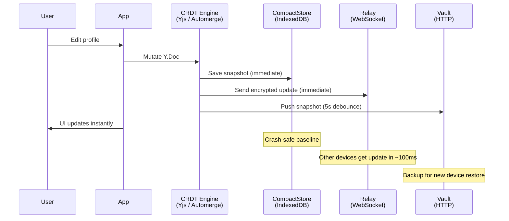
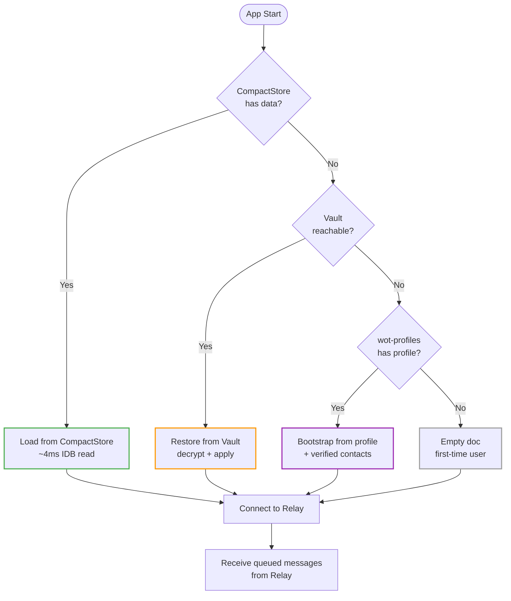
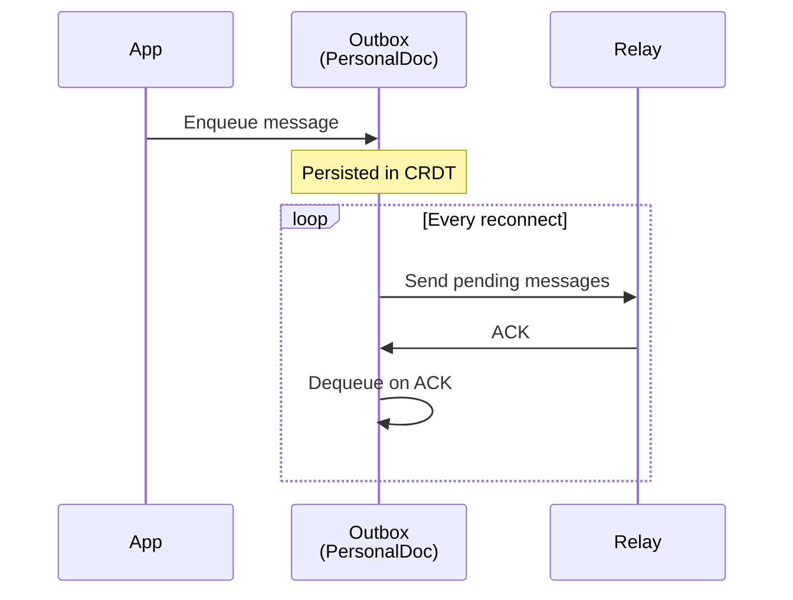
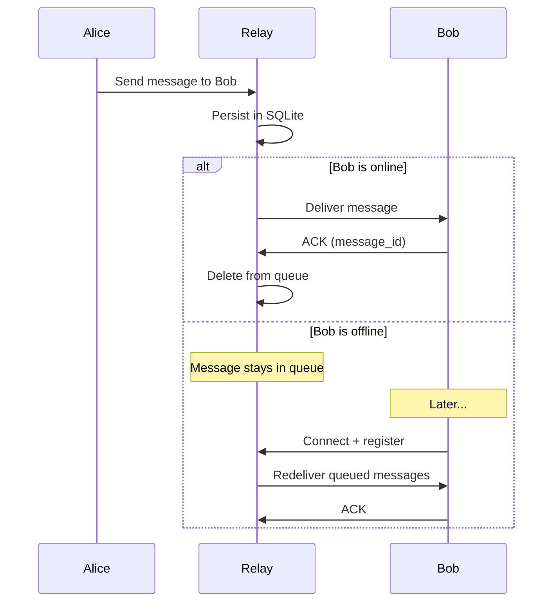
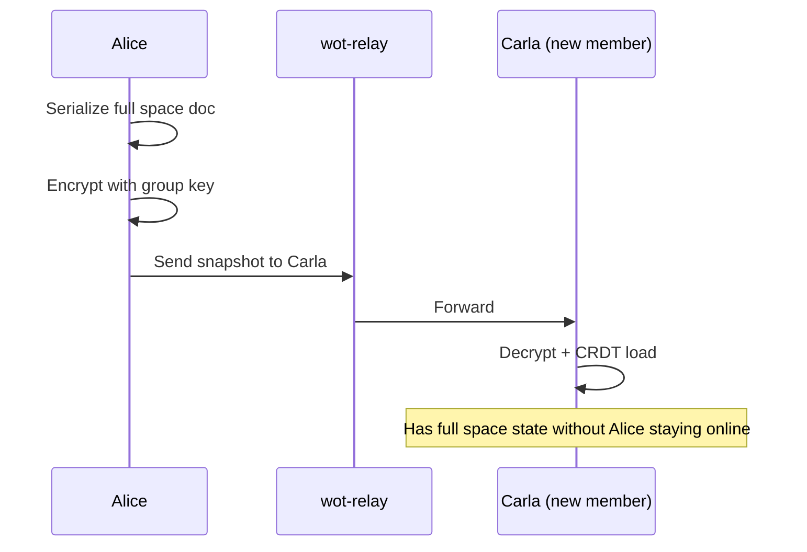

# Sync Architecture

> How data flows between devices, services, and users in Web of Trust.

**Status:** Implemented
**Last updated:** 2026-03-16

---

## Four-Way Architecture

Web of Trust uses four complementary sync paths. Each serves a different purpose:



| Path | Transport | Purpose | Latency | Encryption |
|------|-----------|---------|---------|------------|
| **CompactStore** | IndexedDB | Local persistence | Immediate | At-rest (passphrase) |
| **Relay** | WebSocket | Real-time device-to-device sync | ~100ms | E2EE (envelope auth) |
| **Vault** | HTTPS | Encrypted backup & new device restore | 5s debounce | E2EE (AES-256-GCM) |
| **wot-profiles** | HTTPS | Public profile discovery | On change | JWS-signed (public) |

---

## Data Flow: Write

When the user makes a change (e.g., edits profile, adds contact):



**Key design decisions:**
- **No debounce on Relay** — real-time sync is critical for multi-device UX
- **5s debounce on Vault** — reduces HTTP requests, Vault is backup not real-time
- **Immediate CompactStore** — crash-safe, always has latest state

## Data Flow: Read (App Start)

When the app starts, it loads data from the fastest available source:



**Fallback chain:** CompactStore → Vault → wot-profiles → empty doc

---

## Offline-First Behavior

### Everything works offline

All mutations happen locally first. The CRDT engine (Yjs or Automerge) handles conflict resolution automatically — no vector clocks, no manual merge, no server-side logic.

```
User edits profile while offline
    → CRDT mutated locally
    → CompactStore updated
    → Relay message queued (Outbox)
    → Vault push deferred

User comes online
    → Outbox flushes to Relay
    → Relay delivers queued messages from other devices
    → CRDT merges automatically
    → Vault receives latest snapshot
```

### Outbox Pattern

Messages that can't be delivered (offline, relay down) are queued in the Outbox:



### Relay ACK Protocol

The Relay persists messages until the recipient ACKs them. If a device disconnects before ACK, messages are redelivered on reconnect:



---

## Vault: Snapshot-Replace Pattern

The Vault uses **snapshot-replace** — each push replaces the previous snapshot entirely. We deliberately do not use incremental pushes:

1. **E2EE constraint** — Incremental push requires tracking which heads have already been sent. With encrypted data, the server cannot assist with head reconciliation.
2. **Small docs** — Our documents are 2–50 KB. A full snapshot push costs ~200–700ms (HTTP round-trip) and is negligible.
3. **Idempotency** — No ordering problems, no gaps, no need to track previous push state. Concurrent pushes from two devices result in last-write-wins, which is acceptable because the Relay keeps both devices in sync in real time.

### CRDT Serialization

| Operation | Yjs | Automerge |
|-----------|-----|-----------|
| Serialize for Vault | `Y.encodeStateAsUpdate(ydoc)` | `Automerge.save(doc)` |
| Restore from Vault | `Y.applyUpdate(ydoc, bytes)` | `Automerge.load(bytes)` |
| History overhead | Minimal (GC built-in) | <10% for additive changes |

---

## Invite Sync (Initial Space Join)

When a new member joins a space and no peers are online, the inviting peer sends a full snapshot:



After the invite, the Vault takes over as the persistent fallback.

---

## Encryption Layers

### Personal Doc (Multi-Device)

Same user, multiple devices. Encrypted with the user's personal key derived from BIP39 seed:

```
CRDT update → AES-256-GCM encrypt (personal key) → Relay → decrypt on other device
```

### Shared Spaces (Multi-User)

Multiple users collaborating. Encrypted with a shared group key:

```
CRDT update → AES-256-GCM encrypt (group key) → Relay → decrypt by group members
```

Group keys are managed by `GroupKeyService` with generation tracking for key rotation.

### Attestations (1:1 Delivery)

One sender, one recipient. Encrypted with recipient's public key (X25519 ECIES):

```
Attestation → ECIES encrypt (recipient public key) → Relay → decrypt by recipient
```

### Public Profiles

Not encrypted — intentionally public. Signed with Ed25519 (JWS) for authenticity:

```
Profile → JWS sign (private key) → wot-profiles server → anyone can verify
```

---

## CRDT Conflict Resolution

We use **Yjs** (default) or **Automerge** (option) for conflict-free merging. No manual conflict resolution needed.

| Data type | CRDT type | Conflict behavior |
|-----------|-----------|-------------------|
| Profile fields | Y.Map | Last writer wins (Lamport timestamp) |
| Contacts | Y.Map | Last writer wins per field |
| Attestations | Y.Map | Add-only (recipient stores) |
| Verifications | Y.Map | Add-only (immutable once created) |
| Outbox | Y.Map | Add/remove (dequeue on ACK) |
| Space metadata | Y.Map | Last writer wins |

### Why no Vector Clocks?

Yjs and Automerge use internal logical clocks (Lamport timestamps) for ordering. The CRDT handles merge semantics automatically. We don't implement external vector clocks — the CRDT is the source of truth.

---

## Services

### Relay Server (`wss://relay.utopia-lab.org`)

- **Package:** `@real-life/wot-relay`
- **Role:** Real-time message forwarding with delivery guarantee
- **Storage:** SQLite (message queue until ACK)
- **Auth:** Envelope auth (Ed25519 signed envelopes)
- **Sees:** Encrypted bytes, sender/recipient DIDs, timestamps
- **Cannot see:** Message content (E2EE)

### Vault Server (`https://vault.utopia-lab.org`)

- **Package:** `@real-life/wot-vault`
- **Role:** Encrypted document backup for new device restore
- **Storage:** SQLite (encrypted snapshots)
- **Auth:** Signed capability tokens
- **Pattern:** Snapshot-replace (not incremental)

### Profile Server (`https://profiles.utopia-lab.org`)

- **Package:** `@real-life/wot-profiles`
- **Role:** Public profile discovery (name, bio, avatar, verified contacts)
- **Storage:** SQLite (JWS-signed profiles)
- **Auth:** JWS verification (DID → public key → verify signature)

---

## Performance

### Yjs vs Automerge on Mobile

| Metric (Large doc, 500 contacts) | Yjs | Automerge |
|----------------------------------|-----|-----------|
| **Init (load from IDB)** | 85ms | 6.4s |
| **Mutate 100 contacts** | 3ms | 1.9s |
| **Serialize (snapshot)** | 112ms | 819ms |
| **Bundle size** | 69KB | 1.7MB (WASM) |

Yjs is the default since 2026-03-15 due to 10-76x better performance on mobile. See `/benchmark` page for live measurements on any device.

### Why Automerge is slow on mobile

Automerge compiles Rust to WASM. On mobile ARM chips (especially hardened browsers like Vanadium/GrapheneOS), WASM execution is significantly slower than native JavaScript. Yjs is pure JavaScript — no WASM, no compilation overhead.

---

---

## Future: Subduction

[Subduction](https://www.inkandswitch.com/) (Ink & Switch, pre-alpha) is the next-generation sync protocol that could replace both the Relay sync and the Vault backup pattern:

| Aspect | Current | Subduction |
| --- | --- | --- |
| Storage | Snapshot replace (HTTP) | Sedimentree (depth-indexed) |
| Sync | WebSocket push | Push + pull (WebSocket / QUIC) |
| Encryption | AES-256-GCM (EncryptedSyncService) | Keyhive (BeeKEM CGKA) |
| Key management | GroupKeyService (manual rotation) | Convergent capabilities |

The current architecture was designed as a **bridge to Subduction** — the server remains a blind blob store in both models. Earliest production-ready estimate: **end of 2026 / 2027**.

---

*Replaces: sync-protocol.md, 05-sync-technical.md, vault-and-persistence.md*
