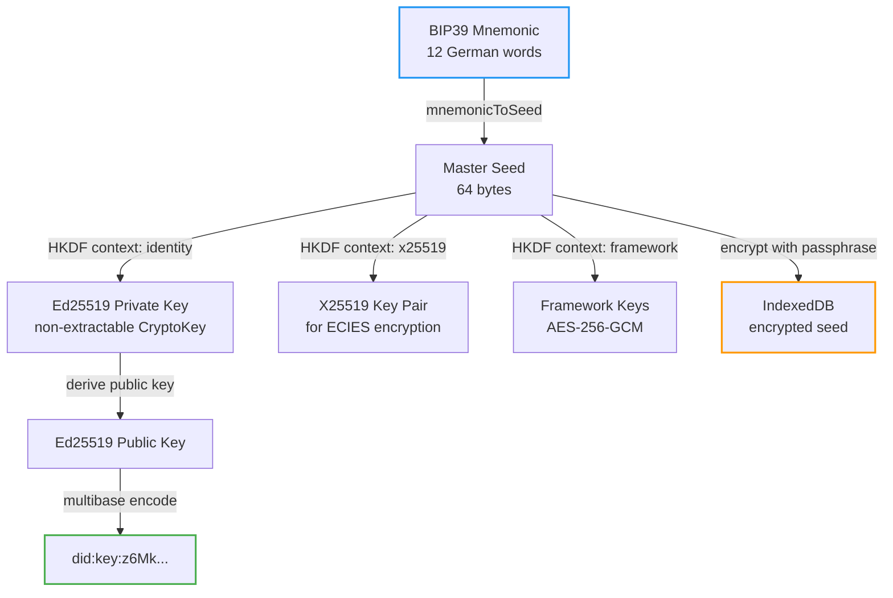

# Identity & Key Architecture

> How Web of Trust generates, protects, and manages cryptographic identities.

**Status:** Implemented (POC)
**Decision:** `did:key` confirmed after evaluating 6 DID methods
**Last updated:** 2026-03-16

---

## Overview

Every Web of Trust identity is derived from a single **BIP39 mnemonic** (12 German words). One seed, one identity, across all devices and all layers.

```
BIP39 Mnemonic (12 words, user writes down)
    │
    ▼
Master Seed (encrypted at rest in IndexedDB)
    │ HKDF
    ├──► Identity Key (Ed25519, non-extractable CryptoKey)
    │       └──► DID (did:key:z6Mk...)
    │
    ├──► Signing Key (Ed25519, for envelope auth)
    │
    ├──► Encryption Key (X25519, for ECIES)
    │
    └──► Framework Keys (AES-256-GCM, for CRDT encryption)
```

### Security Layers

1. **Encryption at rest** — Master seed encrypted with AES-256-GCM, key derived from user passphrase via PBKDF2 (600k iterations)
2. **Non-extractable private key** — Identity private key imported as non-extractable `CryptoKey`. JavaScript cannot export it. Only usable via `crypto.subtle.sign()`
3. **Deterministic derivation** — Same mnemonic always produces the same DID. No server needed for identity recovery
4. **Passphrase protection** — App requires passphrase to unlock (decrypt seed from IndexedDB)

---

## DID Method: did:key

### Why did:key?

We evaluated 6 DID methods and chose `did:key` for its simplicity, offline capability, and zero infrastructure requirements.

```
did:key:z6MkpTHz...
         └── multibase-encoded Ed25519 public key
```

### Comparison

| Criteria | did:key | did:peer | did:web | did:webvh | did:dht | did:plc |
|----------|---------|----------|---------|-----------|---------|---------|
| **No infrastructure** | Yes | Yes | No | No | Yes | No |
| **Offline** | Yes | Yes | No | No | Partial | No |
| **Key rotation** | No | Yes | Yes | Yes | Yes | Yes |
| **Discovery** | No | No | Yes | Yes | Yes | Yes |
| **Decentralized** | Yes | Yes | Partial | Partial | Yes | No |
| **Simplicity** | Yes | Partial | Partial | No | No | Partial |
| **Self-certifying** | Yes | Yes | No | Yes | Yes | No |

### Why not the others?

| Method | Reason eliminated |
|--------|-------------------|
| **did:peer** | Adds complexity without clear benefit for our use case. Deferred as potential future addition for 1:1 channels |
| **did:web** | Depends on domain ownership. Centralization risk. Contradicts our philosophy |
| **did:webvh** | Most robust for key rotation, but too complex for POC |
| **did:dht** | Interesting for discovery, but dependency on BitTorrent DHT |
| **did:plc** | Centralized registry (Bluesky). Philosophically incompatible |

### Key Loss & Recovery

| Scenario | Solution |
|----------|----------|
| **Lost device** | Enter mnemonic on new device → same DID restored |
| **Forgotten passphrase** | Enter mnemonic → set new passphrase |
| **Compromised key** | No rotation possible with did:key — requires Social Recovery (future) |

Social Recovery (Shamir Secret Sharing) is the planned solution for key compromise. See [Social Recovery](social-recovery.md).

---

## Key Derivation Flow



### DID Document

Although no resolver is needed, a DID Document can be derived from any `did:key`:

```json
{
  "@context": [
    "https://www.w3.org/ns/did/v1",
    "https://w3id.org/security/suites/ed25519-2020/v1"
  ],
  "id": "did:key:z6MkhaXgBZDvotDkL5257faiztiGiC2QtKLGpbnnEGta2doK",
  "verificationMethod": [{
    "id": "did:key:z6Mk...#z6Mk...",
    "type": "Ed25519VerificationKey2020",
    "controller": "did:key:z6Mk...",
    "publicKeyMultibase": "z6MkhaXgBZDvotDkL5257faiztiGiC2QtKLGpbnnEGta2doK"
  }],
  "authentication": ["did:key:z6Mk...#z6Mk..."],
  "assertionMethod": ["did:key:z6Mk...#z6Mk..."],
  "keyAgreement": [{
    "id": "did:key:z6Mk...#z6LS...",
    "type": "X25519KeyAgreementKey2020",
    "controller": "did:key:z6Mk...",
    "publicKeyMultibase": "z6LSbysY2xFMRpGMhb7tFTLMpeuPRaqaWM1yECx2AtzE3KCc"
  }]
}
```

The `keyAgreement` entry contains the **X25519 public key** derived from the Ed25519 key — used for ECIES encryption (key exchange without revealing private keys).

### Cryptographic Primitives

| Purpose | Algorithm | Standard |
| --- | --- | --- |
| Signatures | Ed25519 | RFC 8032 |
| Key Agreement | X25519 | RFC 7748 |
| Symmetric Encryption | AES-256-GCM | NIST SP 800-38D |
| Key Derivation | HKDF | RFC 5869 |
| Hashing | SHA-256 | FIPS 180-4 |
| Multibase Encoding | base58btc | Multibase Spec |
| Multicodec Prefix | 0xed01 (Ed25519) | Multicodec Table |

### Wordlist

We use the **dys2p German BIP39 wordlist** — not the standard English wordlist. This makes the mnemonic more accessible for our primarily German-speaking community.

### Multi-Device

Same mnemonic on multiple devices produces the same DID. No server coordination needed. Devices sync data via Relay + Vault, but identity is purely local.

---

## Storage

```
IndexedDB
├── encrypted-seed     → AES-256-GCM(PBKDF2(passphrase), master-seed)
├── identity-cache     → { did, publicKey } (for fast unlock display)
└── compact-store      → CRDT snapshots (Yjs/Automerge)
```

The private key **never** leaves the browser's `CryptoKey` store. The seed is encrypted at rest. Only the user's passphrase can unlock it.

---

## Future Considerations

### Key Rotation (deferred)

`did:key` cannot rotate keys (DID = public key). If key compromise becomes a real concern:
- **Short-term:** Social Recovery via Shamir — guardians help reconstruct seed
- **Long-term:** Evaluate `did:peer` for relationship-scoped key rotation, or `did:webvh` for verifiable history

### WebAuthn Upgrade (deferred)

Optional hardware-backed security for power users:
- Biometric auth (TouchID/FaceID)
- PRF extension for seed encryption
- Not yet implemented — browser support for PRF is still limited

### Device Keys (planned)

Currently all devices share the same master key. Future architecture:
- Master key stays on primary device
- Secondary devices receive UCAN capabilities via AuthorizationAdapter
- Device registry in wot-profiles for encrypted message routing

---

## Reference: Murmurations Network

[Murmurations](https://github.com/MurmurationsNetwork) independently chose the same stack: **did:key + Ed25519 + UCAN** for their MurmurMaps app. Key difference: they use non-exportable keys with email recovery. We use BIP39 mnemonics — no email, no server dependency for recovery.

---

*Merged from: did-methods.md (2026-02-07) + identity-security.md (2026-02-06)*
*Decision: did:key confirmed, did:web rejected. See [CURRENT_IMPLEMENTATION.md](../CURRENT_IMPLEMENTATION.md)*