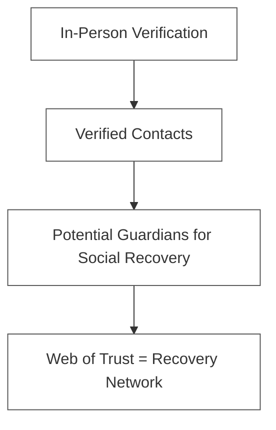

# Social Recovery

> Research findings: How do we protect users from key loss and key compromise?

**Status:** Deferred — planned when federation is needed
**Date:** 2026-02-07
**Context:** Evaluated after DID methods research

> **Note:** Layer 1 (BIP39 seed backup) is already implemented. Layers 2 and 3 are deferred.
> The Guardian model (Layer 3) requires key rotation, which in turn requires federation or a DID
> method that supports rotation (e.g. did:peer). Social Recovery will be revisited once federation
> becomes a concrete requirement.

---

## Problem

Two fundamentally different scenarios:

| Scenario | Description | Risk |
|----------|-------------|------|
| **Key loss** | Phone broken, browser data deleted, seed forgotten | Identity no longer accessible |
| **Key compromise** | Seed stolen, device hacked | Attacker can act as you |

BIP39 mnemonic solves key loss (write down the seed). But: what if the piece of paper is lost too? And BIP39 does nothing against key compromise.

---

## Two Main Approaches

### 1. Shamir Secret Sharing (Seed Reconstruction)

**Principle:** The BIP39 mnemonic is mathematically split into N shares ("shards"). Any M-of-N shards are sufficient to reconstruct the original.

```
Alice's Seed (12 words)
         |
Shamir Secret Sharing (3-of-5)
         |
┌─────────┬─────────┬─────────┬─────────┬─────────┐
│ Shard 1 │ Shard 2 │ Shard 3 │ Shard 4 │ Shard 5 │
│  (Bob)  │ (Carol) │ (David) │  (Eva)  │ (Frank) │
└─────────┴─────────┴─────────┴─────────┴─────────┘

Reconstruction: any 3 of 5 shards → original seed
```

**Mathematics:**
- Shamir's Secret Sharing (1979) is based on polynomial interpolation
- Information-theoretically secure: M-1 shards reveal NOTHING about the secret
- Well-established algorithm, widely implemented

**Reference implementation: Dark Crystal (Scuttlebutt)**
- P2P social key backup
- Custodians store shards in their local SSB feed
- Open source: https://darkcrystal.pw/
- No server required

**Advantages:**
- Original key is reconstructed → DID remains identical
- Mathematically proven secure
- Works with any DID method
- No waiting period

**Disadvantages:**
- Shards must be transmitted and stored securely
- Collusion risk: M custodians together could steal the key
- Does NOT help with key compromise (attacker already has the key)
- Custodians must be reachable when recovery is needed

**Library note:** Use `secrets.js-grempe` for Shamir Secret Sharing in JavaScript — not `@noble/secp256k1`, which is a secp256k1 elliptic curve library and unrelated to secret sharing.

---

### 2. Guardian/Vouching (Key Authorization)

**Principle:** No secret is ever shared. Trusted "guardians" vote together to authorize a new key.

```
Alice loses her key
         |
Alice creates a new key pair
         |
Alice contacts her guardians
         |
┌─────────┬─────────┬─────────┬─────────┬─────────┐
│ Bob ✅  │Carol ✅ │David ❌ │ Eva ✅  │Frank ❌ │
│confirms │confirms │  (not   │confirms │  (not   │
│         │         │reachable│         │reachable│
└─────────┴─────────┴─────────┴─────────┴─────────┘
3 of 5 confirm → new key is authorized
```

**Reference: Vitalik Buterin's Social Recovery Wallet**
- Signing key (daily use) + guardian set (recovery)
- Guardians are ordinary people with their own wallets
- M-of-N guardians confirm new signing key
- 1–3 day delay (protection against social engineering)
- Source: https://vitalik.eth.limo/general/2021/01/11/recovery.html

**Advantages:**
- No secret is ever shared → no collusion risk
- Also works for key compromise
- Guardians can deactivate the old key
- Naturally decentralized
- Guardians need no special setup

**Disadvantages:**
- DID changes (with did:key) → all links must be migrated
- Requires a DID method with key rotation OR a mapping layer
- Social engineering risk
- Waiting period required (protection, but also a barrier)

---

## Comparison: Which Approach for Which Scenario?

| Scenario | Shamir | Guardians |
|----------|--------|-----------|
| Phone lost | Reconstruct seed → same DID | New DID, migrate old connections |
| Seed forgotten | Reconstruct seed | New DID |
| Key compromised | **Does NOT help** | Deactivate old key, authorize new one |
| Long-term security | Key stays the same | Key rotation possible |
| Complexity | Lower | Higher |
| Recovery time | Immediate (if shards available) | 1–3 day waiting period |

**Shamir solves key loss. Guardians solve key compromise.** Together they cover all cases.

---

## Our Advantage: WoT = Guardian Network

In Vitalik's model, you have to artificially designate guardians. In our system **they already exist**: the people who have been verified in person. Our contacts with "verified" status are natural guardians.



---

## Proposed Architecture

### Three Protection Layers

```
Layer 1: Self-protection (BIP39)             ← IMPLEMENTED
  → Write down 12 words
  → Optional: encrypted backup (USB stick, safe)
  → Coverage: key loss (simplest case)

Layer 2: Social Recovery — Shamir            ← DEFERRED
  → Split seed into shards
  → Distribute shards to verified contacts
  → 3-of-5 required for reconstruction
  → Coverage: key loss when paper is also gone
  → Library: secrets.js-grempe

Layer 3: Guardian Recovery — Vouching        ← DEFERRED (needs federation)
  → Verified contacts as guardians
  → Guardians confirm new key pair
  → Migrate old verifications to new DID
  → Coverage: key compromise
  → Requires: key rotation (did:peer or mapping layer)
```

### Priority

| Layer | When to implement | Effort |
|-------|-------------------|--------|
| **Layer 1** | Already done (BIP39) | — |
| **Layer 2** (Shamir) | When federation is needed | Medium |
| **Layer 3** (Guardians) | Later | High (requires key rotation) |

---

## Shamir Implementation Plan

### User Flow

```
Setup (one-time):
1. Alice opens "Set up Recovery"
2. Selects 5 verified contacts as custodians
3. Selects threshold: 3-of-5
4. App generates 5 shards from her seed
5. Per custodian: display QR code → custodian scans
6. Custodian confirms receipt
7. Shard is stored encrypted at the custodian

Recovery:
1. Alice has a new device, seed is lost
2. Creates a new temporary identity
3. Contacts 3+ custodians (in person, phone, etc.)
4. Custodians open "Send Recovery Shard"
5. Shard transmitted via QR code or encrypted channel
6. App reconstructs seed from 3 shards
7. Alice has her identity back
```

### Technical Building Blocks

- **Shamir Library:** `secrets.js-grempe` (JavaScript — note: NOT `@noble/secp256k1`)
- **Shard format:** Encrypted with the custodian's public key
- **Transport:** QR code (in person), or encrypted message
- **Storage:** In the custodian's contact storage (new `shards` field)

### Open Questions

- How do you update shards when the custodian set changes?
- What if a custodian loses their own key?
- Should the threshold be configurable or fixed?
- Should shards have an expiry date?

---

## Sources of Inspiration

| Project | Approach | What we can learn |
|---------|----------|-------------------|
| **Dark Crystal** (SSB) | Shamir + P2P | UX for shard distribution, custodian management |
| **Vitalik's Social Recovery** | Guardians | Guardian set management, waiting periods |
| **Argent Wallet** | Smart contract guardians | Mobile UX for recovery |
| **KERI** | Pre-rotation keys | Key rotation without a central server |
| **Murmurations** | Email reset | What we do NOT want (centralized) |

---

## Relationship to DID Methods

See [did-methods-comparison.md](./did-methods-comparison.md) for details.

**Summary:**
- **Shamir** works with any DID method (seed is reconstructed → same DID)
- **Guardians** require key rotation → did:key alone is not sufficient
- **Hybrid** (did:key + did:peer): did:key as public identity, did:peer for relationships with rotation
- **Long-term:** WoT layer is method-agnostic → different users can use different methods

---

*Created: 2026-02-07 | Context: Research session with Anton*
*Last reviewed: 2026-03-16 | Status: Deferred pending federation decision*
