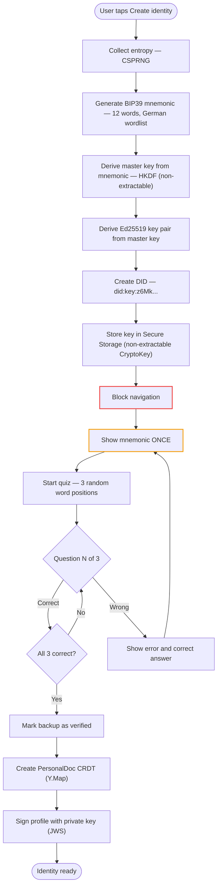
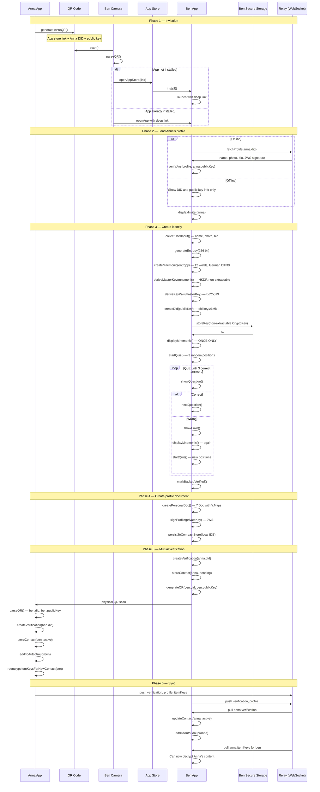
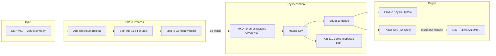
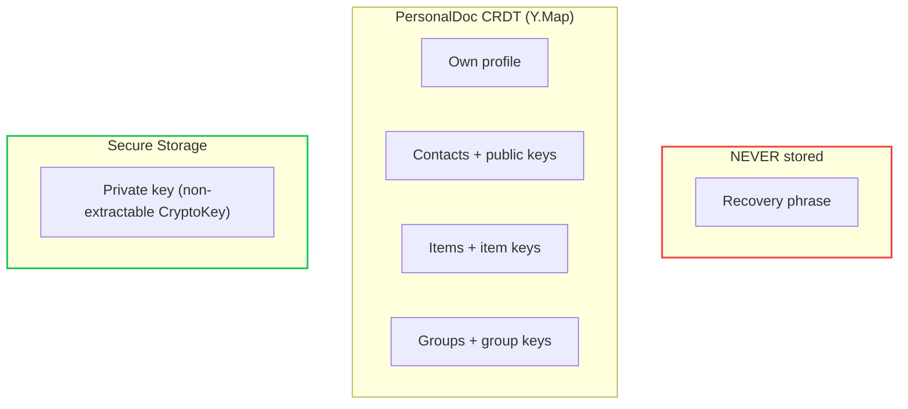
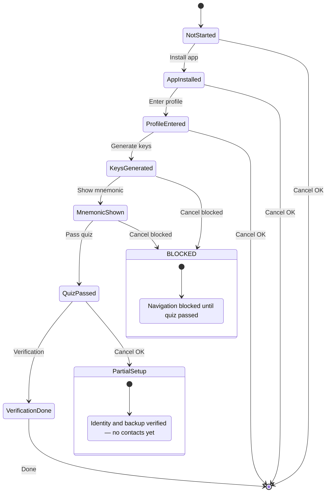
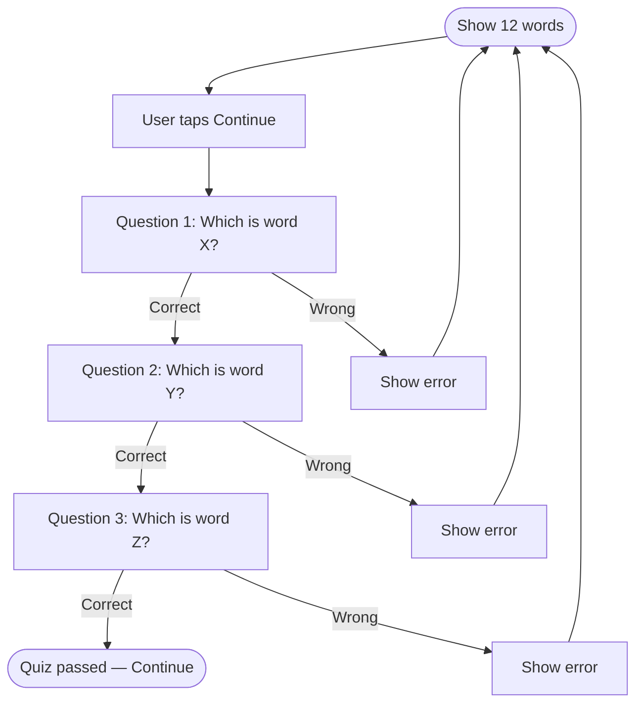
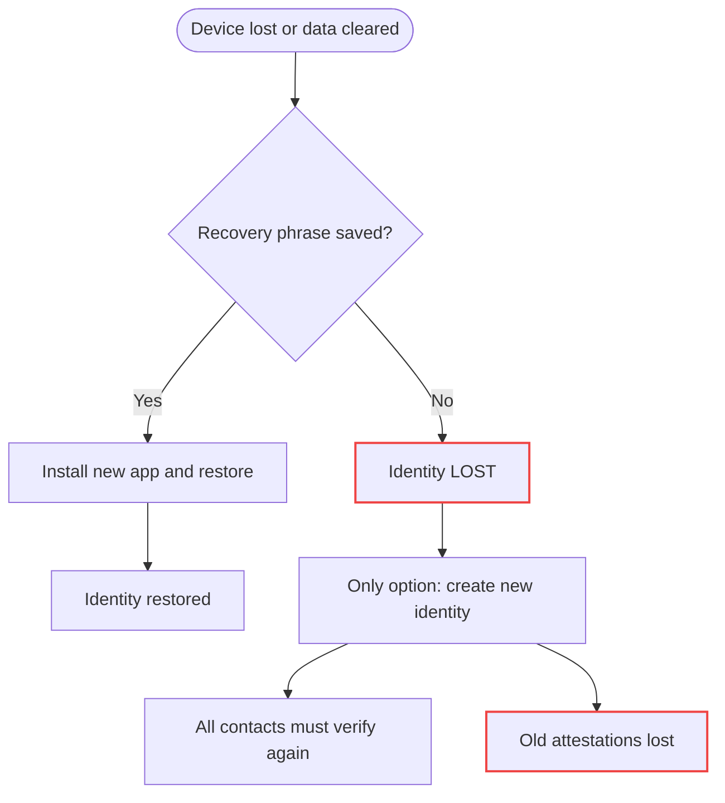

# Onboarding Flow (Technical Perspective)

> How a new identity is created and integrated into the network

## Detail Flow: Identity Creation



## Sequence Diagram: Full Onboarding



## Cryptographic Details

### Key Generation



### DID Structure

```
did:key:z6MkpTHz8SrJgQi3oWFG7Ahs7pFHCmzCyMFVMdBr9ZFm
        └──────────────────────────────────────────── Multibase-encoded
                                                       Ed25519 public key
                                                       (W3C did:key spec)
```

The `z6Mk...` prefix indicates Ed25519 in the multicodec registry. No custom infrastructure required — any W3C DID resolver can verify it.

### Profile Signature

Profiles are published as JWS (JSON Web Signature):

```json
{
  "type": "Profile",
  "id": "did:key:z6MkpTHz8SrJgQi3oWFG7Ahs7pFHCmzCyMFVMdBr9ZFm",
  "name": "Ben Schmidt",
  "photo": "ipfs://Qm...",
  "bio": "New to the area",
  "publicKey": {
    "type": "Ed25519VerificationKey2020",
    "publicKeyMultibase": "z6MkpTHz8SrJgQi3oWFG7..."
  },
  "updated": "2025-01-08T14:30:00Z"
}
```

The JWS proof is a detached Ed25519 signature produced by `WotIdentity.signJws()`. The private key never leaves the device.

## Invite QR vs. Standard QR

### Standard QR (for existing users)

```json
{
  "type": "wot-identity",
  "did": "did:key:z6MkpTHz8SrJgQi3oWFG7...",
  "pk": "z6MkpTHz8SrJgQi3oWFG7..."
}
```

### Invite QR (for onboarding)

```json
{
  "type": "wot-invite",
  "app": "https://web-of-trust.de/download",
  "did": "did:key:z6MkpTHz8SrJgQi3oWFG7...",
  "pk": "z6MkpTHz8SrJgQi3oWFG7...",
  "token": "optional-invite-token"
}
```

The optional `token` can be used for analytics or special invite flows.

## Secure Storage

### Platform-specific

| Platform | Storage | Details |
| -------- | ------- | ------- |
| iOS | Keychain | `kSecClassKey`, hardware-backed when available |
| Android | Keystore | AndroidKeyStore, TEE/Strongbox when available |
| Web | Web Crypto API + IndexedDB | `extractable: false`, key never exportable as raw bytes |

### Web Crypto API Details

```typescript
// Derive non-extractable master key from mnemonic via HKDF
const masterKey = await crypto.subtle.importKey(
  "raw",
  mnemonicBytes,
  { name: "HKDF" },
  false,  // extractable = false
  ["deriveKey", "deriveBits"]
);

// Derive framework-specific sub-key (e.g. for signing)
const signingKey = await crypto.subtle.deriveKey(
  { name: "HKDF", hash: "SHA-256", salt, info },
  masterKey,
  { name: "Ed25519" },
  false,  // still non-extractable
  ["sign"]
);

// Store CryptoKey object directly in IndexedDB
const db = await openDB("wot-keys", 1);
await db.put("keys", signingKey, "signingKey");

// Key can only be used for signing — never exported
const signature = await crypto.subtle.sign(
  { name: "Ed25519" },
  signingKey,
  data
);
```

### Web-specific risks

| Risk | Mitigation |
| ---- | ---------- |
| Clearing browser data deletes keys | Recovery phrase is the ONLY way back |
| No cross-device sync via browser | User must restore on each new device |
| Browser update could break storage | Unlikely, but monitoring recommended |

**Consequence:** Recovery phrase backup is even more critical on the web than on native apps.

### What is stored



**CRITICAL:** The recovery phrase is never stored anywhere. It is displayed **exactly once** during identity creation. The user MUST pass the quiz to continue — there are no unsecured accounts.

## Error Handling

### Onboarding cancellation



### Quiz flow in detail



**Notes:**

- X, Y, Z are random positions (1–12)
- New positions are chosen on every restart
- Multiple choice with 4 options (1 correct, 3 wrong from the wordlist)
- No skipping possible

## Security Considerations

### Threat Model

| Threat | Mitigation |
| ------ | ---------- |
| Mnemonic photographed | Warning + OS screenshot protection on mnemonic screen |
| Shoulder surfing | Private environment recommended |
| Malware on device | Secure Storage / Web Crypto uses hardware isolation |
| Server compromise | Private key never leaves the device |
| QR code forgery | Profile is JWS-signed — forgery is detectable |
| Browser data cleared (web) | Recovery via mnemonic — only way back |

### Best Practices

1. **Mnemonic shown ONLY ONCE** — never stored anywhere
2. **Quiz is MANDATORY** — no continuing without 3 correct answers
3. **Block navigation** — between key generation and quiz completion
4. **No cloud key backup** — only mnemonic on paper
5. **Biometrics optional** — for app unlock, not for key access

### Recovery Scenario


