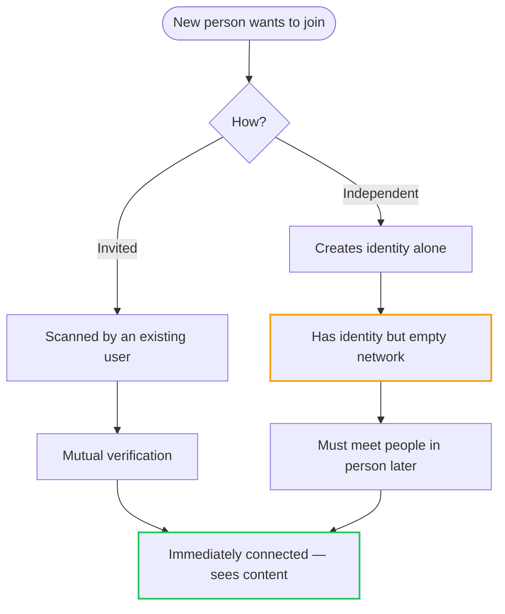
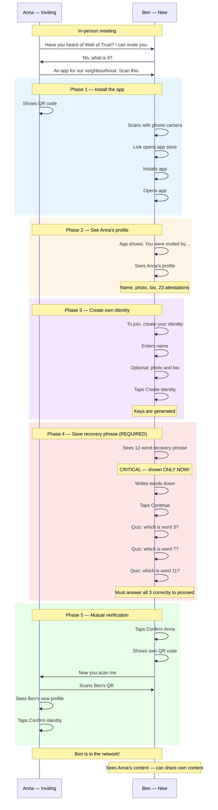
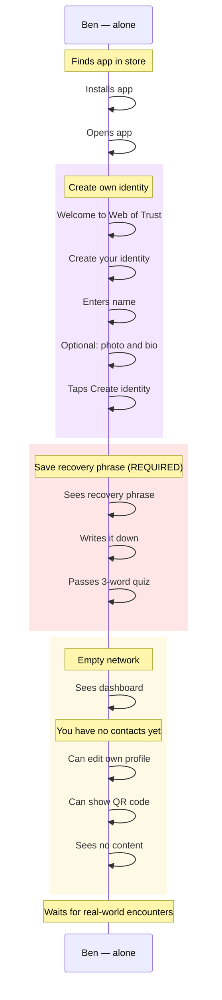
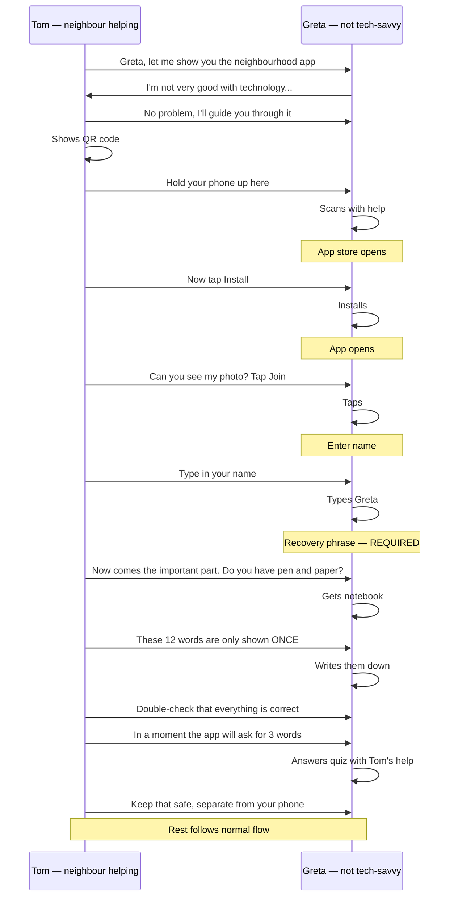
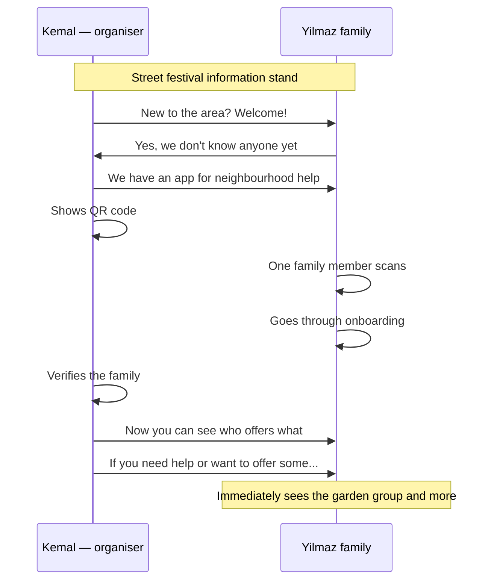
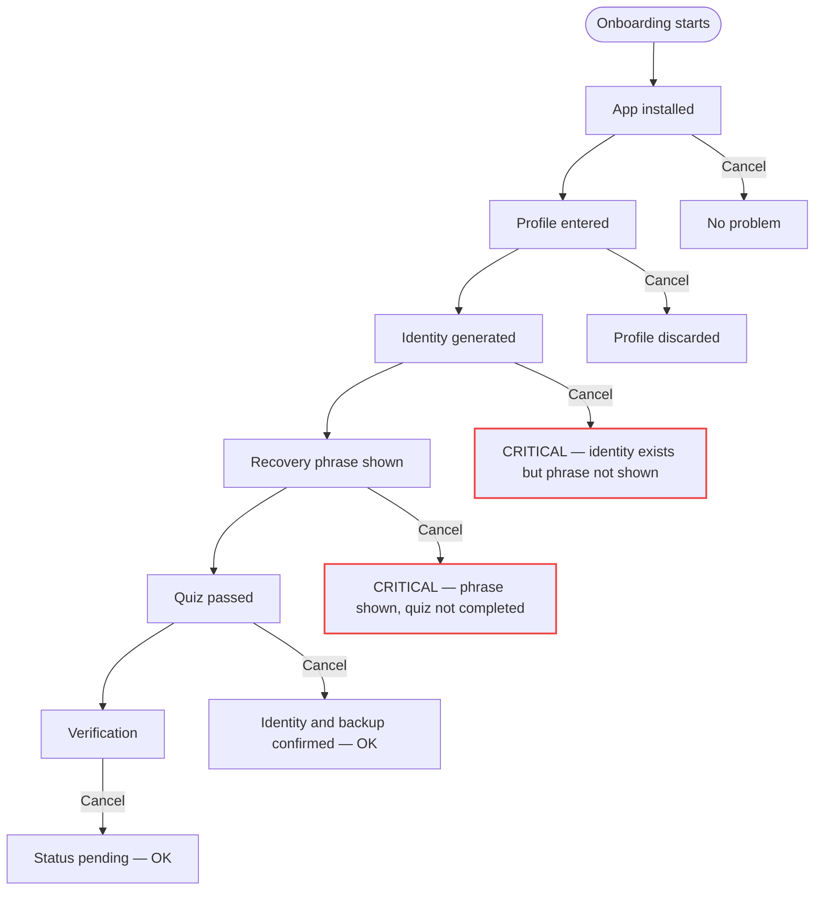

# Onboarding Flow (User Perspective)

> How a new user joins the network

## Overview: Two Paths into the Network



## Main Flow: Onboarding via Invitation



## Variant: Independent Onboarding



## What the User Sees

### Welcome Screen (invited)

```
┌─────────────────────────────────┐
│                                 │
│      🌐 Web of Trust            │
│                                 │
│   You were invited by:          │
│                                 │
│         📷 [Profile photo]      │
│          Anna Müller            │
│                                 │
│   "Active in the Sonnenberg     │
│    community garden"            │
│                                 │
│   ✅ 23 attestations            │
│   ✅ 47 verifications           │
│                                 │
├─────────────────────────────────┤
│                                 │
│   [ Join now ]                  │
│                                 │
│   What is Web of Trust? ℹ️       │
│                                 │
└─────────────────────────────────┘
```

### Create profile

```
┌─────────────────────────────────┐
│                                 │
│   Create your profile           │
│                                 │
│   ┌─────────────────────────┐   │
│   │                         │   │
│   │     📷 Add photo        │   │
│   │       (optional)        │   │
│   │                         │   │
│   └─────────────────────────┘   │
│                                 │
│   Name *                        │
│   ┌─────────────────────────┐   │
│   │ Ben Schmidt             │   │
│   └─────────────────────────┘   │
│                                 │
│   About me (optional)           │
│   ┌─────────────────────────┐   │
│   │ New to the area,        │   │
│   │ interested in...        │   │
│   └─────────────────────────┘   │
│                                 │
│   [ Continue ]                  │
│                                 │
└─────────────────────────────────┘
```

### Recovery phrase (REQUIRED)

```
┌─────────────────────────────────┐
│                                 │
│   🔐 Your recovery phrase       │
│                                 │
│   ⚠️  IMPORTANT — READ THIS!    │
│                                 │
│   These 12 words are shown      │
│   to you ONLY NOW.              │
│   They CANNOT be retrieved      │
│   again!                        │
│                                 │
│   ┌─────────────────────────┐   │
│   │                         │   │
│   │  1. absurd   7. fenster │   │
│   │  2. banane   8. garten  │   │
│   │  3. chaos    9. haus    │   │
│   │  4. dichte  10. irrtum  │   │
│   │  5. eiche   11. jagd    │   │
│   │  6. fluss   12. kiefer  │   │
│   │                         │   │
│   └─────────────────────────┘   │
│                                 │
│   📝 Write them down NOW        │
│   🚫 Do not take a screenshot   │
│   🔒 Store them somewhere safe  │
│                                 │
│   [ Continue to quiz ]          │
│                                 │
└─────────────────────────────────┘
```

### Verify phrase (REQUIRED)

```
┌─────────────────────────────────┐
│                                 │
│   Confirm your backup           │
│                                 │
│   Which is word number 4?       │
│                                 │
│   ┌─────────┐ ┌─────────┐       │
│   │ dichte  │ │  eiche  │       │
│   └─────────┘ └─────────┘       │
│   ┌─────────┐ ┌─────────┐       │
│   │ fluss   │ │ absurd  │       │
│   └─────────┘ └─────────┘       │
│                                 │
│   ━━━━━━━━━━━━━━━━━━━━━━━━━━━   │
│   Question 1 of 3               │
│                                 │
└─────────────────────────────────┘
```

On wrong answer:

```
┌─────────────────────────────────┐
│                                 │
│   ❌ Incorrect                  │
│                                 │
│   Word 4 is "dichte"            │
│                                 │
│   Please check your notes       │
│   and try again.                │
│                                 │
│   [ Back to phrase ]            │
│                                 │
└─────────────────────────────────┘
```

### Confirm first contact

```
┌─────────────────────────────────┐
│                                 │
│   ✅ Your identity was created! │
│                                 │
│   Now confirm Anna:             │
│                                 │
│         📷 [Anna's photo]       │
│          Anna Müller            │
│                                 │
│   Is this the person standing   │
│   in front of you right now?    │
│                                 │
│   [ Yes, confirm identity ]     │
│                                 │
│   [ No, cancel ]                │
│                                 │
└─────────────────────────────────┘
```

### Show QR code

```
┌─────────────────────────────────┐
│                                 │
│   Almost done!                  │
│                                 │
│   Show Anna this code:          │
│                                 │
│   ┌─────────────────────────┐   │
│   │                         │   │
│   │      ▄▄▄▄▄▄▄▄▄▄▄       │   │
│   │      █ QR-CODE █       │   │
│   │      █         █       │   │
│   │      ▀▀▀▀▀▀▀▀▀▀▀       │   │
│   │                         │   │
│   └─────────────────────────┘   │
│                                 │
│   Ben Schmidt                   │
│   did:key:z6MkpTHz...          │
│                                 │
│   "Now you scan me"             │
│                                 │
└─────────────────────────────────┘
```

### Welcome to the network

```
┌─────────────────────────────────┐
│                                 │
│   🎉 Welcome to the network!    │
│                                 │
│   You are now connected with:   │
│                                 │
│   👩 Anna Müller                │
│                                 │
├─────────────────────────────────┤
│                                 │
│   Next steps:                   │
│                                 │
│   📅 See Anna's events          │
│                                 │
│   🗺️  Places nearby             │
│                                 │
│   👥 Meet more people           │
│                                 │
│   [ Let's go ]                  │
│                                 │
└─────────────────────────────────┘
```

## Personas During Onboarding

### Greta (62) — needs help



### The Yilmaz family — street festival



## Edge Cases

### Cancelling during onboarding



**Important:**

- After step 3 (identity generated) the app blocks navigation away
- The user MUST pass the quiz to continue
- If the app is closed during phrase display or quiz: on next launch the app shows the phrase again and requires quiz completion

### Quiz not passed

If the user gives a wrong answer:

1. Error message with correct answer
2. Back to phrase display
3. Quiz restarts with new random word positions

There is **no way** to skip the quiz.
