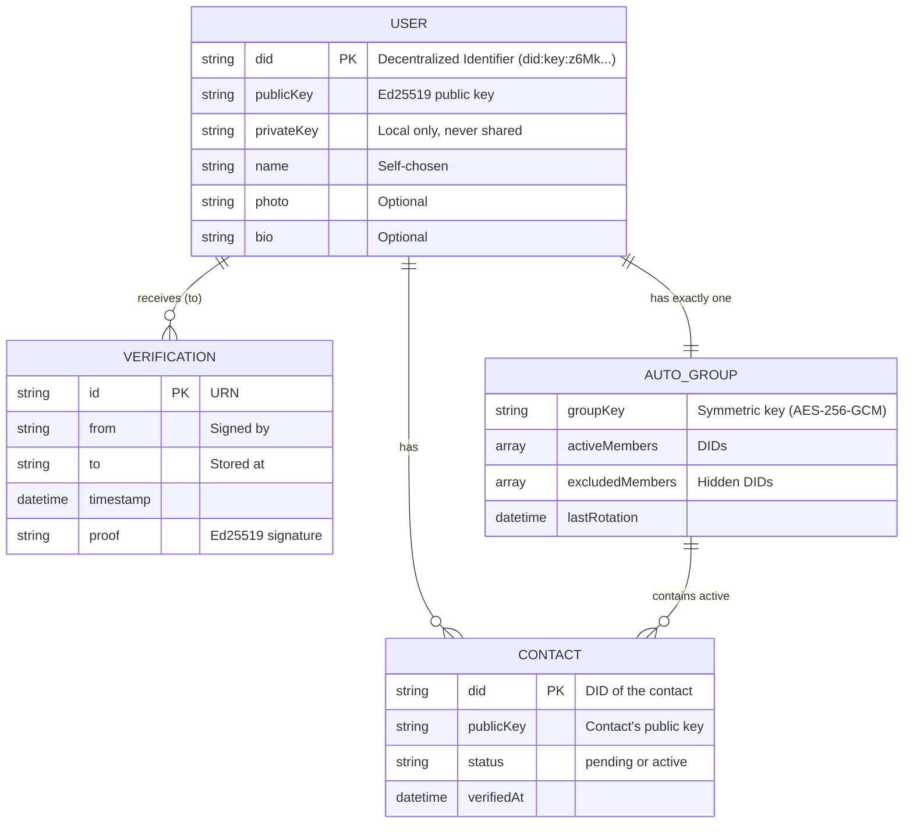
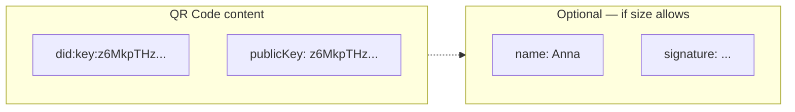
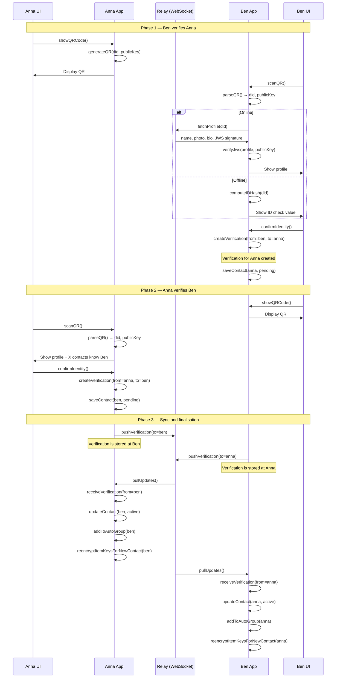
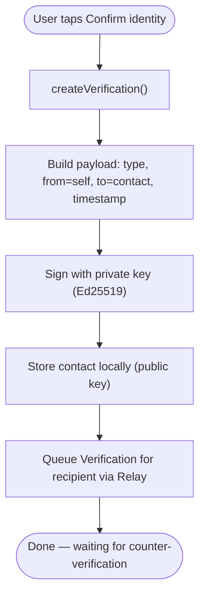
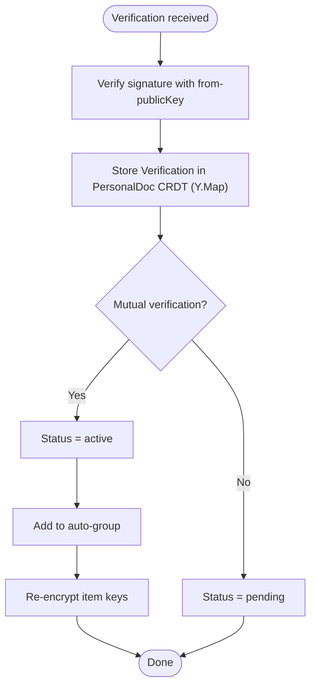
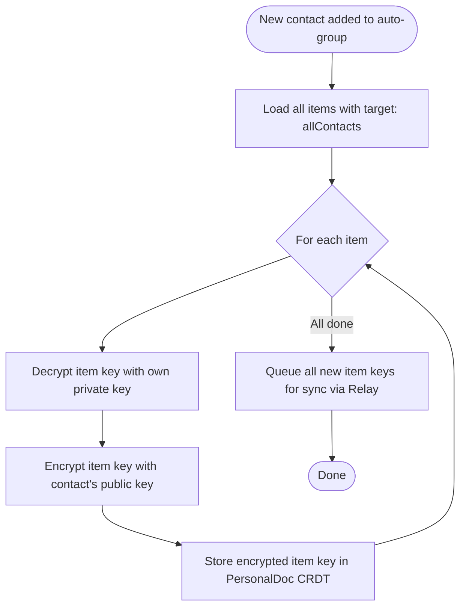
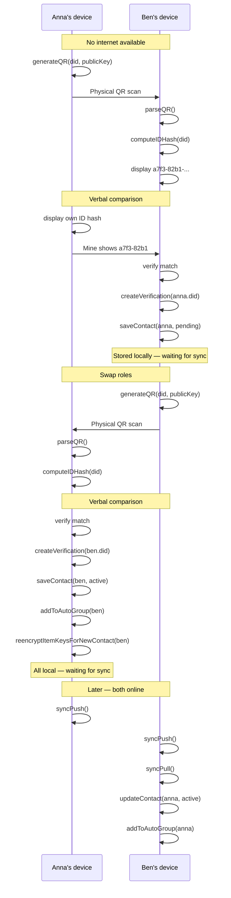
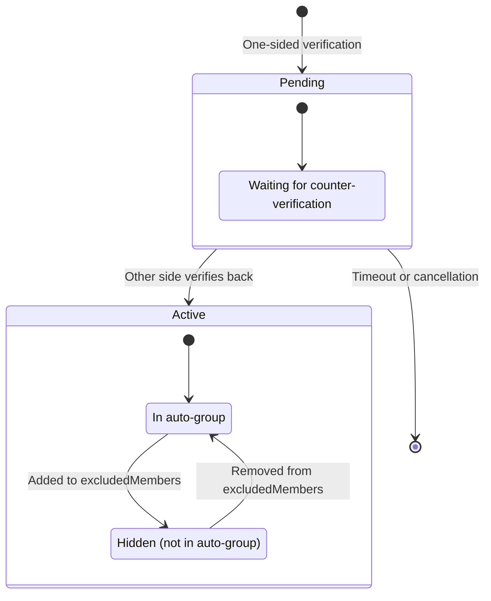

# Verification Flow (Technical Perspective)

> What the devices and the system do

## Data Model



> **Recipient principle:** Verifications are stored at the recipient (`to`). Ben verifies Anna → the Verification is stored at **Anna**.

## QR Code Structure



**Minimal (print-friendly):**

```json
{
  "did": "did:key:z6MkpTHz8SrJgQi3oWFG7Ahs7pFHCmzCyMFVMdBr9ZFm",
  "pk": "z6MkpTHz8SrJgQi3oWFG7Ahs7pFHCmzCyMFVMdBr9ZFm"
}
```

**Extended (digital QR):**

```json
{
  "did": "did:key:z6MkpTHz8SrJgQi3oWFG7Ahs7pFHCmzCyMFVMdBr9ZFm",
  "pk": "z6MkpTHz8SrJgQi3oWFG7Ahs7pFHCmzCyMFVMdBr9ZFm",
  "name": "Anna Müller",
  "sig": "signature_of_payload"
}
```

## Main Flow: Mutual Verification



> **Note:** The Verification is sent to the recipient (`to`) and stored there. Ben's Verification for Anna lands at Anna; Anna's Verification for Ben lands at Ben.

## Detail Flow: Creating a Verification





**Prerequisite:** User already has an identity (see Flow 01: Onboarding).

> **Two phases:** (1) Create and send the Verification to the recipient; (2) Receive and process the counter-verification.

## Detail Flow: Re-encrypting Item Keys



## Detail Flow: Offline Verification



## State Diagram: Contact Status



### Contact status details

| Status | In auto-group | Sees content | Receives item keys |
| ------ | ------------- | ------------ | ------------------ |
| Pending | No | No | No |
| Active | Yes | Yes (new) | Yes |
| Active + excluded | No | No (new) | No — old still readable |

> **Note:** Hiding a contact is done via `excludedMembers` in the auto-group, not by changing the contact status. A hidden contact remains `active`.

## Data Structures

### Verification Document

Stored at the **recipient** (`to`):

```json
{
  "type": "IdentityVerification",
  "id": "urn:uuid:123e4567-e89b-12d3-a456-426614174000",
  "from": "did:key:z6MkpTHz8SrJgQi3oWFG7Ahs7pFHCmzCyMFVMdBr9ZFm",
  "to": "did:key:z6MknGc3xNCLjFrSnBMBsNXZtE2jHicoAcBpN4CXTPPA",
  "timestamp": "2025-01-08T14:30:00Z",
  "proof": {
    "type": "Ed25519Signature2020",
    "verificationMethod": "did:key:z6MkpTHz8SrJgQi3oWFG7Ahs7pFHCmzCyMFVMdBr9ZFm#z6MkpTHz...",
    "proofValue": "z58DAdFfa9SkqZMVPxAQpic7ndTEcnUn..."
  }
}
```

| Field | Description |
| ----- | ----------- |
| `from` | Who verified (signer) |
| `to` | Who was verified (storage location) |

### Contact Record (local — PersonalDoc CRDT)

The sender stores only the **public key** of the contact (for E2E encryption):

```json
{
  "did": "did:key:z6MknGc3xNCLjFrSnBMBsNXZtE2jHicoAcBpN4CXTPPA",
  "publicKey": "z6MknGc3xNCLjFrSnBMBsNXZtE2jHicoAcBpN4CXTPPA",
  "name": "Ben Schmidt",
  "status": "active",
  "verifiedAt": "2025-01-08T14:30:00Z"
}
```

All contact records live inside the user's PersonalDoc CRDT (`Y.Map` keyed by DID).

> **Note:** Verification IDs (`myVerification`, `theirVerification`) are no longer needed, since Verifications reside at the respective recipient.

### Auto-Group (local — PersonalDoc CRDT)

```json
{
  "id": "urn:uuid:autogroup-anna",
  "type": "AutoContactGroup",
  "groupKey": "aes256:encrypted_with_own_pubkey...",
  "activeMembers": [
    "did:key:z6MknGc3xNCLjFrSnBMBsNXZtE2jHicoAcBpN4CXTPPA",
    "did:key:z6MkhaXgBZDvotDkL5257faiztiGiC2QtKLGpbnnEefRe"
  ],
  "excludedMembers": [
    "did:key:z6MksRvQSGBMDjS5E6rK9GXNt6qdQxLRgmUq5PKTPgvN"
  ],
  "lastKeyRotation": "2025-01-08T14:30:00Z"
}
```
