# Attestation Flow (Technical Perspective)

> How attestations are created, signed, and delivered

## Data Model

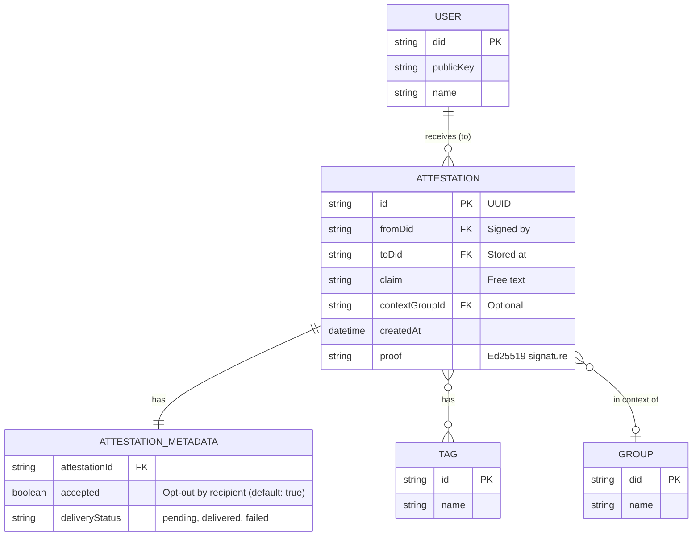

> **Recipient principle:** Attestations are stored at the recipient (`to`). Anna attests Ben → attestation lives in **Ben's** PersonalDoc CRDT (Y.Map).

> **`attestationMetadata.accepted`** replaces the old `hidden` field. Ben can set `accepted = false` to hide an attestation from his public profile.

## Attestation Document Structure

Stored in the **recipient's** PersonalDoc CRDT (`attestations` Y.Map):

```json
{
  "@context": "https://w3id.org/weboftrust/v1",
  "type": "Attestation",
  "id": "urn:uuid:550e8400-e29b-41d4-a716-446655440000",
  "from": "did:key:z6MkhaXgBZDvotDkL5257faiztiGiC2QtKLGpbnnEGta2doK",
  "to": "did:key:z6MkpTHR8VNsBxYAAWHut2Geadd9jSwuias8sisDArDJF6K2",
  "claim": "Helped for 3 hours in the community garden",
  "tags": ["garden", "helping"],
  "context": "did:key:z6MkGroup...",
  "createdAt": "2025-01-08T14:32:00Z",
  "proof": {
    "type": "Ed25519Signature2020",
    "verificationMethod": "did:key:z6MkhaXgBZDvotDkL5257faiztiGiC2QtKLGpbnnEGta2doK#key-1",
    "proofPurpose": "assertionMethod",
    "proofValue": "z58DAdFfa9SkqZMVPxAQpic7ndTEcnUn..."
  }
}
```

Stored separately in `attestationMetadata` Y.Map (mutable by recipient only):

```json
{
  "attestationId": "urn:uuid:550e8400-e29b-41d4-a716-446655440000",
  "accepted": true,
  "deliveryStatus": "delivered"
}
```

| Field | Description |
| --- | --- |
| `from` | Who attested (signer) |
| `to` | Who receives the attestation (storage location) |
| `attestationMetadata.accepted` | Recipient can hide (default: `true`) |

## Main Flow: Creating an Attestation

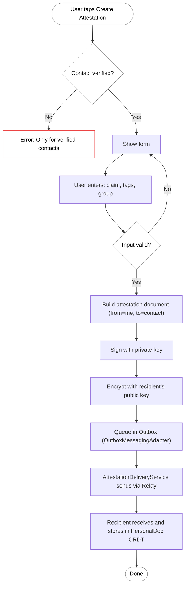

> **Note:** The attestation is encrypted for the recipient and sent via the Relay (WebSocket). The sender does not retain a local copy. Delivery is tracked via `attestationMetadata.deliveryStatus`.

## Sequence Diagram: Create and Deliver Attestation

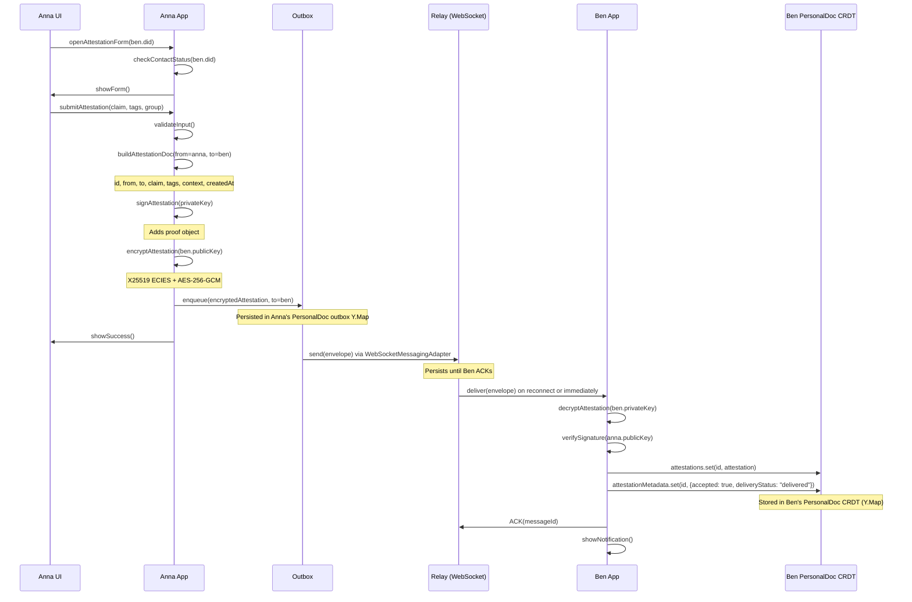

> **Recipient principle:** Anna sends the attestation to Ben. Ben stores it in his PersonalDoc CRDT (Y.Map) and controls visibility via `attestationMetadata.accepted`.

## Storage: PersonalDoc CRDT

Attestations are stored in the recipient's **PersonalDoc CRDT** using Yjs (default) or Automerge (option), not in a SQL/Dexie database.

```typescript
// PersonalDoc structure (simplified)
PersonalDoc {
  attestations:        Y.Map<string, AttestationDoc>
  attestationMetadata: Y.Map<string, { accepted: boolean, deliveryStatus: string }>
  outbox:              Y.Map<string, OutboxEntryDoc>
}
```

Access pattern:

```typescript
// Store received attestation (Ben's PersonalDoc)
doc.attestations[attestation.id] = attestation;
doc.attestationMetadata[attestation.id] = {
  accepted: true,
  deliveryStatus: "delivered",
};

// Hide an attestation (Ben opts out)
doc.attestationMetadata[attestation.id] = {
  ...doc.attestationMetadata[attestation.id],
  accepted: false,
};

// Query all accepted attestations for a DID
const received = Object.values(doc.attestations)
  .filter(a => a.to === ben.did)
  .filter(a => doc.attestationMetadata[a.id]?.accepted !== false);
```

The PersonalDoc is persisted via **CompactStore (IDB)**, synced in real-time via **Relay (WebSocket)**, and backed up via **Vault (HTTP)**.

## Detail Flow: Creating the Signature

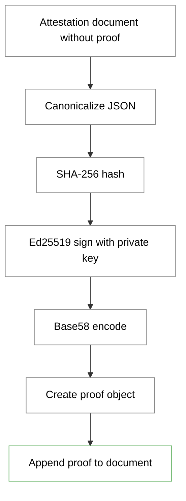

### Canonicalization

Before signing, the JSON must be canonicalized:

1. Sort keys alphabetically
2. No whitespace except within strings
3. UTF-8 encoding

```javascript
const canonical = JSON.stringify(doc, Object.keys(doc).sort());
const hash = sha256(canonical);
const signature = ed25519.sign(hash, privateKey);
const proofValue = base58.encode(signature);
```

## Detail Flow: Verifying the Signature

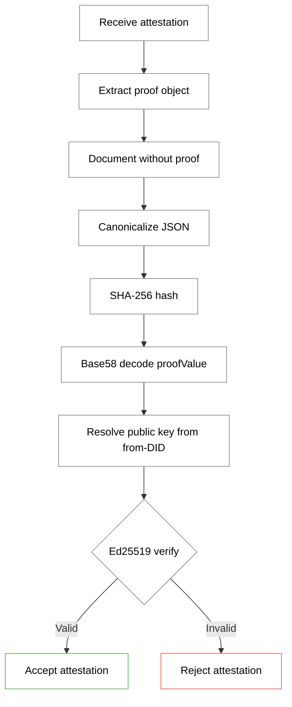

## Delivery: AttestationDeliveryService + Outbox

The **AttestationDeliveryService** handles the full delivery lifecycle:

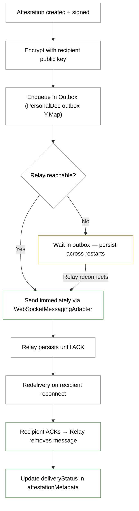

> **Offline-first:** If the sender is offline when creating an attestation, it is queued in the Outbox (stored in the PersonalDoc CRDT). On reconnect, the OutboxMessagingAdapter flushes the queue automatically.

## Encryption and Distribution

### Who receives the attestation?

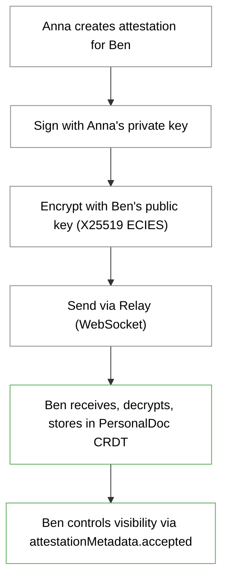

### Visibility after receipt

Ben controls who sees the attestation:

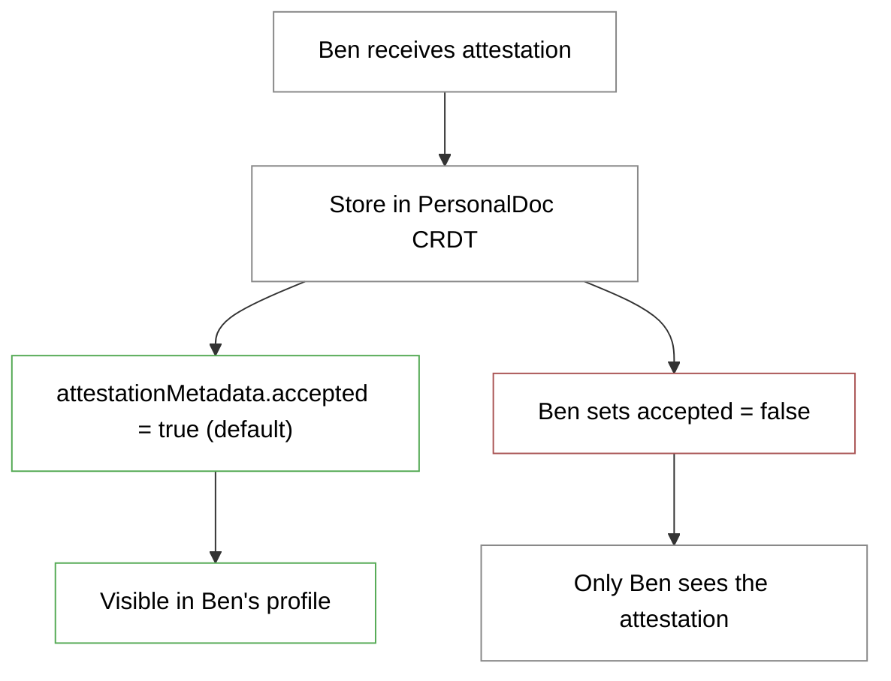

## Tags and Search

### Tag Management

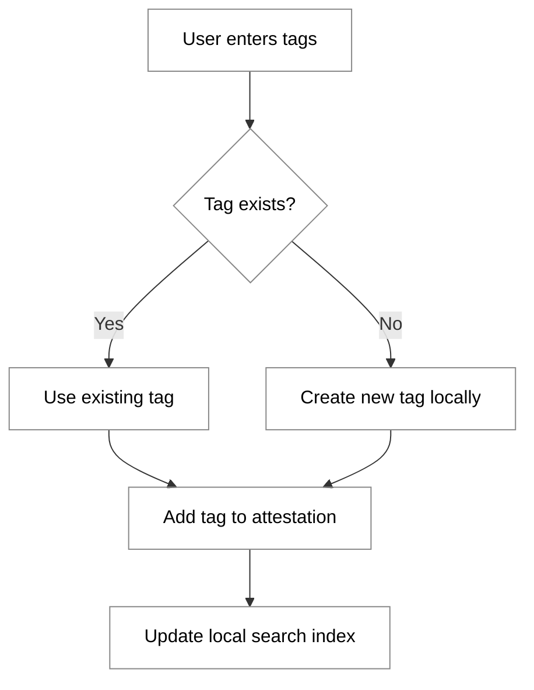

### Predefined Tags

```json
{
  "predefinedTags": [
    {"id": "helping",      "emoji": "🤝", "label": "Helping"},
    {"id": "garden",       "emoji": "🌱", "label": "Garden"},
    {"id": "crafts",       "emoji": "🔧", "label": "Crafts"},
    {"id": "transport",    "emoji": "🚗", "label": "Transport"},
    {"id": "advice",       "emoji": "💬", "label": "Advice"},
    {"id": "cooking",      "emoji": "🍳", "label": "Cooking"},
    {"id": "childcare",    "emoji": "👶", "label": "Childcare"},
    {"id": "tech",         "emoji": "💻", "label": "Tech"}
  ]
}
```

## Group Context

### Attestation with Group Context

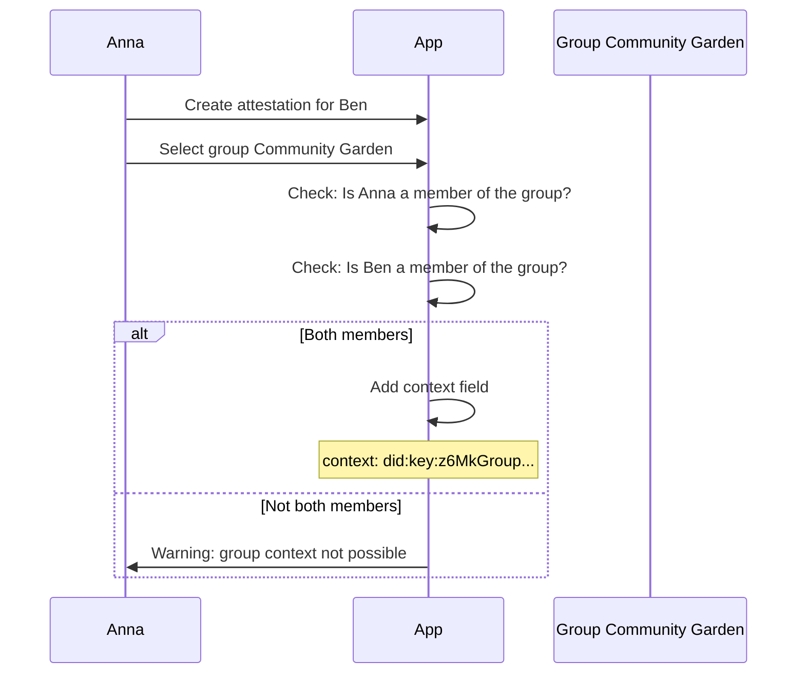

### Group Context Meaning

| With context | Without context |
| --- | --- |
| Attestation arose within the group | General attestation |
| Visible to all group members | Only to direct contacts |
| Can appear in group statistics | Only in personal profile |

## Notifications

### Notification for Recipient

```json
{
  "type": "attestation_received",
  "from": "did:key:z6MkhaXgBZDvotDkL5257faiztiGiC2QtKLGpbnnEGta2doK",
  "fromName": "Anna Mueller",
  "attestationId": "urn:uuid:550e8400...",
  "preview": "Helped for 3 hours in the community garden",
  "createdAt": "2025-01-08T14:32:00Z"
}
```

### Notification Flow

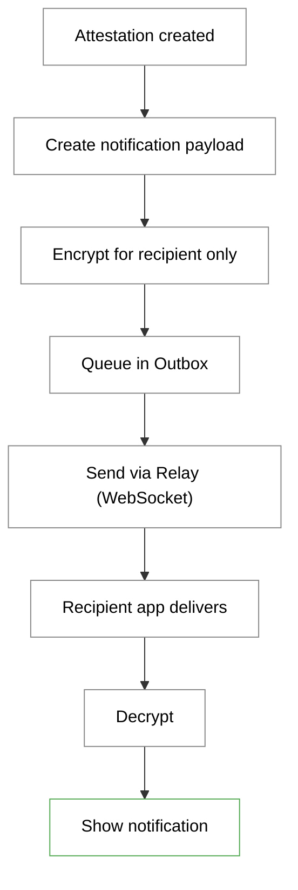

## Validation

### Input Validation

| Field | Validation |
| --- | --- |
| claim | Min 5 chars, max 500 chars |
| tags | Min 0, max 5 tags |
| context | Must be an existing group or empty |

### Signature Validation on Receipt

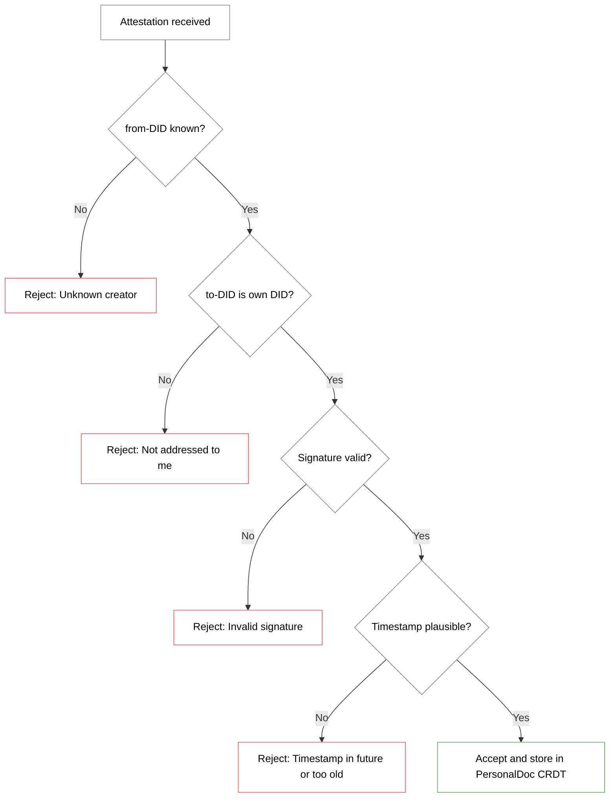

## Security Considerations

### Spam Protection

| Measure | Description |
| --- | --- |
| Verified contacts only | Attestations only for verified contacts |
| Rate limiting | Max 10 attestations per hour (client-side) |
| Social control | Spammers lose credibility |

### Manipulation

| Attack | Protection |
| --- | --- |
| Forge attestation | Signature with creator's private key |
| Alter attestation | Any change invalidates signature |
| Delete attestation | Recipient has own copy in PersonalDoc CRDT |
| False claim | Only social consequences possible |

### Immutability

Attestations are deliberately **immutable**:

1. **Signature:** Any change breaks the signature
2. **Distributed:** Stored in recipient's CRDT, replicated across devices
3. **Design:** A statement about the past cannot be undone

On errors: create a new correcting attestation.
