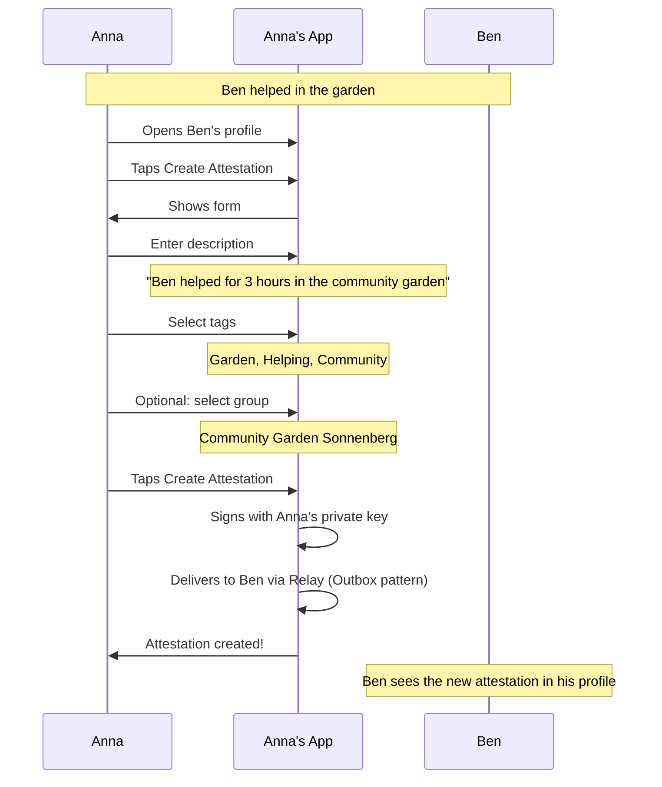
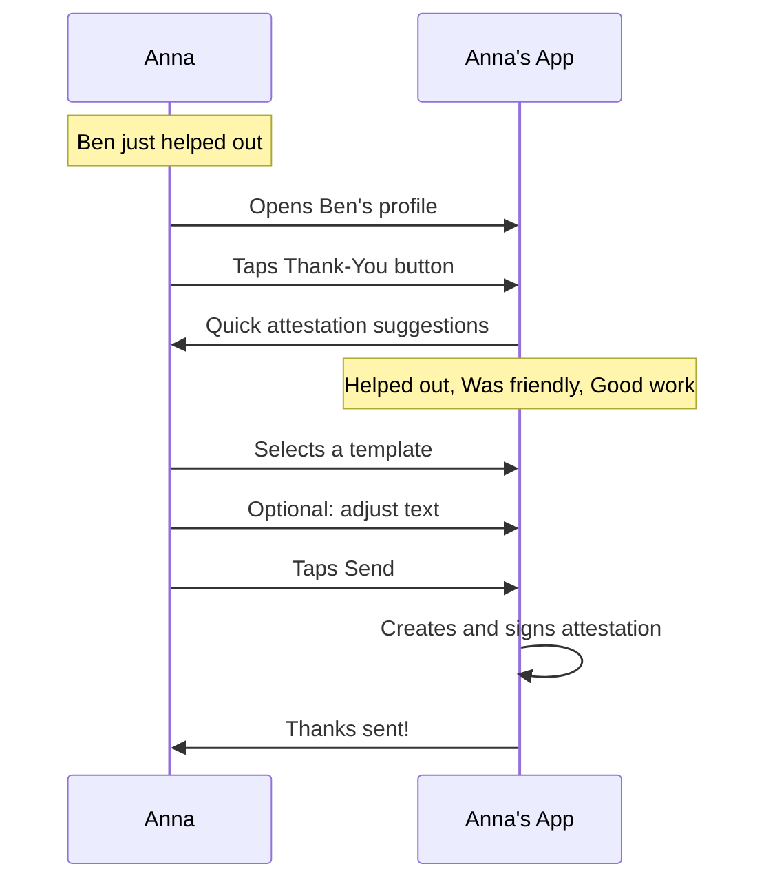
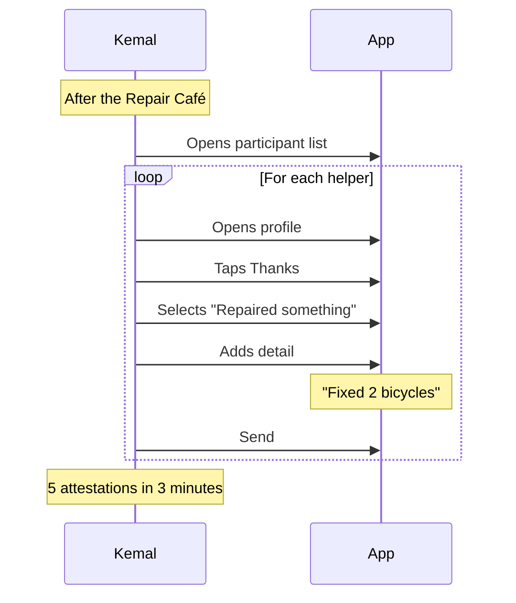
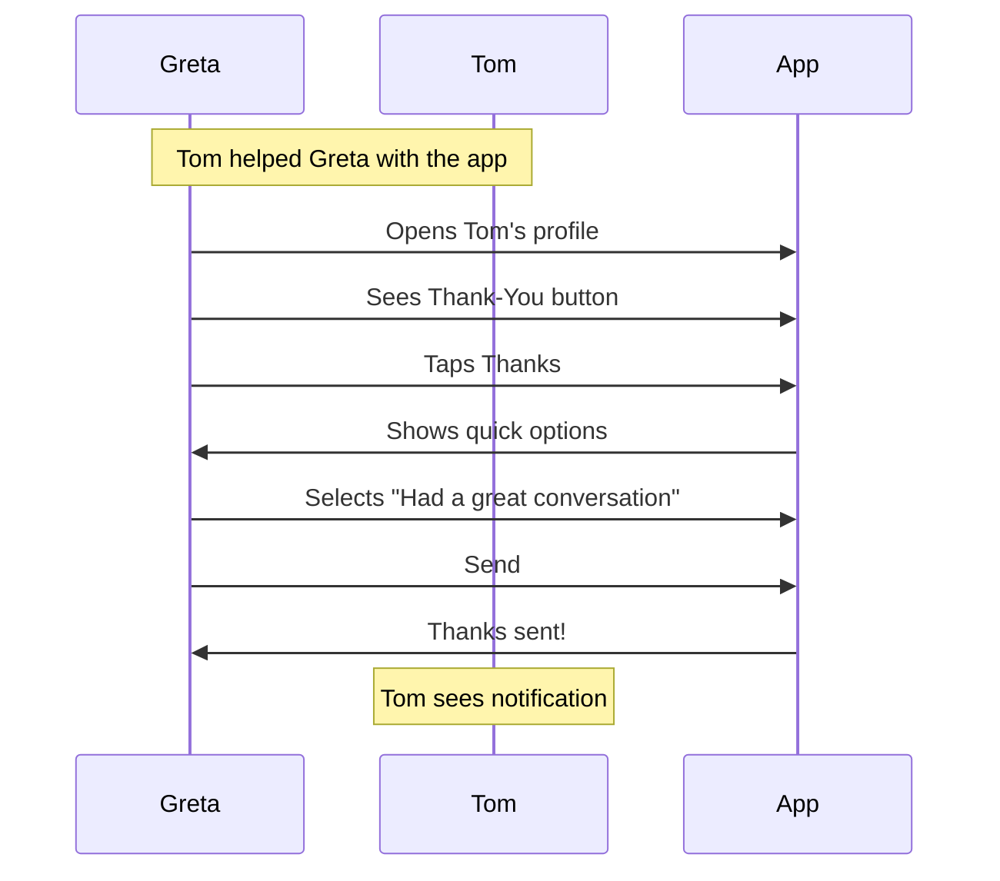
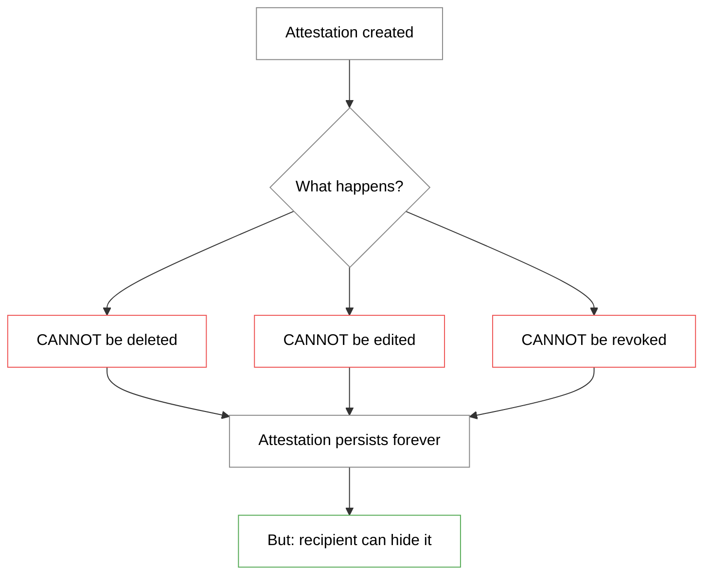
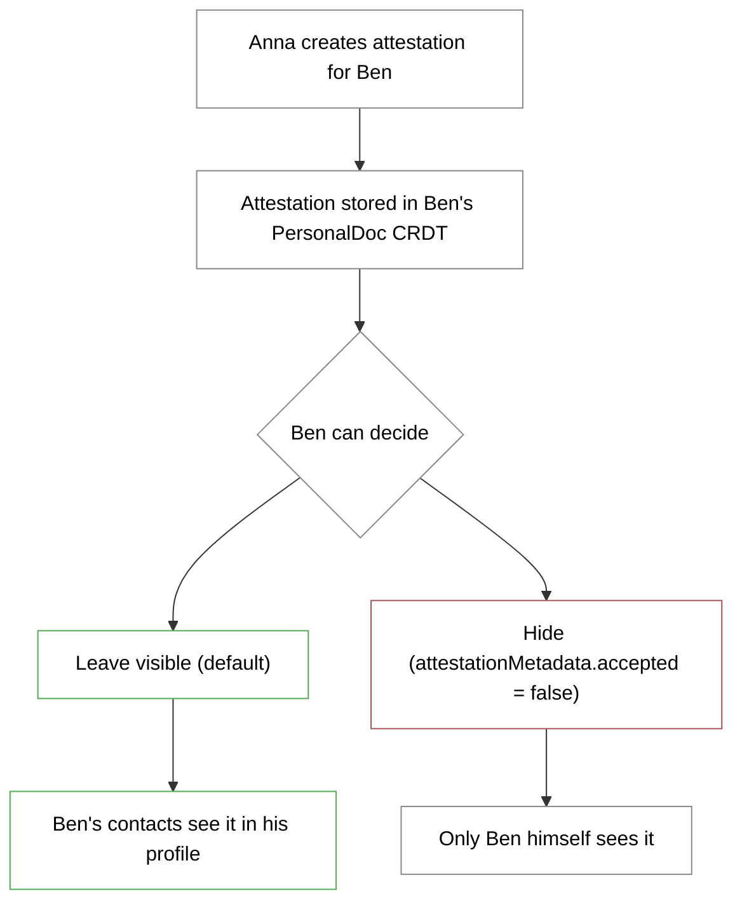

# Attestation Flow (User Perspective)

> How users create and view attestations

## What is an Attestation?

An attestation is a **signed statement** made by one person about another person.

| Verification | Attestation |
|--------------|-------------|
| "I have met this person" | "This person did X" |
| Identity confirmation | Building trust |
| Once per contact | Any number possible |
| Binary (yes/no) | Content-rich (what, when, where) |

## Main Flow: Creating an Attestation



> **Delivery:** Attestations are sent via the **AttestationDeliveryService** and the **Outbox pattern** — messages are queued locally and delivered reliably via the WebSocket Relay, with redelivery on reconnect.

## Variant: Quick Attestation (Thank-You Button)



## What the User Sees

### Ben's Profile with Attestation Button

```
┌─────────────────────────────────┐
│                                 │
│         📷 [Profile photo]      │
│                                 │
│          Ben Schmidt            │
│     "New to the neighborhood"   │
│                                 │
├─────────────────────────────────┤
│                                 │
│  Verified on 08.01.25 ✅        │
│                                 │
│  12 attestations received       │
│                                 │
├─────────────────────────────────┤
│                                 │
│  [ 👍 Thanks ] [ ✍️ Attest ]    │
│                                 │
├─────────────────────────────────┤
│                                 │
│  Recent attestations:           │
│                                 │
│  "Helped with moving"           │
│  by Tom · 3 days ago            │
│                                 │
│  "Knows bikes really well"      │
│  by Carla · 1 week ago          │
│                                 │
│  [ Show all ]                   │
│                                 │
└─────────────────────────────────┘
```

### Create Attestation — Form

```
┌─────────────────────────────────┐
│                                 │
│  ✍️ Attestation for Ben          │
│                                 │
├─────────────────────────────────┤
│                                 │
│  What do you want to attest?    │
│                                 │
│  ┌─────────────────────────┐    │
│  │ Ben helped for 3 hours  │    │
│  │ in the community garden │    │
│  │ and watered the         │    │
│  │ tomatoes.               │    │
│  │                         │    │
│  └─────────────────────────┘    │
│                                 │
│  Tags (select relevant):        │
│                                 │
│  [Garden] [Helping] [Crafts]    │
│  [Advice] [Transport] [+New]    │
│                                 │
│  In context of a group?         │
│                                 │
│  ┌─────────────────────────┐    │
│  │ Community Garden     ▼  │    │
│  └─────────────────────────┘    │
│                                 │
│  ━━━━━━━━━━━━━━━━━━━━━━━━━━━    │
│                                 │
│  ℹ️ Attestations cannot be       │
│    taken back.                  │
│                                 │
│  [ Create Attestation ]         │
│                                 │
└─────────────────────────────────┘
```

### Quick Attestation (Thank You)

```
┌─────────────────────────────────┐
│                                 │
│  👍 Thanks to Ben               │
│                                 │
├─────────────────────────────────┤
│                                 │
│  What do you want to thank      │
│  them for?                      │
│                                 │
│  ┌─────────────────────────┐    │
│  │ 🌱 Helped in the        │    │
│  │    garden               │    │
│  └─────────────────────────┘    │
│                                 │
│  ┌─────────────────────────┐    │
│  │ 🔧 Fixed something      │    │
│  └─────────────────────────┘    │
│                                 │
│  ┌─────────────────────────┐    │
│  │ 📦 Helped carry things  │    │
│  └─────────────────────────┘    │
│                                 │
│  ┌─────────────────────────┐    │
│  │ 💬 Had a great          │    │
│  │    conversation         │    │
│  └─────────────────────────┘    │
│                                 │
│  ┌─────────────────────────┐    │
│  │ ✍️ Write custom text...  │    │
│  └─────────────────────────┘    │
│                                 │
└─────────────────────────────────┘
```

### Attestation Created — Confirmation

```
┌─────────────────────────────────┐
│                                 │
│         ✅ Attestation          │
│            created!             │
│                                 │
├─────────────────────────────────┤
│                                 │
│  "Ben helped for 3 hours in     │
│   the community garden"         │
│                                 │
│  Tags: Garden, Helping          │
│  Group: Community Garden        │
│                                 │
│  Signed: 08.01.25 14:32         │
│                                 │
├─────────────────────────────────┤
│                                 │
│  Ben will be notified.          │
│                                 │
│  [ Done ]                       │
│                                 │
└─────────────────────────────────┘
```

## Viewing Attestations

### My Received Attestations

```
┌─────────────────────────────────┐
│                                 │
│  📜 My Attestations             │
│                                 │
│  Filter: [All ▼] [Garden ▼]     │
│                                 │
├─────────────────────────────────┤
│                                 │
│  ┌─────────────────────────┐    │
│  │ "Helped for 3 hours     │    │
│  │  in the garden"         │    │
│  │                         │    │
│  │  👩 Anna · 08.01.25      │    │
│  │  🏷️ Garden, Helping      │    │
│  │  👥 Community Garden     │    │
│  └─────────────────────────┘    │
│                                 │
│  ┌─────────────────────────┐    │
│  │ "Knows bikes really     │    │
│  │  well"                  │    │
│  │                         │    │
│  │  👴 Tom · 05.01.25       │    │
│  │  🏷️ Crafts, Bicycle      │    │
│  └─────────────────────────┘    │
│                                 │
│  ┌─────────────────────────┐    │
│  │ "Helped with the move   │    │
│  │  — super reliable!"     │    │
│  │                         │    │
│  │  👩 Carla · 01.01.25     │    │
│  │  🏷️ Helping, Transport   │    │
│  └─────────────────────────┘    │
│                                 │
└─────────────────────────────────┘
```

### Viewing a Contact's Attestations

```
┌─────────────────────────────────┐
│                                 │
│  📜 Attestations for Ben        │
│                                 │
│  23 attestations from           │
│  8 different people             │
│                                 │
├─────────────────────────────────┤
│                                 │
│  Most common tags:              │
│                                 │
│  ████████████ Helping (12)      │
│  ████████     Garden (8)        │
│  █████        Crafts (5)        │
│  ███          Transport (3)     │
│                                 │
├─────────────────────────────────┤
│                                 │
│  From your contacts:            │
│                                 │
│  👩 Anna (3 attestations)       │
│  👴 Tom (2 attestations)        │
│  👩 Carla (1 attestation)       │
│                                 │
│  From others:                   │
│  👤 5 more people               │
│                                 │
├─────────────────────────────────┤
│                                 │
│  [ All attestations ]           │
│                                 │
└─────────────────────────────────┘
```

## Personas

### Kemal attests after a Repair Café



### Greta thanks Tom



## Rules and Constraints

### What Attestations CANNOT Do



> **Note:** The recipient can hide unwanted attestations by setting `attestationMetadata.accepted = false`. They remain stored but are not publicly visible.

### Why can't they be deleted?

| Reason | Explanation |
|--------|-------------|
| Integrity | Signed statements are immutable |
| Trust | Others rely on the statement |
| Abuse prevention | Otherwise one could collect positive attestations and then delete them |

### Handling incorrect attestations

If someone attested something incorrectly:

1. **New attestation:** Create a correcting attestation
2. **Hide contact:** If attestations are systematically wrong
3. **Social consequence:** Those who attest falsely lose credibility

## Visibility of Attestations

With the **recipient principle**, the attestation is stored at Ben's end — he controls visibility:



### Visibility Matrix

| Viewer | Sees attestation? | Why? |
|--------|-------------------|------|
| Ben (recipient) | ✅ Always | It's his profile, he controls visibility |
| Ben's contacts | ✅ Unless hidden | Part of Ben's profile |
| Anna (creator) | ✅ If Ben's contact | Sees Ben's profile |
| Strangers | ❌ No | Not in Ben's network |

> **Note:** Ben can hide unwanted attestations but not delete them. Anna's signature remains valid.
