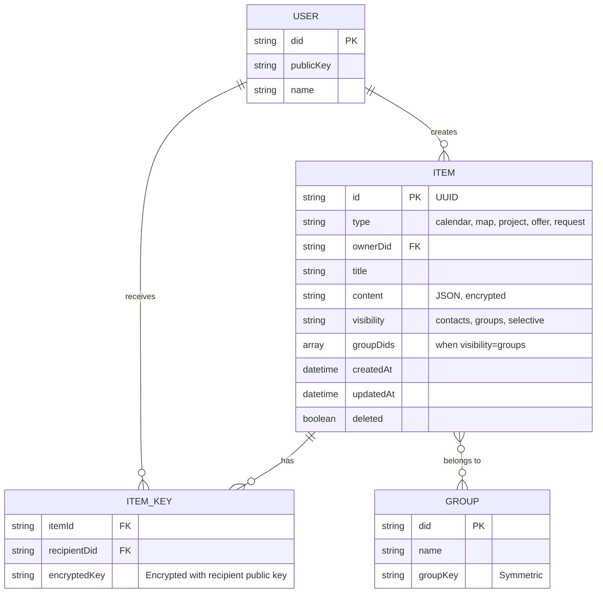
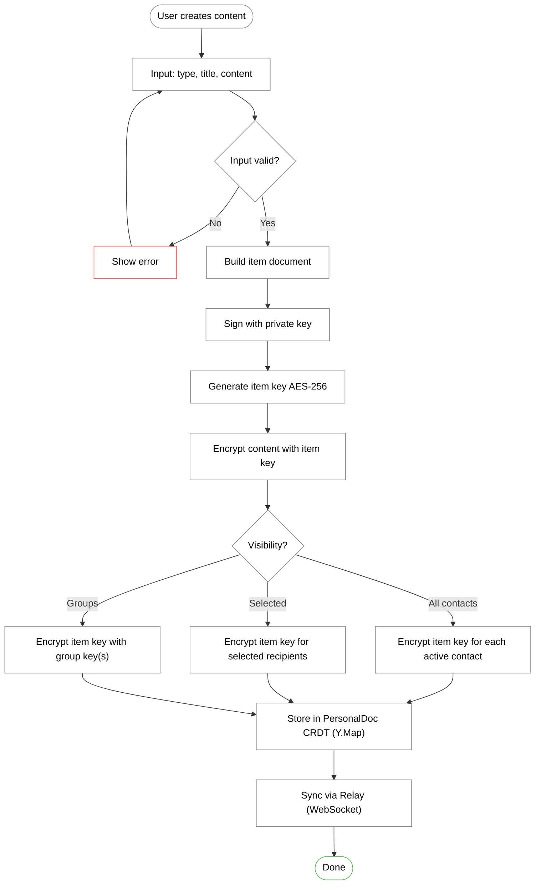
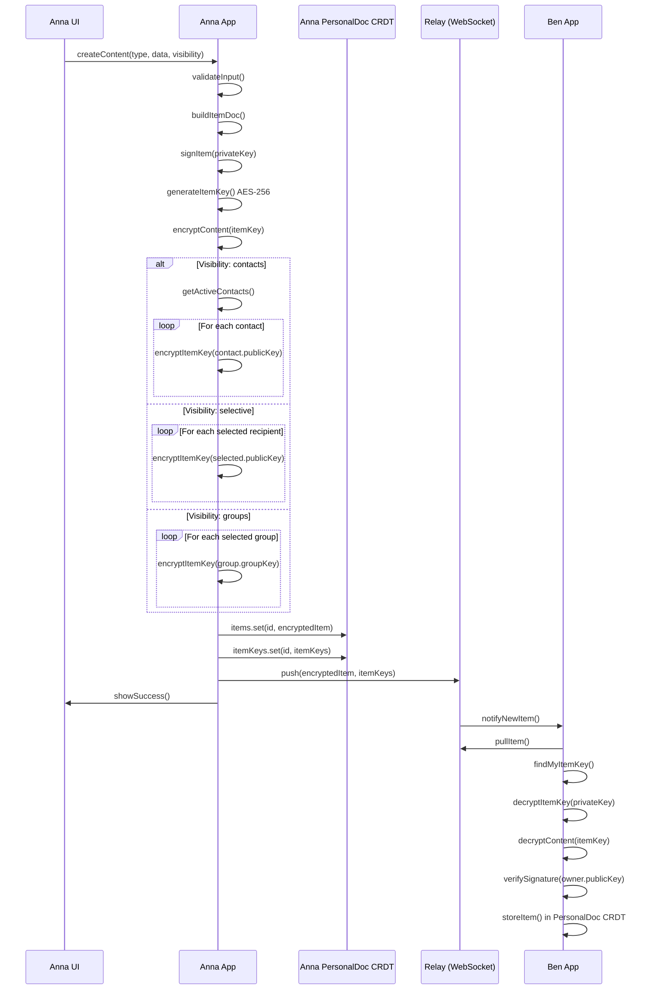
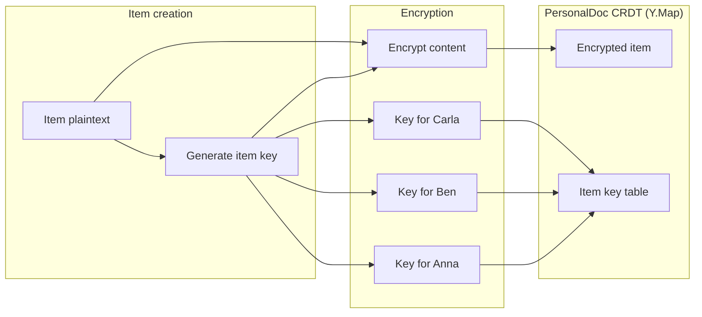
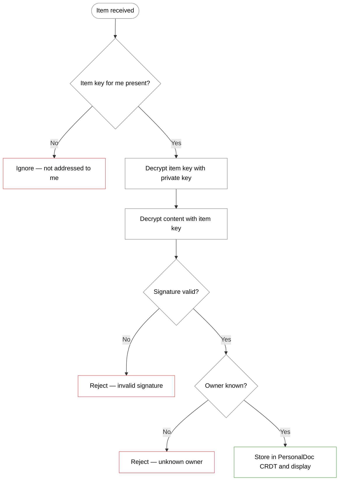
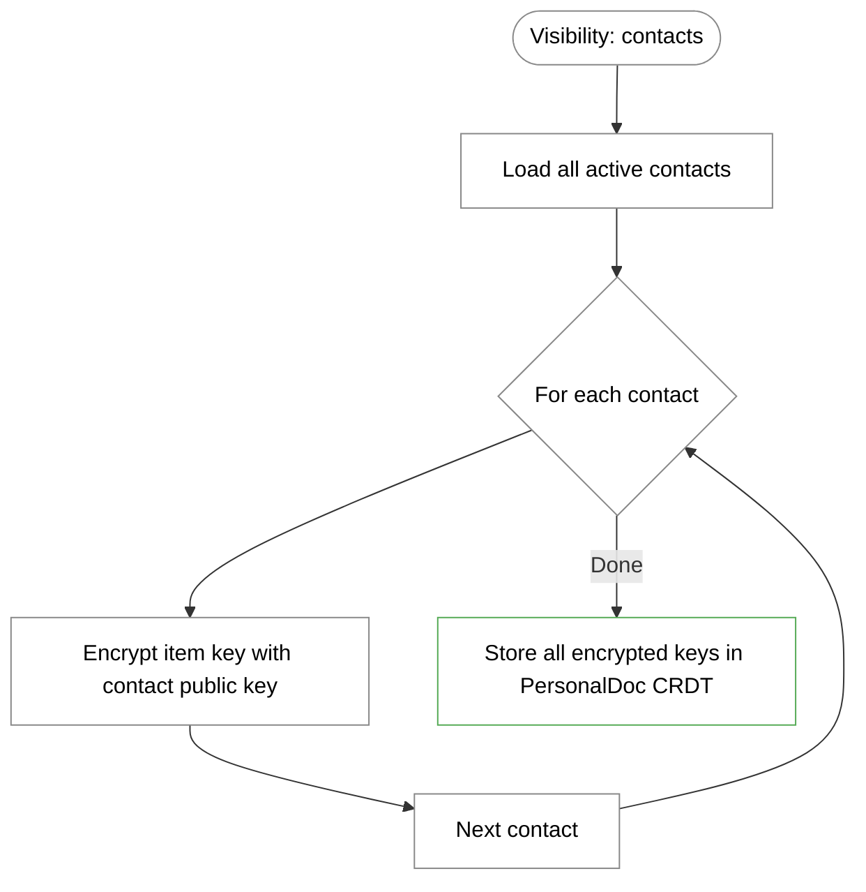
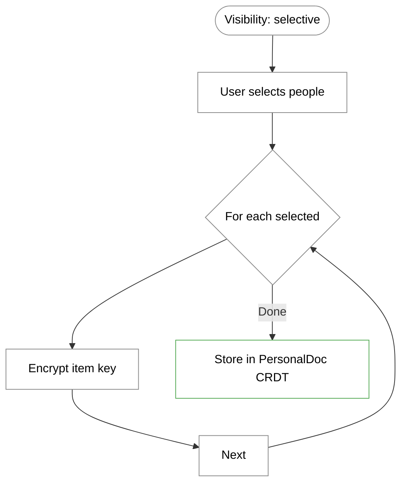
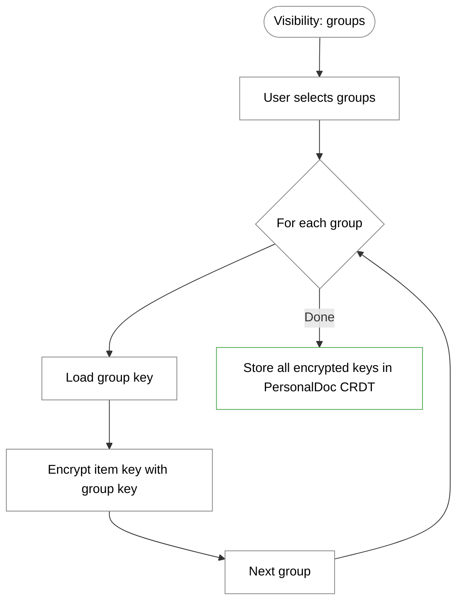
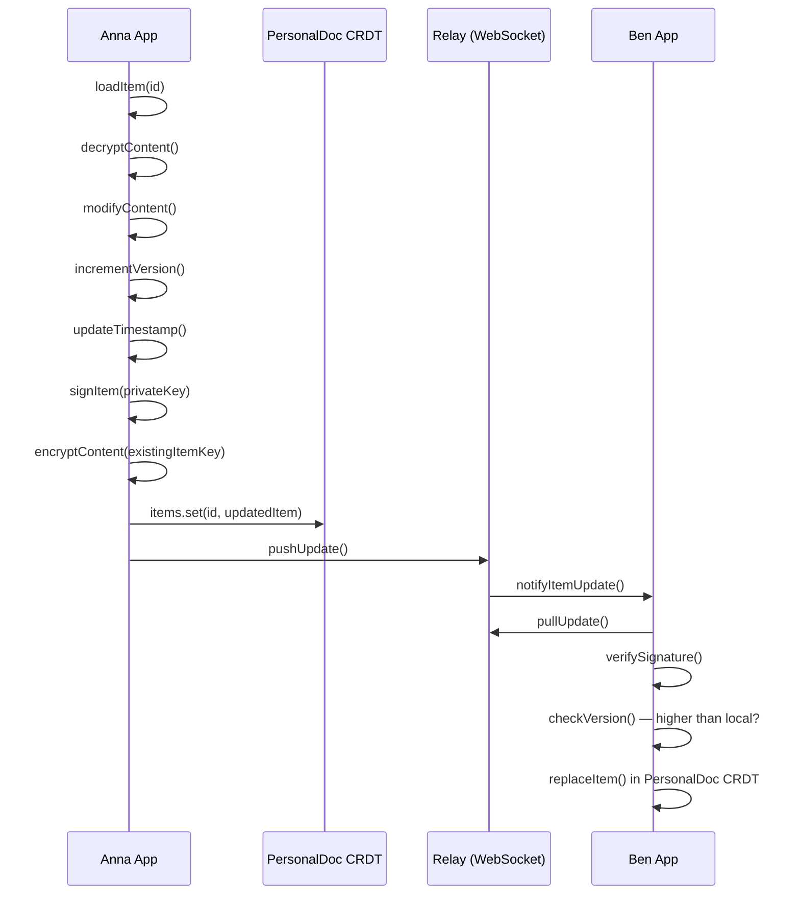
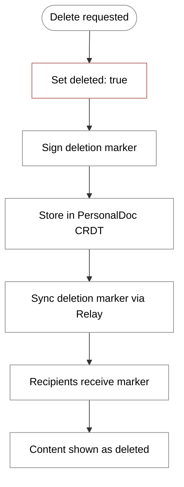

# Content Flow (Technical Perspective)

> How content is created, encrypted, and distributed

> **Status: Planned — not yet implemented in the demo app.**
> The content types described here (Calendar, Map, Offers, Requests, Projects) are part of the planned feature set. The current demo app implements Attestations and Group Spaces. Content types will be built on the same infrastructure (PersonalDoc CRDT, Relay, Vault).

## Data Model



> **Storage:** When implemented, items will be stored in the owner's **PersonalDoc CRDT (Y.Map)**, not in a SQL/Dexie database. The PersonalDoc is persisted via CompactStore (IDB), synced via Relay (WebSocket), and backed up via Vault (HTTP).

## Item Document Structure

### Calendar Entry

```json
{
  "@context": "https://w3id.org/weboftrust/v1",
  "type": "CalendarItem",
  "id": "urn:uuid:550e8400-e29b-41d4-a716-446655440000",
  "owner": "did:key:z6MkhaXgBZDvotDkL5257faiztiGiC2QtKLGpbnnEGta2doK",
  "title": "Garden meetup",
  "content": {
    "startDate": "2025-01-15T14:00:00Z",
    "endDate": "2025-01-15T17:00:00Z",
    "location": {
      "name": "Community Garden Sonnenberg",
      "coordinates": [51.0504, 13.7373]
    },
    "description": "We'll be preparing the beds for spring."
  },
  "visibility": {
    "type": "contacts"
  },
  "createdAt": "2025-01-08T10:00:00Z",
  "updatedAt": "2025-01-08T10:00:00Z",
  "proof": {
    "type": "Ed25519Signature2020",
    "verificationMethod": "did:key:z6MkhaXgBZDvotDkL5257faiztiGiC2QtKLGpbnnEGta2doK#key-1",
    "proofValue": "z58DAdFfa9..."
  }
}
```

### Map Marker

```json
{
  "@context": "https://w3id.org/weboftrust/v1",
  "type": "MapItem",
  "id": "urn:uuid:660e8400-e29b-41d4-a716-446655440001",
  "owner": "did:key:z6MkhaXgBZDvotDkL5257faiztiGiC2QtKLGpbnnEGta2doK",
  "title": "Tool lending",
  "content": {
    "coordinates": [51.0504, 13.7373],
    "category": "lending",
    "description": "Tools available to borrow here."
  },
  "visibility": {
    "type": "contacts"
  },
  "createdAt": "2025-01-08T10:00:00Z",
  "proof": { }
}
```

### Offer / Request

```json
{
  "@context": "https://w3id.org/weboftrust/v1",
  "type": "OfferItem",
  "id": "urn:uuid:770e8400-e29b-41d4-a716-446655440002",
  "owner": "did:key:z6MkpTHR8VNsBxYAAWHut2Geadd9jSwuias8sisDArDJF6K2",
  "title": "Can help with moving",
  "content": {
    "category": "help",
    "description": "I have a car and can carry heavy things.",
    "availability": "Weekends"
  },
  "visibility": {
    "type": "contacts"
  },
  "createdAt": "2025-01-08T10:00:00Z",
  "proof": { }
}
```

---

## Main Flow: Creating Content



---

## Sequence Diagram: Create and Distribute Content



---

## Encryption Schema

### Item Key Distribution



### Data Structure

```json
{
  "encryptedItem": {
    "id": "urn:uuid:550e8400...",
    "owner": "did:key:z6MkhaXgBZDvotDkL5257faiztiGiC2QtKLGpbnnEGta2doK",
    "ciphertext": "base64...",
    "nonce": "base64...",
    "proof": { }
  },
  "itemKeys": [
    {
      "recipientDid": "did:key:z6MkhaXgBZDvotDkL5257faiztiGiC2QtKLGpbnnEGta2doK",
      "encryptedKey": "base64..."
    },
    {
      "recipientDid": "did:key:z6MkpTHR8VNsBxYAAWHut2Geadd9jSwuias8sisDArDJF6K2",
      "encryptedKey": "base64..."
    }
  ]
}
```

---

## Detail Flow: Receiving Content



---

## Visibility Options

### Type: contacts (All Contacts)



**On new contact:** When Anna later verifies a new contact, all items with `visibility: contacts` are automatically re-encrypted for that contact.

### Type: selective (Selected Recipients)



**On new contact:** New contacts do NOT automatically see this content.

### Type: groups (One or More Groups)



**Multi-group:** An item can be shared with multiple groups simultaneously. Each group gets its own encrypted item key.

**Efficiency:** Only one encryption operation per group, regardless of how many members it has.

---

## Updating Content



### Versioning

```json
{
  "id": "urn:uuid:550e8400...",
  "version": 3,
  "previousVersion": "hash-of-version-2",
  "updatedAt": "2025-01-08T15:00:00Z"
}
```

---

## Deleting Content



### Deletion Marker

```json
{
  "type": "ItemDeletion",
  "itemId": "urn:uuid:550e8400...",
  "deletedAt": "2025-01-08T16:00:00Z",
  "proof": {
    "type": "Ed25519Signature2020",
    "verificationMethod": "did:key:z6MkhaXgBZDvotDkL5257faiztiGiC2QtKLGpbnnEGta2doK#key-1",
    "proofValue": "z58DAdFfa9..."
  }
}
```

**Important:** The encrypted content is not physically deleted. Recipients who already decrypted it retain a local copy in their PersonalDoc CRDT.

---

## Storage: PersonalDoc CRDT

When implemented, content items will live in the owner's PersonalDoc CRDT alongside attestations, contacts, and other user data:

```typescript
// PersonalDoc structure (planned extension)
PersonalDoc {
  profile:             Y.Map  // profile data
  contacts:            Y.Map  // verified contacts
  attestations:        Y.Map  // received attestations
  attestationMetadata: Y.Map  // accepted, deliveryStatus
  outbox:              Y.Map  // pending deliveries
  spaces:              Y.Map  // group space metadata
  groupKeys:           Y.Map  // group encryption keys
  // planned:
  items:               Y.Map  // content items (calendar, map, offers, ...)
  itemKeys:            Y.Map  // per-recipient encrypted keys
}
```

Access pattern (planned):

```typescript
// Store a new item
doc.items[item.id] = encryptedItem;
doc.itemKeys[item.id] = itemKeys;

// Query calendar items
const calendarItems = Object.values(doc.items)
  .filter(item => item.type === "CalendarItem" && !item.deleted)
  .map(item => decryptContent(item, myPrivateKey));

// Query items near a location
const nearbyItems = Object.values(doc.items)
  .filter(item => item.type === "MapItem")
  .map(item => decryptContent(item, myPrivateKey))
  .filter(item => calculateDistance(myLocation, item.content.coordinates) < 1000);
```

---

## Notifications

### Notification Types

```json
{
  "type": "item_created",
  "itemId": "urn:uuid:550e8400...",
  "itemType": "CalendarItem",
  "ownerDid": "did:key:z6MkhaXgBZDvotDkL5257faiztiGiC2QtKLGpbnnEGta2doK",
  "ownerName": "Anna Mueller",
  "title": "Garden meetup",
  "createdAt": "2025-01-08T10:00:00Z"
}
```

```json
{
  "type": "item_updated",
  "itemId": "urn:uuid:550e8400...",
  "changes": ["title", "content.startDate"],
  "updatedAt": "2025-01-08T15:00:00Z"
}
```

```json
{
  "type": "item_deleted",
  "itemId": "urn:uuid:550e8400...",
  "deletedAt": "2025-01-08T16:00:00Z"
}
```

---

## Security Considerations

### Validation

| Check | Description |
| --- | --- |
| Signature | Item must be signed by the stated owner |
| Owner | Owner must be a known contact |
| Version | Update version must be higher than local |
| Delete permission | Only the owner can delete |

### Attack Vectors

| Attack | Protection |
| --- | --- |
| Forged item | Signature verification |
| Replay old version | Version check |
| Unauthorized deletion | Only accept signed deletion markers |
| Metadata leak | Metadata is also encrypted |
