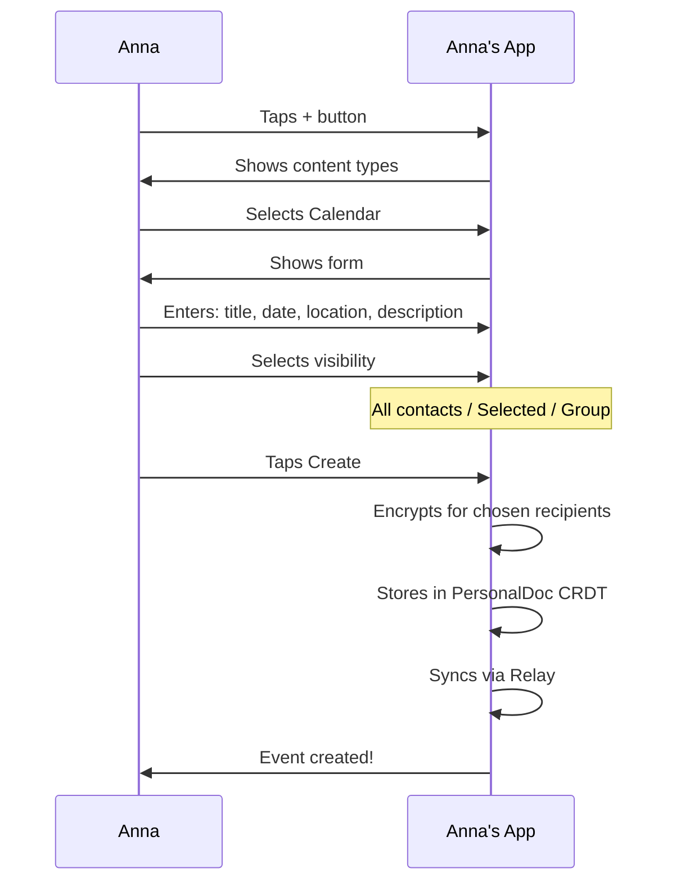
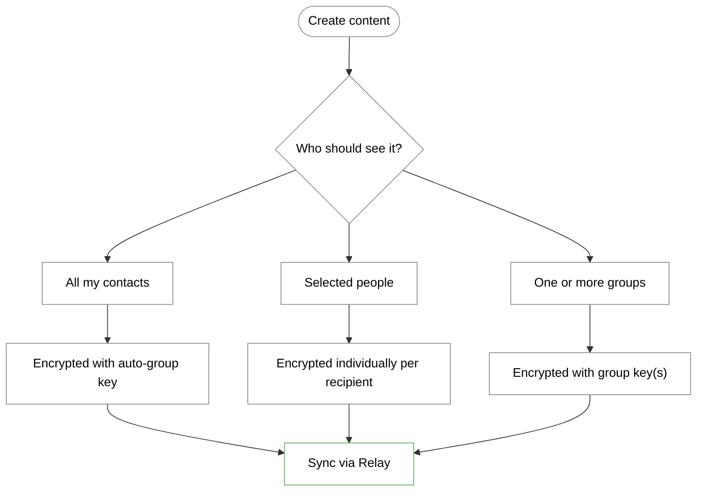
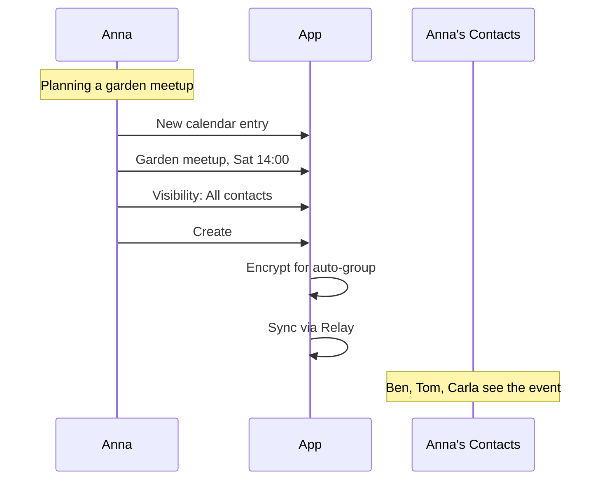
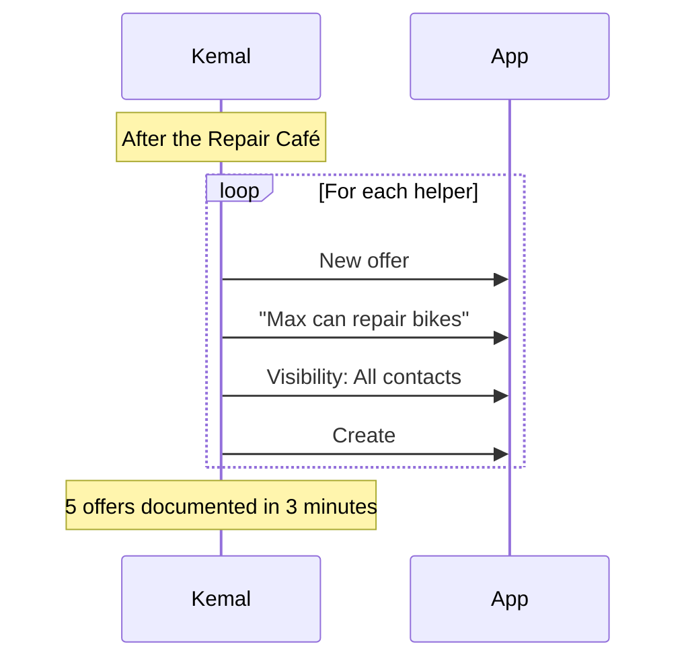
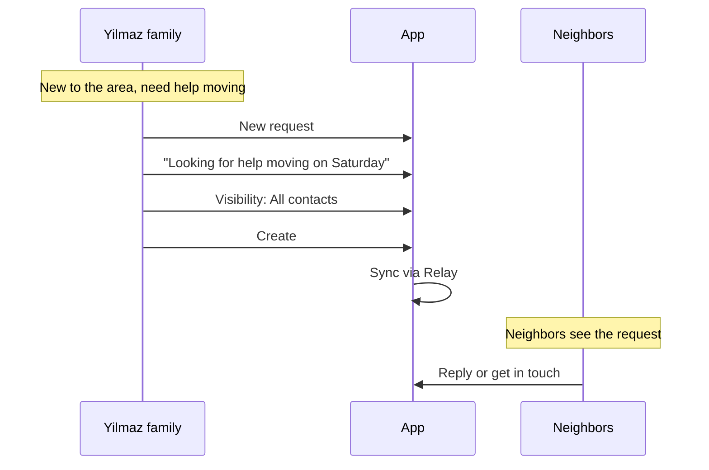
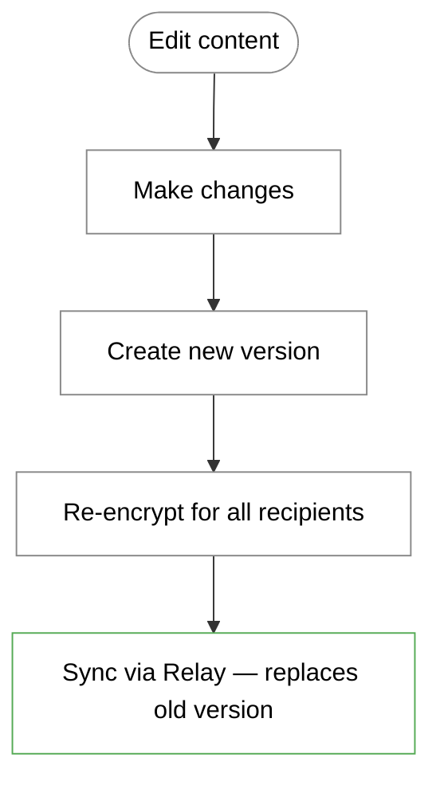
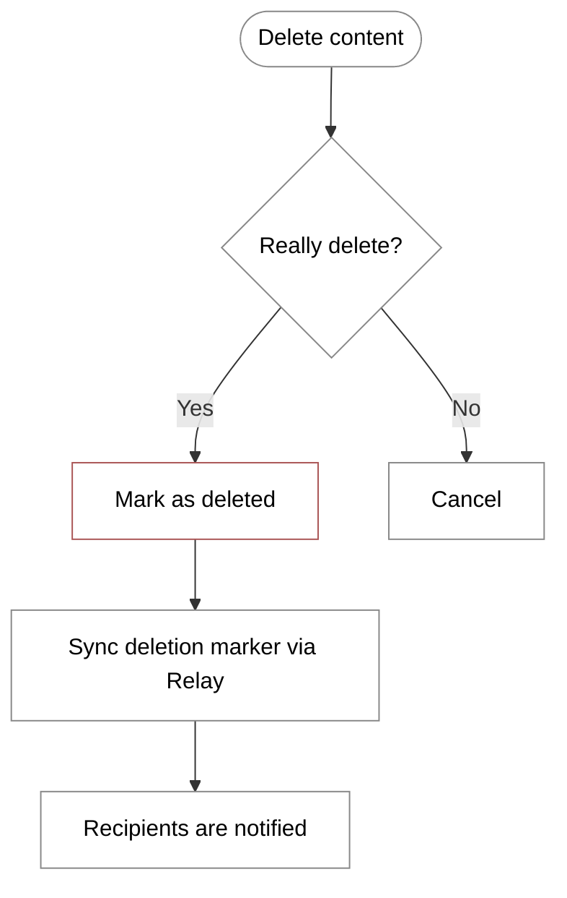

# Content Flow (User Perspective)

> How users create and share content

> **Status: Planned — not yet implemented in the demo app.**
> The content types described here (Calendar, Map, Offers, Requests, Projects) are part of the planned feature set. The current demo app implements Attestations and Group Spaces. Content types will be built on the same infrastructure (PersonalDoc CRDT, Relay, Vault).

## Content Types

The Web of Trust supports several content types:

| Type | Description | Example |
| --- | --- | --- |
| Calendar | Events and appointments | "Garden meetup on Saturday" |
| Map | Locations and markers | "Tool lending at Anna's" |
| Project | Collaborative initiatives | "Community Garden 2025" |
| Offer | What I can offer | "Can repair bikes" |
| Request | What I'm looking for | "Need help moving" |

---

## Main Flow: Creating Content



---

## Controlling Visibility

### Options When Creating



### Changing Visibility Later

Content visibility can be expanded after creation (add more recipients), but not restricted (copies already shared cannot be recalled).

---

## What the User Sees

### Create New Content

```
┌─────────────────────────────────┐
│                                 │
│   + New Content                 │
│                                 │
├─────────────────────────────────┤
│                                 │
│   ┌─────────────────────────┐   │
│   │  📅 Calendar Entry      │   │
│   │     Event or appointment│   │
│   └─────────────────────────┘   │
│                                 │
│   ┌─────────────────────────┐   │
│   │  📍 Map Marker          │   │
│   │     Location or address │   │
│   └─────────────────────────┘   │
│                                 │
│   ┌─────────────────────────┐   │
│   │  📋 Project             │   │
│   │     Collaborative       │   │
│   │     initiative          │   │
│   └─────────────────────────┘   │
│                                 │
│   ┌─────────────────────────┐   │
│   │  🤝 Offer               │   │
│   │     What I can offer    │   │
│   └─────────────────────────┘   │
│                                 │
│   ┌─────────────────────────┐   │
│   │  🔍 Request             │   │
│   │     What I'm looking for│   │
│   └─────────────────────────┘   │
│                                 │
└─────────────────────────────────┘
```

### Create Calendar Entry

```
┌─────────────────────────────────┐
│                                 │
│   📅 New Event                  │
│                                 │
├─────────────────────────────────┤
│                                 │
│   Title *                       │
│   ┌─────────────────────────┐   │
│   │ Garden meetup           │   │
│   └─────────────────────────┘   │
│                                 │
│   Date *                        │
│   ┌─────────────────────────┐   │
│   │ Sat, 15.01.2025  14:00  │   │
│   └─────────────────────────┘   │
│                                 │
│   Location                      │
│   ┌─────────────────────────┐   │
│   │ Community Garden        │   │
│   │ Sonnenberg              │   │
│   └─────────────────────────┘   │
│                                 │
│   Description                   │
│   ┌─────────────────────────┐   │
│   │ We'll be preparing the  │   │
│   │ beds for spring.        │   │
│   │ Please bring gloves!    │   │
│   └─────────────────────────┘   │
│                                 │
│   ━━━━━━━━━━━━━━━━━━━━━━━━━━━   │
│                                 │
│   Who should see this?          │
│                                 │
│   (•) All my contacts           │
│   ( ) Selected people           │
│   ( ) Groups:                   │
│       [ ] Community Garden      │
│       [ ] Neighborhood Help     │
│       [ ] Repair Café           │
│                                 │
│   [ Create Event ]              │
│                                 │
└─────────────────────────────────┘
```

### Create Map Marker

```
┌─────────────────────────────────┐
│                                 │
│   📍 New Marker                 │
│                                 │
├─────────────────────────────────┤
│                                 │
│   ┌─────────────────────────┐   │
│   │                         │   │
│   │      [Map with pin]     │   │
│   │           📍            │   │
│   │                         │   │
│   └─────────────────────────┘   │
│                                 │
│   Title *                       │
│   ┌─────────────────────────┐   │
│   │ Tool lending            │   │
│   └─────────────────────────┘   │
│                                 │
│   Category                      │
│   ┌─────────────────────────┐   │
│   │ Lending              ▼  │   │
│   └─────────────────────────┘   │
│                                 │
│   Description                   │
│   ┌─────────────────────────┐   │
│   │ Tools available to      │   │
│   │ borrow here. Just ring! │   │
│   └─────────────────────────┘   │
│                                 │
│   [ Create Marker ]             │
│                                 │
└─────────────────────────────────┘
```

### Content Overview (Feed)

```
┌─────────────────────────────────┐
│  News                           │
├─────────────────────────────────┤
│                                 │
│  ┌─────────────────────────┐    │
│  │ 📅 Garden meetup        │    │
│  │    Sat, 15.01. 14:00    │    │
│  │                         │    │
│  │    👩 Anna · 2h ago      │    │
│  │    📍 Community Garden   │    │
│  └─────────────────────────┘    │
│                                 │
│  ┌─────────────────────────┐    │
│  │ 🤝 Offer                │    │
│  │    Can help with moving │    │
│  │                         │    │
│  │    👨 Ben · 1 day ago    │    │
│  └─────────────────────────┘    │
│                                 │
│  ┌─────────────────────────┐    │
│  │ 🔍 Request              │    │
│  │    Looking for a drill  │    │
│  │    to borrow            │    │
│  │                         │    │
│  │    👴 Tom · 3 days ago   │    │
│  └─────────────────────────┘    │
│                                 │
│  [ Load more ]                  │
│                                 │
└─────────────────────────────────┘
```

---

## Personas

### Anna shares an event



### Kemal creates offers after Repair Café



### The Yilmaz family needs help



---

## Editing and Deleting Content

### Editing



**Note:** Recipients who already have the old version retain it locally. The new version overwrites on the next sync.

### Deleting



**Note:** Deleted content is shown to recipients as "no longer available". Encrypted data cannot be remotely deleted.

---

## Calendar View

```
┌─────────────────────────────────┐
│  📅 January 2025                │
│  ◄                          ►   │
├─────────────────────────────────┤
│  Mo Tu We Th Fr Sa Su           │
│                    1  2  3  4   │
│   5  6  7  8  9 10 11           │
│  12 13 14[15]16 17 18           │
│  19 20 21 22 23 24 25           │
│  26 27 28 29 30 31              │
├─────────────────────────────────┤
│                                 │
│  Sat, 15 January                │
│                                 │
│  ┌─────────────────────────┐    │
│  │ 14:00 Garden meetup     │    │
│  │       👩 Anna            │    │
│  │       📍 Community       │    │
│  │          Garden          │    │
│  └─────────────────────────┘    │
│                                 │
│  ┌─────────────────────────┐    │
│  │ 18:00 Repair Café       │    │
│  │       👨 Kemal           │    │
│  │       📍 Community       │    │
│  │          Center          │    │
│  └─────────────────────────┘    │
│                                 │
└─────────────────────────────────┘
```

---

## Map View

```
┌─────────────────────────────────┐
│  🗺️ Map                         │
│  Filter: [All ▼]                │
├─────────────────────────────────┤
│                                 │
│   ┌─────────────────────────┐   │
│   │                         │   │
│   │     📍 Tools            │   │
│   │          📍 Garden      │   │
│   │                    📍   │   │
│   │        📍               │   │
│   │     Repair              │   │
│   │                         │   │
│   └─────────────────────────┘   │
│                                 │
├─────────────────────────────────┤
│  Nearby:                        │
│                                 │
│  📍 Tool lending (200m)         │
│     Lending · Anna              │
│                                 │
│  📍 Community Garden (350m)     │
│     Garden · Group              │
│                                 │
│  📍 Repair Café (500m)          │
│     Repair · Kemal              │
│                                 │
└─────────────────────────────────┘
```

---

## Notifications

Users are notified when:

| Event | Notification |
| --- | --- |
| New content from contact | "Anna shared an event" |
| Content was updated | "Event was changed" |
| Content was deleted | "Event is no longer available" |
| Upcoming event | "Garden meetup in 1 hour" |

---

## Constraints

| What | Constraint |
| --- | --- |
| Restrict visibility | Not possible after sharing |
| Expand visibility | Possible at any time |
| Delete content | Marked as deleted, not physically removed |
| Create offline | Possible, synced on reconnect via Relay |
