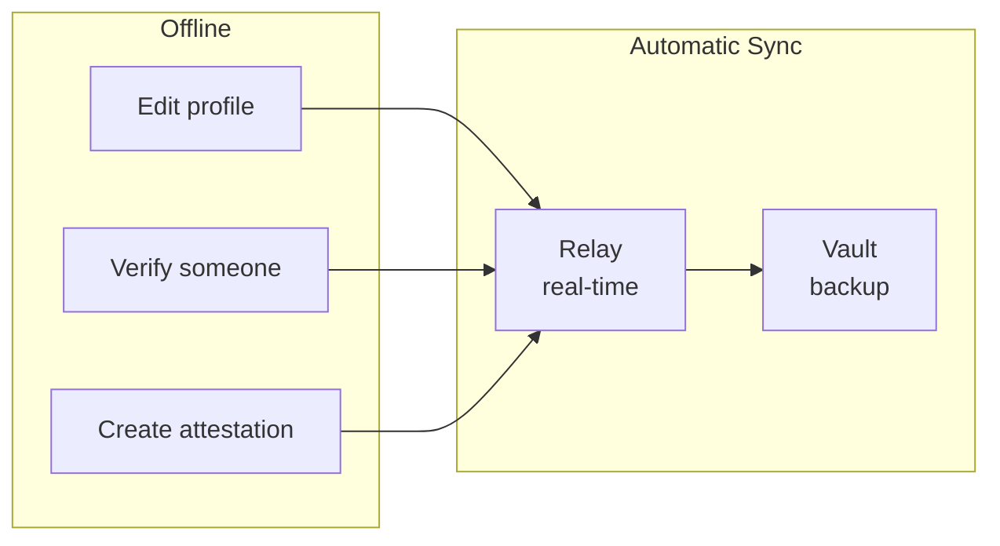
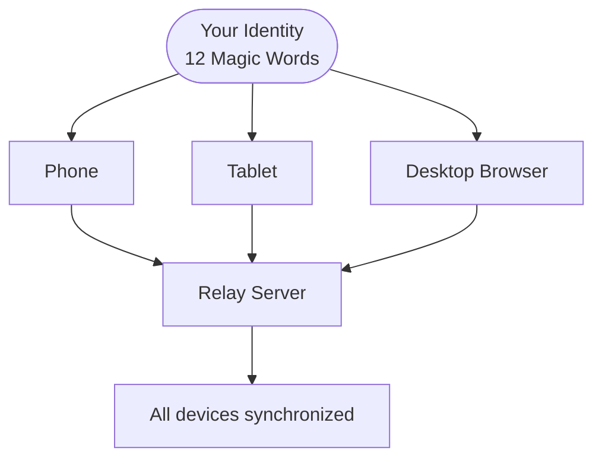
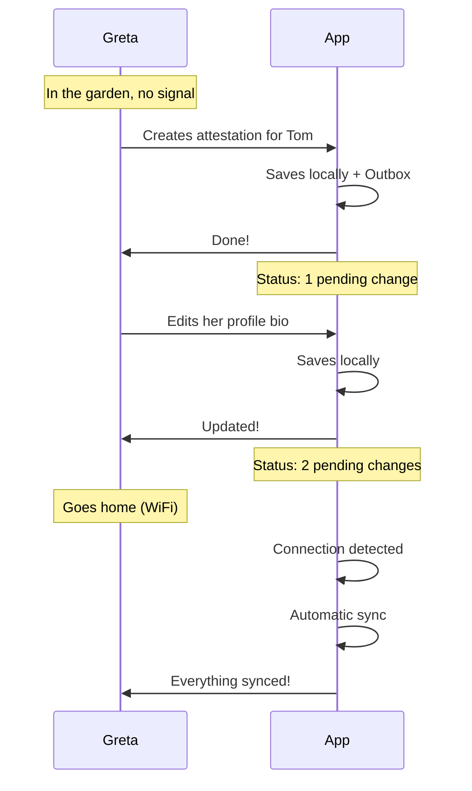
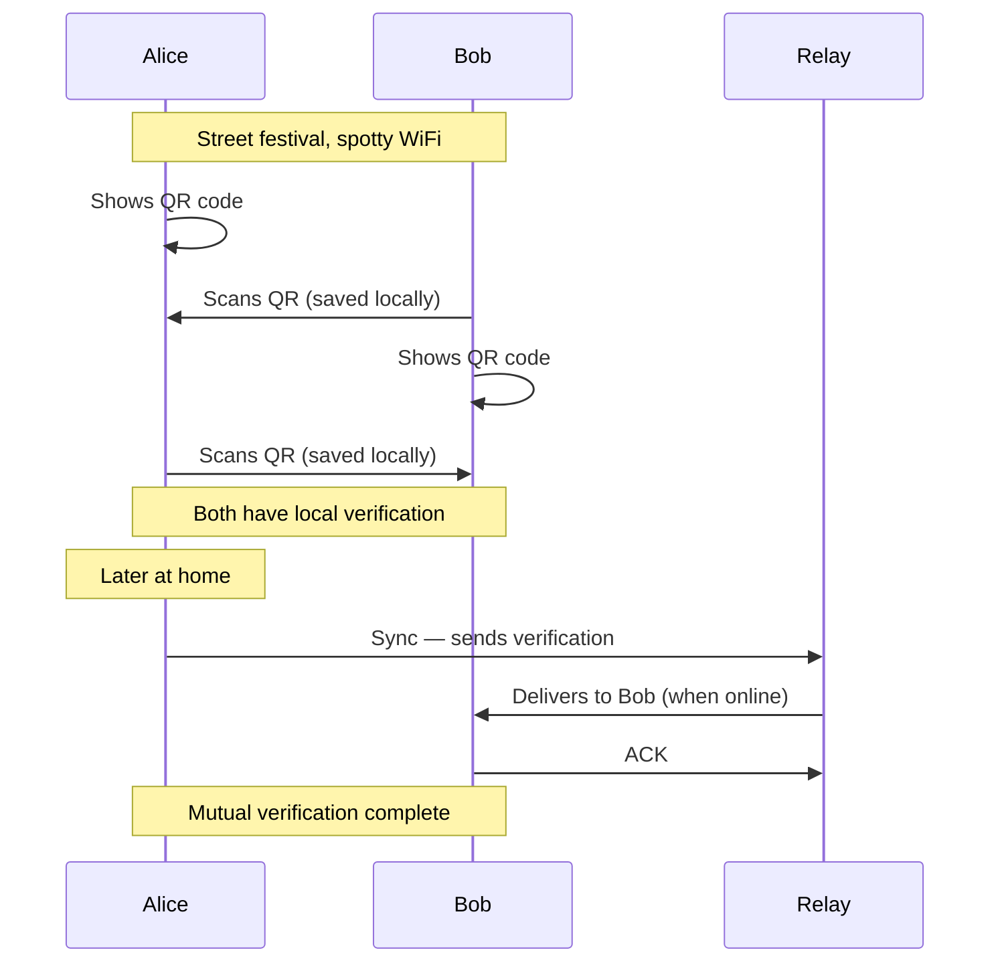
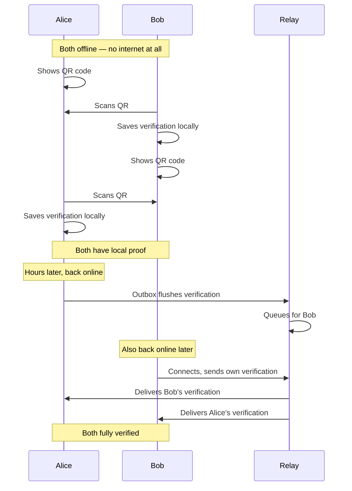

# Sync Flow (User Perspective)

> How data syncs between devices — from the user's point of view.

---

## Core Principle: Offline-First

Web of Trust works **offline by default**. You can use the app at any time, even without internet. Changes sync automatically in the background when a connection is available.

**No manual sync needed.** No "pull to refresh." No progress bar. Changes appear on your other devices within seconds.

---

## What Works Offline

| Action | Offline? | What happens |
| --- | --- | --- |
| View profile, contacts, attestations | Yes | Everything is stored locally |
| Edit profile | Yes | Saved locally, synced when online |
| Verify someone (QR scan) | Yes | Both sides save locally, sync later |
| Create attestation | Yes | Queued in Outbox, delivered when online |
| Accept/reject attestation | Yes | Status saved locally |
| Create a Space | Yes | Created locally, invite sent when online |
| See new contacts / attestations from others | No | Requires sync from Relay |

---

## Sync Status

The app shows a simple connection indicator in the Debug Panel:

| Status | Meaning |
| --- | --- |
| **Relay: Connected** | Real-time sync active, changes propagate instantly |
| **Relay: Disconnected** | Offline — app works normally, changes queued |
| **Relay: Reconnecting** | Connection lost, automatically retrying |

When offline, an amber banner appears at the top of the app.

---

## Conflict Resolution

**There are no manual conflicts.** The app uses CRDT technology (Yjs) which merges changes automatically:

| Situation | Resolution |
| --- | --- |
| Same field edited on two devices | Last write wins (automatic) |
| Different fields edited | Both changes kept (automatic) |
| Attestation received while offline | Appears after reconnect (automatic) |
| Profile edited offline on two devices | Merged automatically |

You will never see a "conflict dialog" — the CRDT handles everything behind the scenes.

---

## Multi-Device

### Same identity on multiple devices

Enter the same 12 Magic Words on any device — same identity, same data, automatic sync.

### Adding a new device

1. Open the app on the new device
2. Choose "Import Identity"
3. Enter your 12 Magic Words
4. Set a new password for this device
5. Data restores from Vault (encrypted backup)

---

## Offline Scenarios

### Greta in the Garden (no signal)

### Street Festival (unstable connection)

### Cave Verification (both completely offline)

---

## Data Recovery

### What if I lose my device?

1. Get a new device
2. Enter your 12 Magic Words
3. Your identity is restored (deterministic — same words = same identity)
4. Your data is restored from the Vault (encrypted backup)
5. Your contacts and attestations come back via Relay

### What if I forget my password?

The password protects your data on *this device* only. Enter your 12 Magic Words to set a new password.

### What if I lose my Magic Words?

**This is the only way to recover your identity.** Without your Magic Words, your identity cannot be restored. Future versions will support Social Recovery (trusted contacts help reconstruct your seed).

---

*For technical details, see [Sync Architecture](../architecture/sync.md)*
