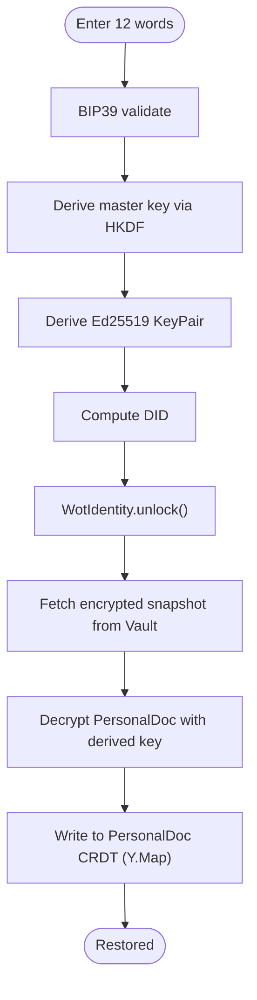
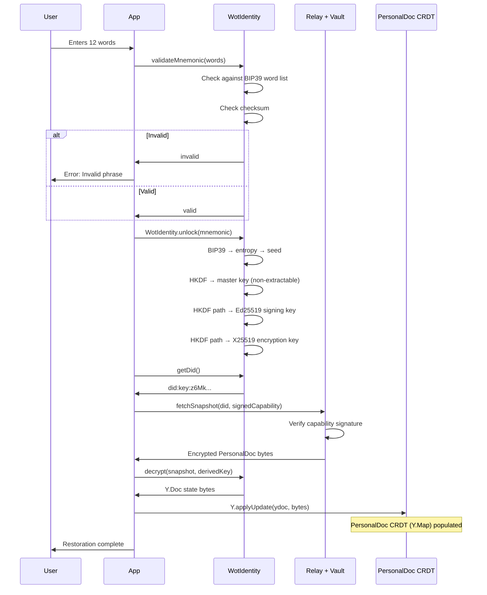
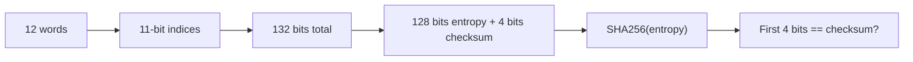
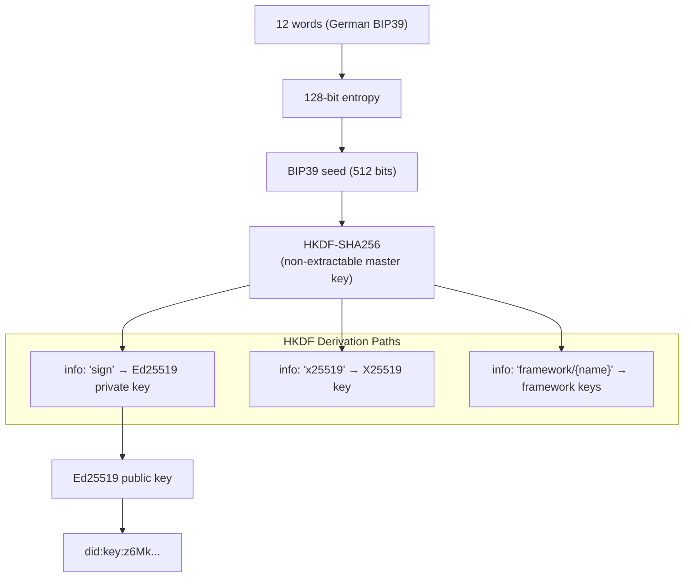
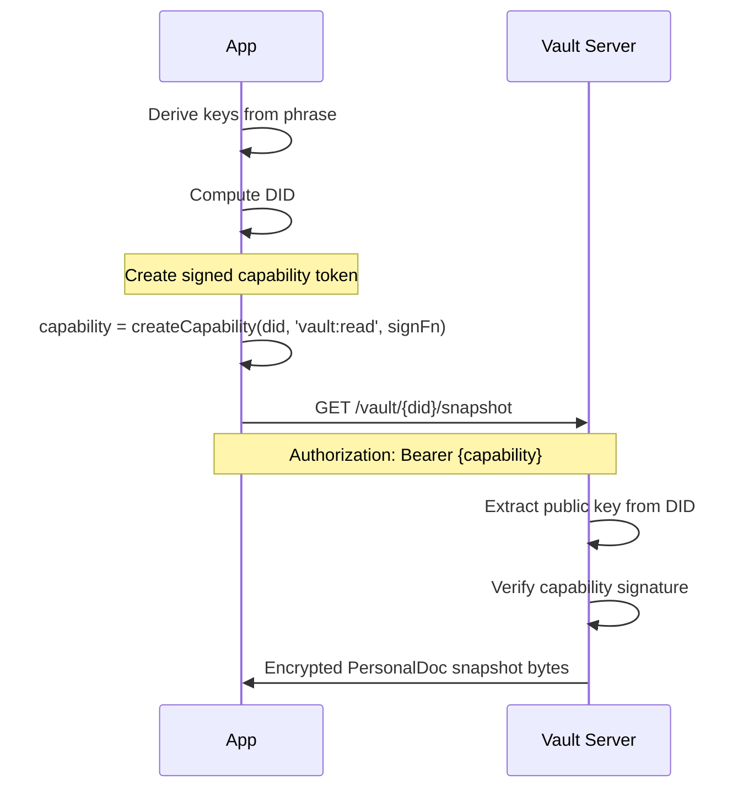
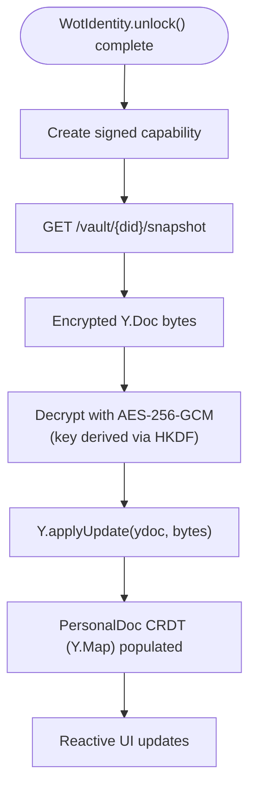
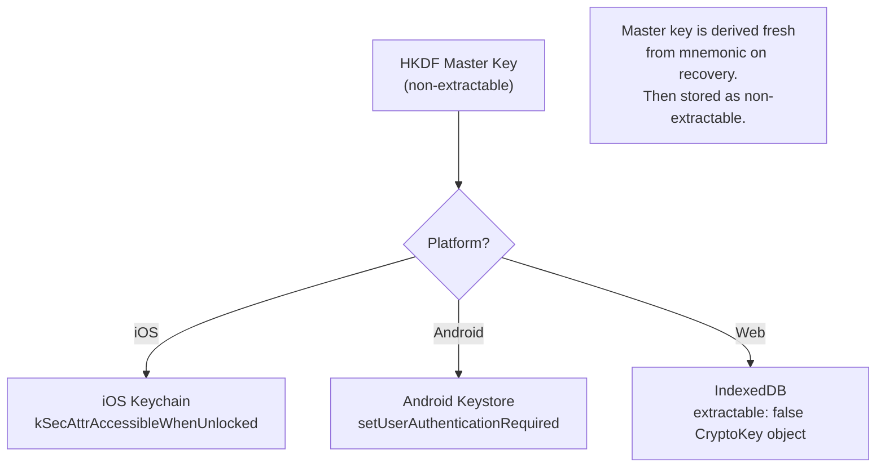
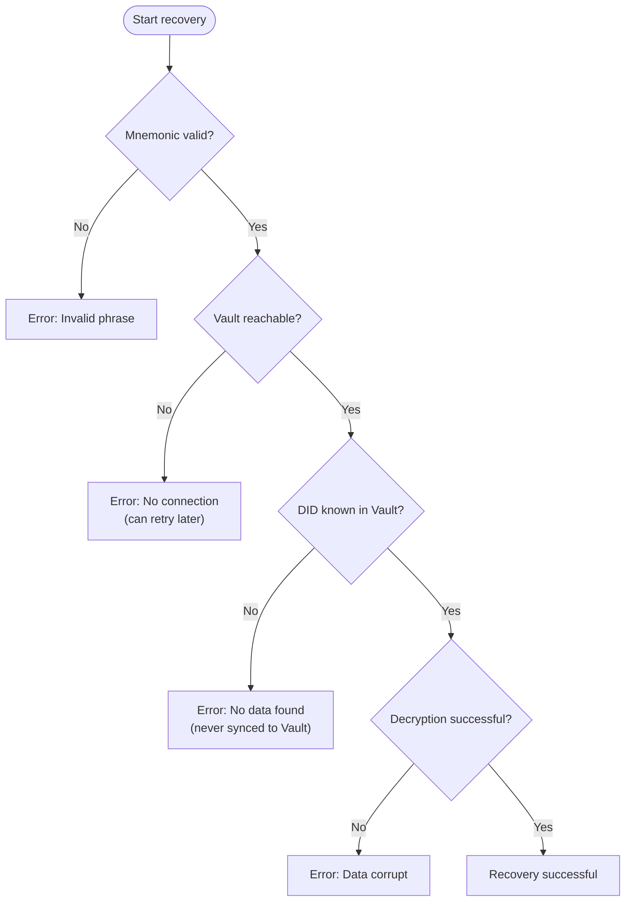
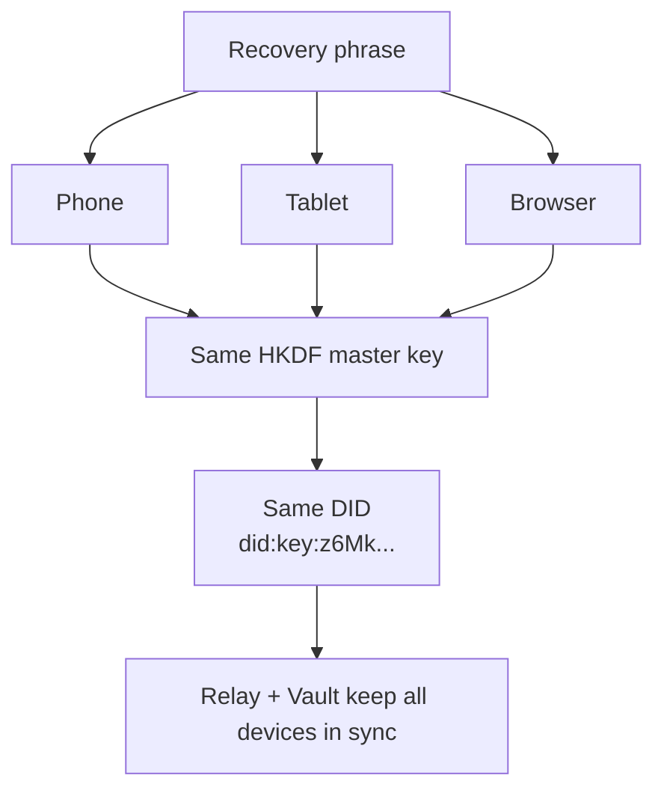
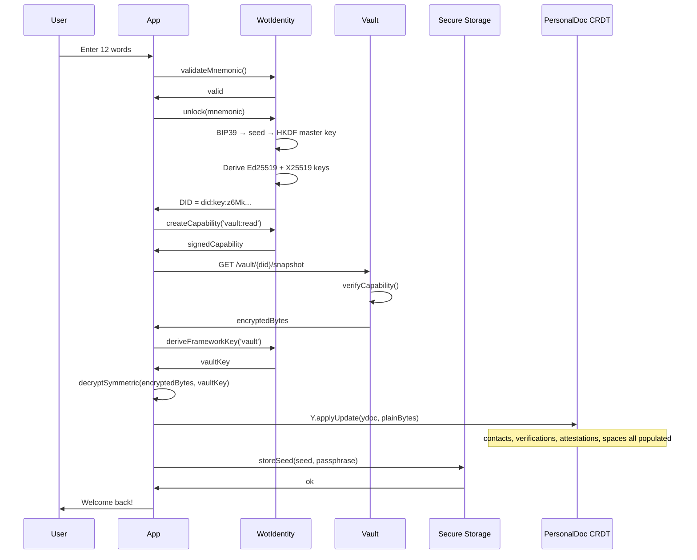

# Recovery Flow (Technical Perspective)

> How an identity is restored from the recovery phrase

## Overview



---

## Main flow: Recovery



---

## Step 1: Validate mnemonic

### BIP39 validation

```typescript
function validateMnemonic(words: string[]): { valid: boolean; error?: string } {
  // 1. Check count
  if (words.length !== 12) {
    return { valid: false, error: 'Exactly 12 words required' };
  }

  // 2. Check all words against BIP39 list (German wordlist)
  const wordlist = getBIP39Wordlist('german');
  for (const word of words) {
    if (!wordlist.includes(word.toLowerCase())) {
      return { valid: false, error: `Unknown word: ${word}` };
    }
  }

  // 3. Check checksum
  const entropy = mnemonicToEntropy(words);
  const checksumBits = calculateChecksum(entropy);
  const expectedChecksum = extractChecksumFromMnemonic(words);

  if (checksumBits !== expectedChecksum) {
    return { valid: false, error: 'Invalid checksum' };
  }

  return { valid: true };
}
```

### Checksum calculation



---

## Step 2: Derive keys — WotIdentity.unlock()

### From mnemonic to key material



### Code example

```typescript
// WotIdentity.unlock() — simplified
async function unlock(mnemonic: string): Promise<void> {
  // 1. Mnemonic → entropy → seed
  const entropy = mnemonicToEntropy(mnemonic.split(' '));
  const seed = await mnemonicToSeed(entropy); // standard BIP39

  // 2. Seed → HKDF master key (non-extractable)
  const masterKey = await crypto.subtle.importKey(
    'raw', seed,
    { name: 'HKDF' },
    false, // non-extractable
    ['deriveKey', 'deriveBits']
  );

  // 3. Derive Ed25519 signing key
  const signingKeyBytes = await crypto.subtle.deriveBits(
    { name: 'HKDF', hash: 'SHA-256', salt: new Uint8Array(32), info: encode('sign') },
    masterKey,
    256
  );
  // → used with @noble/ed25519 for signing

  // 4. Compute DID
  const publicKey = ed25519.getPublicKey(new Uint8Array(signingKeyBytes));
  const did = createDid(publicKey); // did:key:z6Mk...
}
```

---

## Step 3: Vault restore

### Authentication for recovery



### Data manifest (what is available)

```json
{
  "did": "did:key:z6Mk...",
  "dataAvailable": {
    "profile": true,
    "contacts": 23,
    "verifications": 23,
    "attestationsReceived": 47,
    "attestationsGiven": 12,
    "items": 34,
    "spaces": 3
  },
  "snapshotSize": "2.3 MB",
  "lastSync": "2026-01-08T10:00:00Z"
}
```

### Restore flow



---

## Step 4: PersonalDoc CRDT (Y.Map)

### Data model after restore

```typescript
// PersonalDoc is a Y.Doc with Y.Maps for each collection
interface PersonalDoc {
  profile:             Y.Map<ProfileDoc>
  contacts:            Y.Map<ContactDoc>        // keyed by DID
  verifications:       Y.Map<VerificationDoc>   // keyed by ID
  attestations:        Y.Map<AttestationDoc>    // keyed by ID
  attestationMetadata: Y.Map<AttestationMetaDoc>
  outbox:              Y.Map<OutboxEntryDoc>
  spaces:              Y.Map<SpaceMetadataDoc>
  groupKeys:           Y.Map<GroupKeyDoc>
}
```

### Applying the snapshot

```typescript
async function restoreFromVault(
  identity: WotIdentity,
  vaultClient: VaultClient
): Promise<YjsPersonalDocManager> {
  const did = identity.getDid();

  // 1. Fetch encrypted snapshot
  const encryptedBytes = await vaultClient.getSnapshot(did);

  if (!encryptedBytes) {
    // No vault data — fresh start
    return new YjsPersonalDocManager(identity);
  }

  // 2. Decrypt
  const vaultKey = await identity.deriveFrameworkKey('vault');
  const plainBytes = await decryptSymmetric(encryptedBytes, vaultKey);

  // 3. Apply to Y.Doc
  const ydoc = new Y.Doc();
  Y.applyUpdate(ydoc, plainBytes);

  // 4. Wrap in manager
  return new YjsPersonalDocManager(identity, ydoc);
}
```

---

## Step 5: Key storage after restore

### Platform-specific storage



### Encrypted seed storage (web)

On web, the seed is stored encrypted in IndexedDB so that subsequent unlocks only require a passphrase (not the full mnemonic):

```typescript
// After recovery: store encrypted seed for future unlockFromStorage()
async function storeSeed(seed: Uint8Array, passphrase: string): Promise<void> {
  // PBKDF2 to derive storage key from passphrase
  const storageKey = await deriveStorageKey(passphrase); // PBKDF2, 600k rounds

  // AES-256-GCM encrypt the seed
  const { ciphertext, iv } = await encryptAesGcm(seed, storageKey);

  // Store in IndexedDB
  await idb.put('seed-store', { ciphertext, iv }, 'encrypted-seed');
}
```

---

## Error handling

### Error types



### Error responses

```json
{
  "error": "invalid_mnemonic",
  "message": "The recovery phrase is invalid",
  "details": {
    "invalidWord": "bananx",
    "position": 2,
    "suggestion": "banane"
  }
}
```

```json
{
  "error": "did_not_found",
  "message": "No data exists for this identity",
  "details": {
    "did": "did:key:z6Mk...",
    "hint": "Was the identity synced to the Vault before the device was lost?"
  }
}
```

---

## Security considerations

### Brute-force protection

| Measure | Description |
| ------- | ----------- |
| BIP39 entropy | 128 bits = 2^128 combinations |
| HKDF | Key derivation is fast (unlike PBKDF2) but entropy space is the protection |
| No enumeration | Vault does not reveal whether a DID exists without a valid signature |
| Capability token | Vault requires a freshly signed capability — proves key possession |

### Timing analysis

```typescript
// Constant-time comparison for signature verification
function constantTimeEqual(a: Uint8Array, b: Uint8Array): boolean {
  if (a.length !== b.length) return false;

  let result = 0;
  for (let i = 0; i < a.length; i++) {
    result |= a[i] ^ b[i];
  }

  return result === 0;
}
```

### Recovery vs. new login

The Vault cannot distinguish between:

- A legitimate user recovering their identity
- An attacker who has stolen the phrase

**Consequence:** The phrase IS the identity. Whoever holds the phrase has control.

---

## Multi-Device vs. Recovery

### Difference

| Aspect | Multi-Device | Recovery |
| ------ | ------------ | -------- |
| Enter phrase | Yes | Yes |
| Old device still active | Yes | No |
| Sync state | Incremental from Relay | Full restore from Vault |
| Master key | Freshly derived from phrase | Freshly derived from phrase |
| PersonalDoc | Merge with existing | Replace from snapshot |

### Same phrase, multiple devices



---

## Complete sequence diagram


