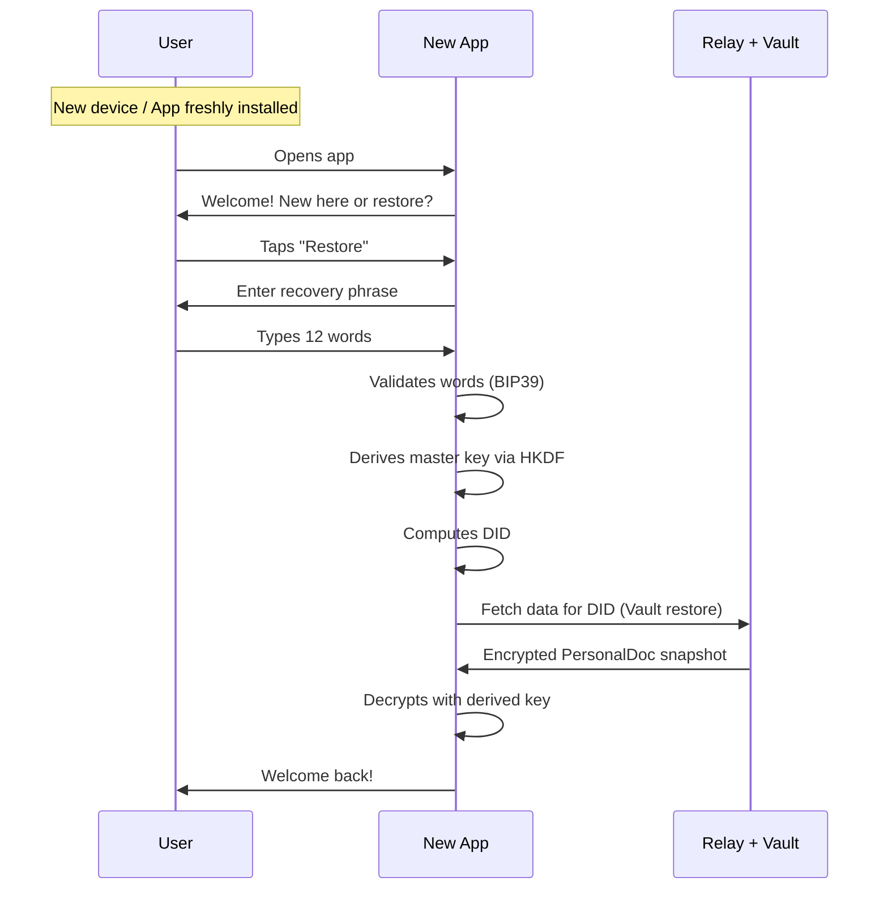
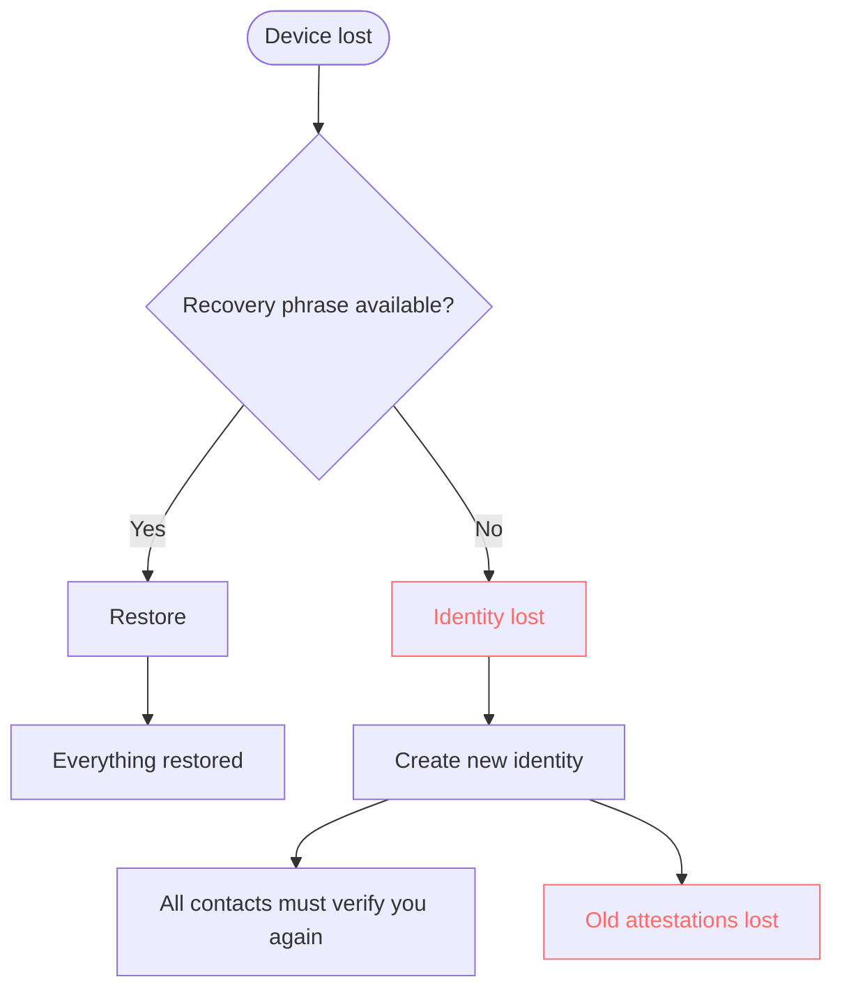
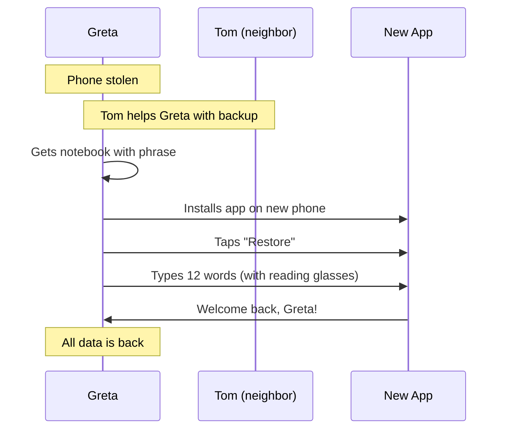
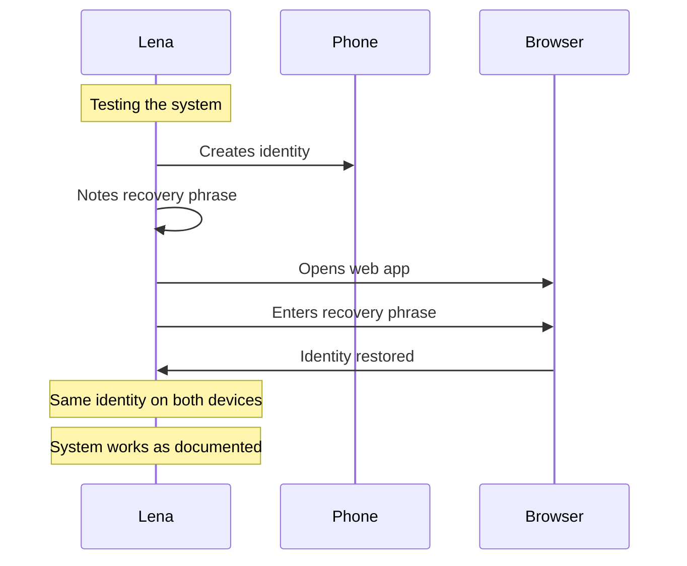
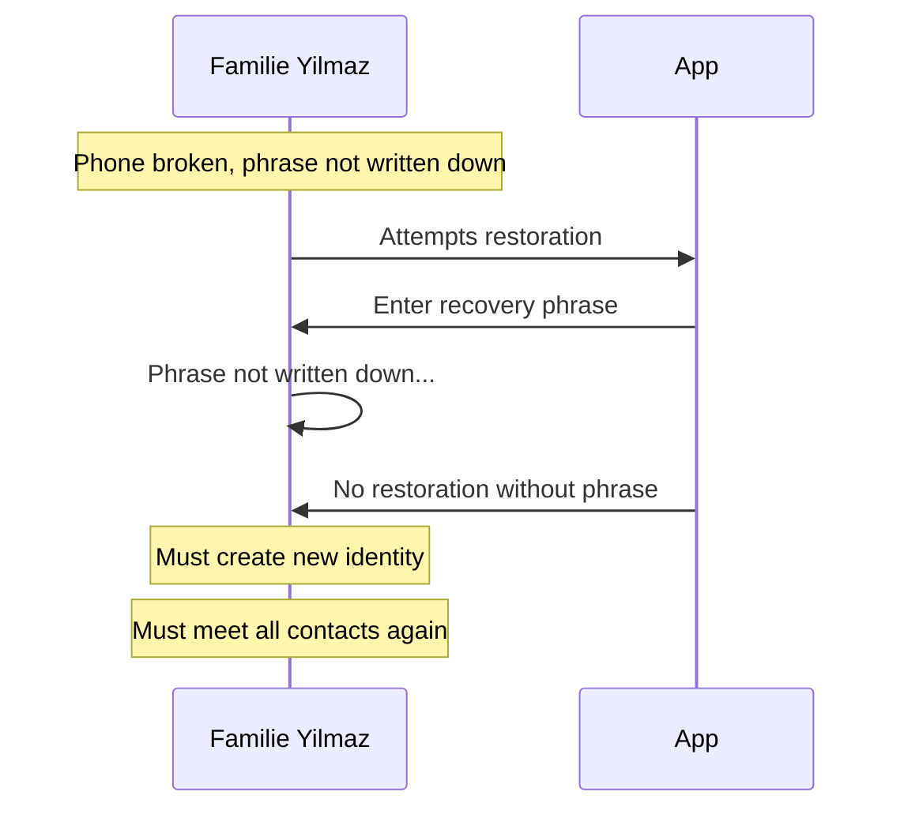
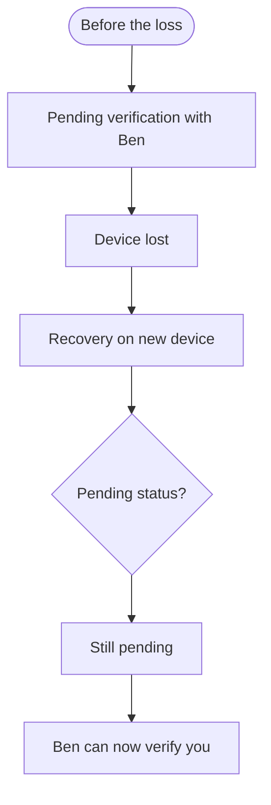
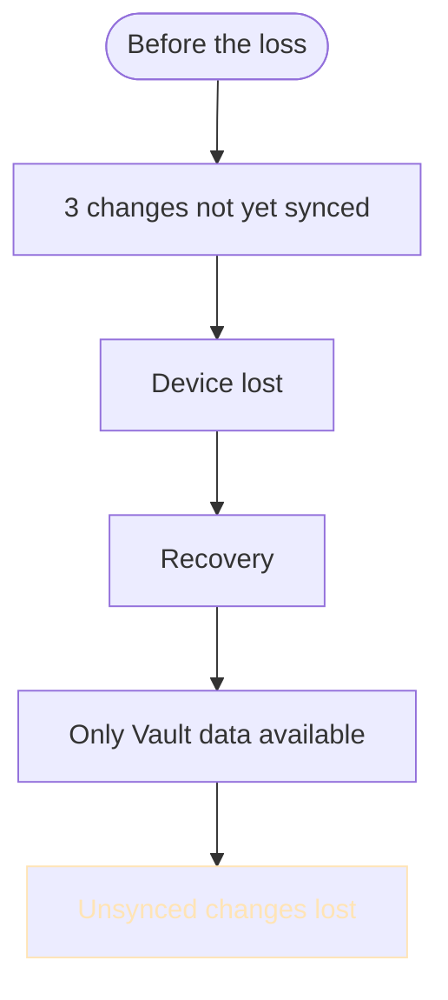

# Recovery Flow (User Perspective)

> How an identity is restored after losing access

## When do I need recovery?

| Situation | Recovery needed? |
| --------- | ---------------- |
| Device lost | Yes |
| Device stolen | Yes |
| App deleted | Yes |
| Browser data cleared (Web) | Yes |
| New device | Yes (or Multi-Device Setup) |
| App update | No |
| Password forgotten | There is no password |

---

## Prerequisite: Recovery Phrase

The recovery phrase is the **only way** to restore your identity.

```
┌─────────────────────────────────┐
│                                 │
│  ⚠️  IMPORTANT                  │
│                                 │
│  Your recovery phrase was       │
│  shown to you ONCE when you     │
│  created your identity.         │
│                                 │
│  It CANNOT be retrieved         │
│  again.                         │
│                                 │
│  Without it your identity       │
│  is LOST.                       │
│                                 │
└─────────────────────────────────┘
```

---

## Main flow: Restore identity



---

## What the user sees

### Start screen (fresh install)

```
┌─────────────────────────────────┐
│                                 │
│      🌐 Web of Trust            │
│                                 │
├─────────────────────────────────┤
│                                 │
│  ┌─────────────────────────┐    │
│  │                         │    │
│  │  New here?              │    │
│  │                         │    │
│  │  Create a new           │    │
│  │  identity               │    │
│  │                         │    │
│  └─────────────────────────┘    │
│                                 │
│  ┌─────────────────────────┐    │
│  │                         │    │
│  │  Restore                │    │
│  │                         │    │
│  │  I already have         │    │
│  │  an identity            │    │
│  │                         │    │
│  └─────────────────────────┘    │
│                                 │
└─────────────────────────────────┘
```

### Enter recovery phrase

```
┌─────────────────────────────────┐
│                                 │
│  Restore identity               │
│                                 │
├─────────────────────────────────┤
│                                 │
│  Enter your 12 words:           │
│                                 │
│  ┌─────────────────────────┐    │
│  │ 1. absurd               │    │
│  └─────────────────────────┘    │
│  ┌─────────────────────────┐    │
│  │ 2. banane               │    │
│  └─────────────────────────┘    │
│  ┌─────────────────────────┐    │
│  │ 3. chaos                │    │
│  └─────────────────────────┘    │
│  ┌─────────────────────────┐    │
│  │ 4.                      │    │
│  └─────────────────────────┘    │
│        ...                      │
│  ┌─────────────────────────┐    │
│  │ 12.                     │    │
│  └─────────────────────────┘    │
│                                 │
│  [ Restore ]                    │
│                                 │
└─────────────────────────────────┘
```

### Restoration in progress

```
┌─────────────────────────────────┐
│                                 │
│  Restoring...                   │
│                                 │
├─────────────────────────────────┤
│                                 │
│  ████████████░░░░░░░ 60%        │
│                                 │
│  ✅ Keys derived                │
│  ✅ Identity found              │
│  ⏳ Loading data...             │
│  ⬜ Loading contacts            │
│  ⬜ Loading content             │
│                                 │
└─────────────────────────────────┘
```

### Restoration successful

```
┌─────────────────────────────────┐
│                                 │
│  ✅ Welcome back!               │
│                                 │
├─────────────────────────────────┤
│                                 │
│  Your identity has been         │
│  restored:                      │
│                                 │
│         [Profile photo]         │
│          Anna Müller            │
│                                 │
│  ━━━━━━━━━━━━━━━━━━━━━━━━━━━    │
│                                 │
│  Restored:                      │
│                                 │
│  👥 23 contacts                 │
│  📜 47 attestations             │
│  📅 12 calendar entries         │
│  📍 8 map markers               │
│                                 │
│  [ Let's go ]                   │
│                                 │
└─────────────────────────────────┘
```

---

## Error case: Wrong phrase

```
┌─────────────────────────────────┐
│                                 │
│  ❌ Invalid phrase              │
│                                 │
├─────────────────────────────────┤
│                                 │
│  The recovery phrase you        │
│  entered is not valid.          │
│                                 │
│  Possible reasons:              │
│                                 │
│  • Word misspelled              │
│  • Words in wrong order         │
│  • Wrong word used              │
│                                 │
│  Please check your notes        │
│  and try again.                 │
│                                 │
│  [ Try again ]                  │
│                                 │
└─────────────────────────────────┘
```

---

## Error case: No recovery phrase



### What is lost

```
┌─────────────────────────────────┐
│                                 │
│  Without recovery phrase        │
│                                 │
├─────────────────────────────────┤
│                                 │
│  Unfortunately we cannot        │
│  restore your identity.         │
│                                 │
│  What is lost:                  │
│                                 │
│  ❌ Your identity (DID)         │
│  ❌ All verifications           │
│  ❌ All received attestations   │
│  ❌ Your profile                │
│                                 │
│  ━━━━━━━━━━━━━━━━━━━━━━━━━━━    │
│                                 │
│  You can create a new identity, │
│  but you will need to:          │
│                                 │
│  • Meet all contacts again      │
│  • Collect new attestations     │
│                                 │
│  [ Create new identity ]        │
│                                 │
└─────────────────────────────────┘
```

---

## Personas

### Greta loses her phone



### Lena (skeptic) tests recovery



### Familie Yilmaz without phrase



---

## Recovery on different platforms

### iOS / Android

```
┌─────────────────────────────────┐
│                                 │
│  After restoration:             │
│                                 │
│  ✅ Master key derived via HKDF │
│     stored in secure storage    │
│                                 │
│  ✅ All data loaded             │
│     from Vault                  │
│                                 │
│  ✅ Push notifications          │
│     activated                   │
│                                 │
└─────────────────────────────────┘
```

### Web (Browser)

```
┌─────────────────────────────────┐
│                                 │
│  ⚠️  Web note                   │
│                                 │
│  In the browser your key is     │
│  protected by the Web Crypto    │
│  API and cannot be extracted.   │
│                                 │
│  WARNING: If you use "Clear     │
│  browser data" you will need    │
│  to restore again using         │
│  your recovery phrase.          │
│                                 │
│  [ Understood ]                 │
│                                 │
└─────────────────────────────────┘
```

---

## What happens to ongoing processes?

### Pending verifications



**Result:** Pending verifications are preserved. The other person can still verify you.

### Unsynced changes



**Result:** Changes that were not synced before the loss are gone.

---

## Security notes

### Store your phrase safely

```
┌─────────────────────────────────┐
│                                 │
│  Recommendations                │
│                                 │
├─────────────────────────────────┤
│                                 │
│  ✅ Write on paper              │
│                                 │
│  ✅ Store in a safe place       │
│     (not on your phone!)        │
│                                 │
│  ✅ Consider a second copy      │
│     at a different location     │
│                                 │
│  ━━━━━━━━━━━━━━━━━━━━━━━━━━━    │
│                                 │
│  ❌ Do not store digitally      │
│     (photos, note apps, cloud)  │
│                                 │
│  ❌ Do not send via email/chat  │
│                                 │
│  ❌ Do not take a screenshot    │
│                                 │
└─────────────────────────────────┘
```

### If you suspect compromise

```
┌─────────────────────────────────┐
│                                 │
│  ⚠️  Phrase compromised?        │
│                                 │
├─────────────────────────────────┤
│                                 │
│  If you believe someone         │
│  knows your phrase:             │
│                                 │
│  1. Create a NEW identity       │
│                                 │
│  2. Inform your contacts        │
│                                 │
│  3. Get re-verified             │
│                                 │
│  The old identity should        │
│  no longer be used.             │
│                                 │
└─────────────────────────────────┘
```

---

## FAQ

**Can I change my phrase?**
No. The phrase is permanently bound to your identity. A new phrase means a new identity.

**What if I wrote down a word incorrectly?**
The app checks whether all words are valid (BIP39 word list). If a word is wrong, the phrase is rejected.

**Can support help me?**
No. Nobody but you knows your phrase. That is intentional — so nobody can steal it.

**Can I view the phrase again later?**
No. The phrase is shown only once at identity creation and is not stored anywhere afterwards.
