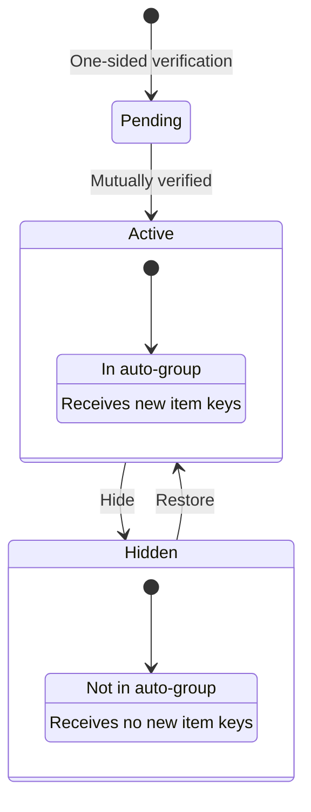
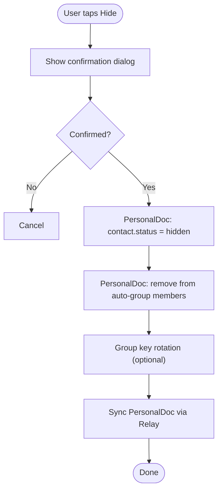
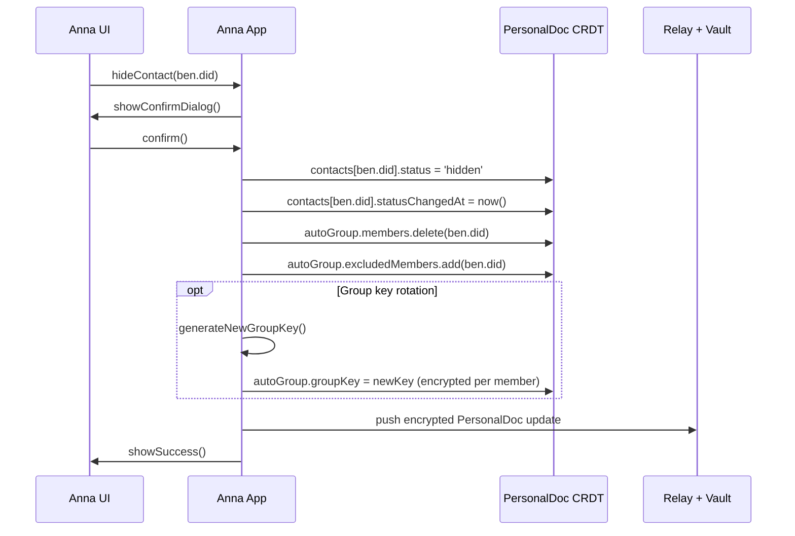
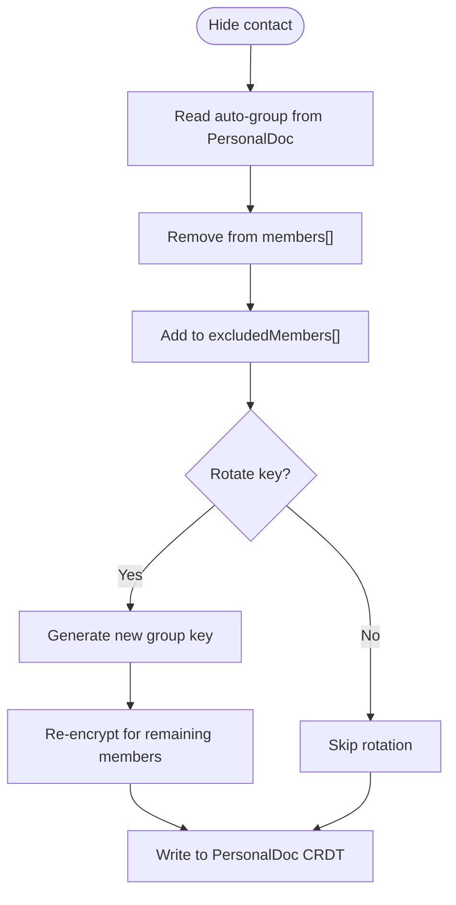
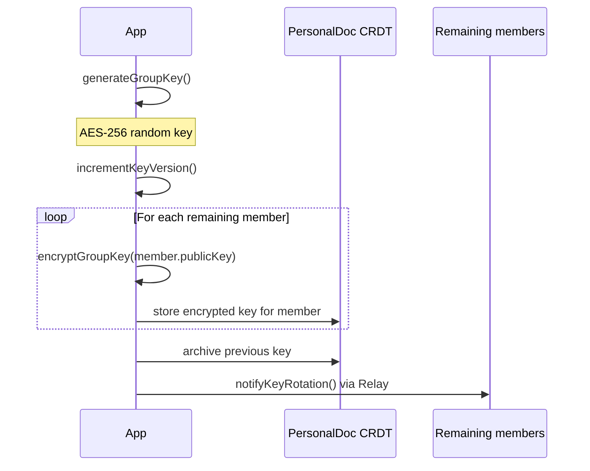
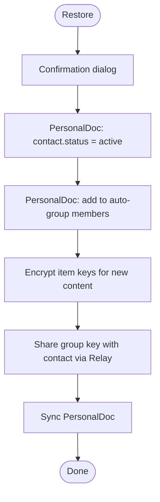
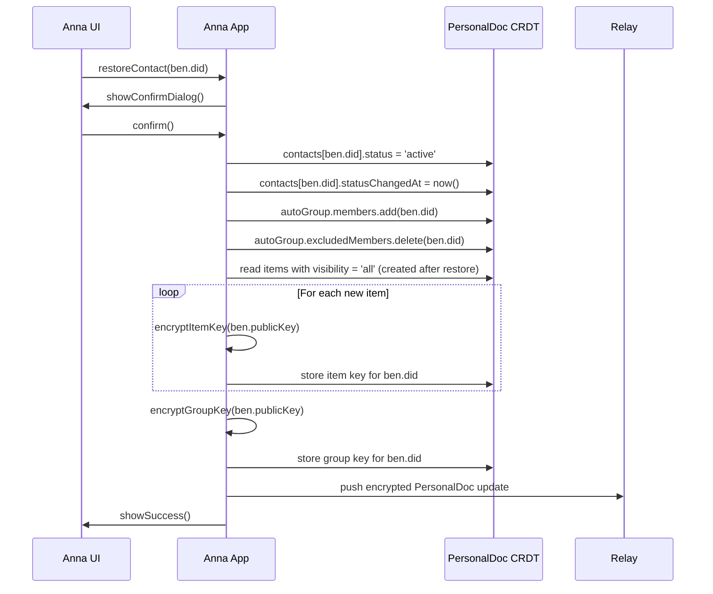
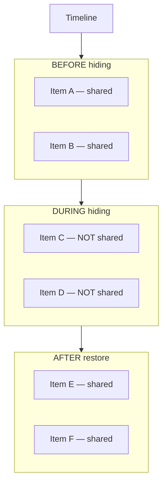
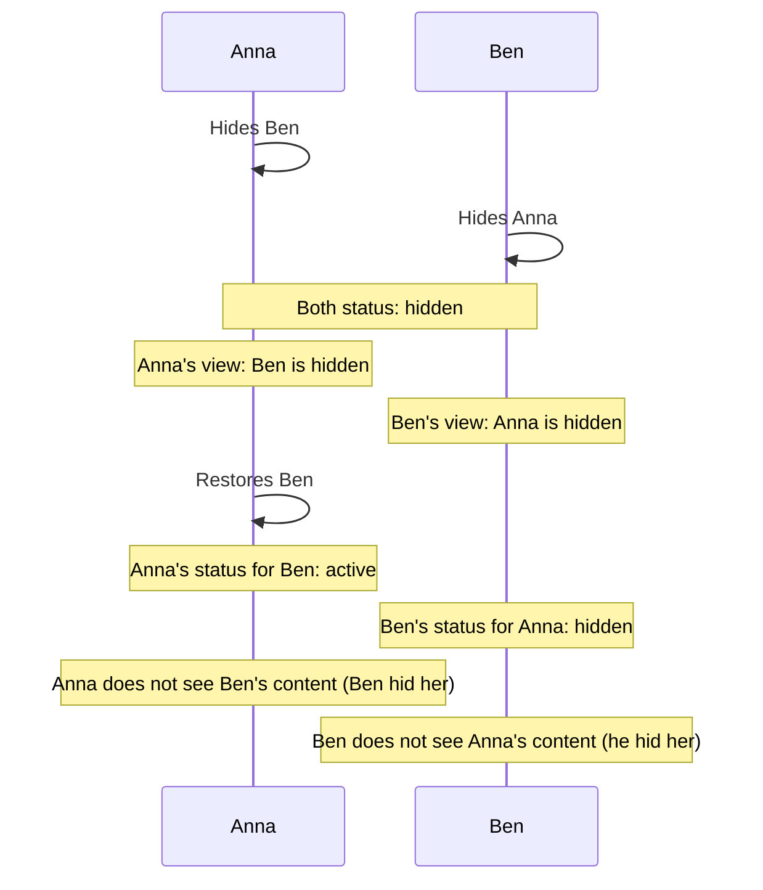
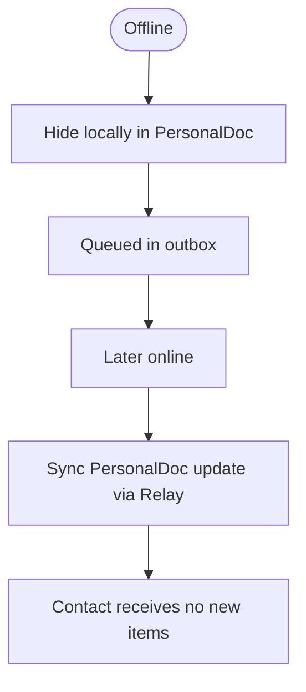

# Hide Flow (Technical Perspective)

> How contacts are hidden and restored

## Data model

### Contact status state machine



### Contact record in PersonalDoc CRDT (Y.Map)

```json
{
  "did": "did:key:z6MkBen...",
  "publicKey": "ed25519:base64...",
  "name": "Ben Schmidt",
  "status": "hidden",
  "statusChangedAt": "2026-01-08T14:00:00Z",
  "statusReason": "user_initiated",
  "statusHistory": [
    {
      "status": "pending",
      "timestamp": "2026-01-05T10:00:00Z"
    },
    {
      "status": "active",
      "timestamp": "2026-01-05T10:05:00Z"
    },
    {
      "status": "hidden",
      "timestamp": "2026-01-08T14:00:00Z",
      "reason": "user_initiated"
    }
  ],
  "verifiedAt": "2026-01-05T10:05:00Z",
  "myVerification": "urn:uuid:123...",
  "theirVerification": "urn:uuid:456..."
}
```

All contact data lives in the **PersonalDoc CRDT (Y.Map)** — there is no separate SQL or Dexie table.

---

## Main flow: Hide a contact



---

## Sequence diagram: Hide



---

## Auto-group management in PersonalDoc

### Structure (Y.Map entries)

```json
{
  "id": "autogroup-anna",
  "type": "AutoContactGroup",
  "owner": "did:key:z6MkAnna...",
  "members": [
    "did:key:z6MkCarla...",
    "did:key:z6MkTom..."
  ],
  "excludedMembers": [
    "did:key:z6MkBen..."
  ],
  "groupKey": {
    "current": {
      "key": "aes256:encrypted...",
      "version": 3,
      "createdAt": "2026-01-08T14:00:00Z"
    },
    "previous": [
      {
        "key": "aes256:encrypted...",
        "version": 2,
        "validUntil": "2026-01-08T14:00:00Z"
      }
    ]
  }
}
```

### Removing from auto-group



---

## Key rotation (optional)

### When to rotate?

| Scenario | Rotate key? |
| -------- | ----------- |
| Normal hide | Optional (recommended: No) |
| Security concern | Yes |
| User explicitly requests | Yes |

### Why optional?

```
┌─────────────────────────────────┐
│                                 │
│  Design decision                │
│                                 │
│  Key rotation on hide is NOT    │
│  the default, because:          │
│                                 │
│  1. The hidden contact already  │
│     has all old item keys       │
│                                 │
│  2. New items will not be       │
│     encrypted for them anyway   │
│                                 │
│  3. Rotation is expensive       │
│     (re-encrypt for all members)│
│                                 │
│  For genuine security concerns  │
│  rotation can be triggered      │
│  explicitly.                    │
│                                 │
└─────────────────────────────────┘
```

### Rotation flow



---

## Restore a contact



### Sequence diagram



---

## What is NOT shared after restore?



**Rationale:** Items created during the "hidden period" were never encrypted for the contact. Sharing them retroactively would be inconsistent with the decision to hide that contact.

---

## API

### Hide

```typescript
async function hideContact(contactDid: string): Promise<void> {
  // 1. Validate
  const contact = personalDoc.contacts[contactDid];
  if (!contact || contact.status !== 'active') {
    throw new Error('Contact not active');
  }

  // 2. Update status in PersonalDoc CRDT
  personalDoc.contacts[contactDid] = {
    ...contact,
    status: 'hidden',
    statusChangedAt: new Date().toISOString(),
    statusReason: 'user_initiated',
    statusHistory: [
      ...(contact.statusHistory ?? []),
      { status: 'hidden', timestamp: new Date().toISOString(), reason: 'user_initiated' }
    ]
  };

  // 3. Remove from auto-group
  await removeFromAutoGroup(contactDid);

  // 4. Sync via Relay (immediate, no debounce)
  await relay.pushUpdate(encryptedPersonalDocUpdate());
}
```

### Restore

```typescript
async function restoreContact(contactDid: string): Promise<void> {
  // 1. Validate
  const contact = personalDoc.contacts[contactDid];
  if (!contact || contact.status !== 'hidden') {
    throw new Error('Contact not hidden');
  }

  // 2. Update status in PersonalDoc CRDT
  personalDoc.contacts[contactDid] = {
    ...contact,
    status: 'active',
    statusChangedAt: new Date().toISOString(),
    statusReason: 'user_restored',
    statusHistory: [
      ...(contact.statusHistory ?? []),
      { status: 'active', timestamp: new Date().toISOString(), reason: 'user_restored' }
    ]
  };

  // 3. Add back to auto-group
  await addToAutoGroup(contactDid);

  // 4. Re-encrypt recent items for contact
  await reencryptRecentItemsForContact(contactDid);

  // 5. Share group key
  await shareGroupKeyWithContact(contactDid);

  // 6. Sync via Relay
  await relay.pushUpdate(encryptedPersonalDocUpdate());
}
```

---

## Security considerations

### What the hidden contact still has access to

| Data | Access after hiding |
| ---- | ------------------- |
| Old item keys | Yes (already decrypted) |
| Old content | Yes (stored locally) |
| Old attestations | Yes (immutable) |
| Old group key | Yes (if not rotated) |
| **New content** | **No** |
| **New item keys** | **No** |

### Signalling to the contact

The Relay could signal to the contact that they have been hidden. **Recommendation:** Do not do this.

| Option | Pro | Con |
| ------ | --- | --- |
| Signal | Transparency | May cause conflict |
| No signal | Privacy | Contact may notice |

**Recommendation:** No explicit signalling. The contact will notice when they stop receiving new content.

---

## Edge cases

### Both sides hide each other



### Hiding while offline



**Note:** Items created for "all contacts" while offline will not be distributed to the hidden contact when syncing.

### Contact cannot be deleted

Contacts cannot be deleted, only hidden. This is intentional: the verification record is immutable and remains as historical fact.
