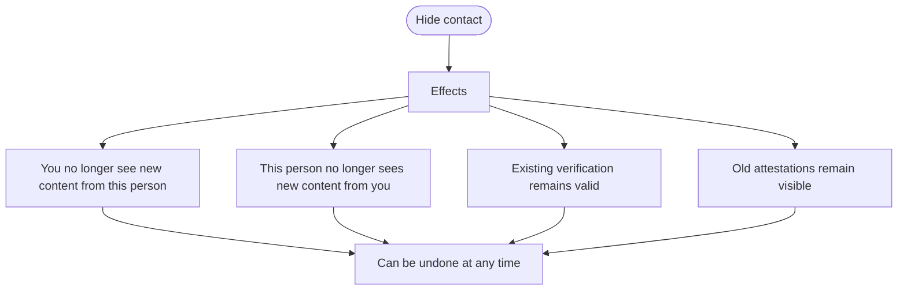
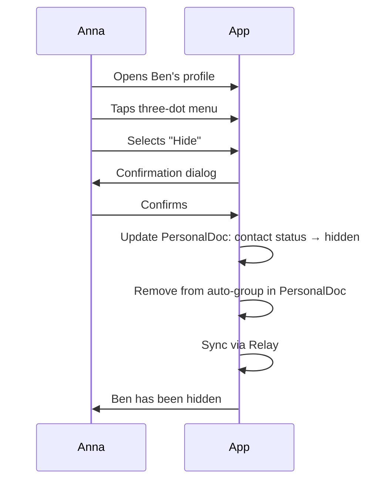
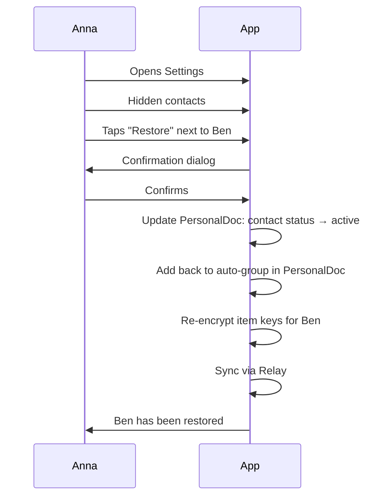
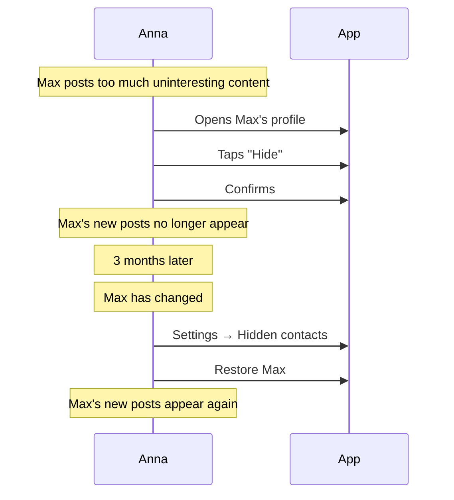
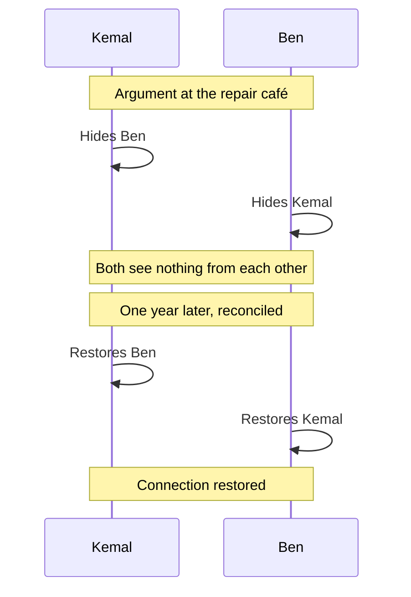

# Hide Flow (User Perspective)

> How a contact is hidden

## What does "hide" mean?

Hiding is a **soft separation** from a contact. The verification remains intact, but the contact is removed from your active network.

| Hide | Block (does not exist) |
| ---- | ---------------------- |
| Soft, reversible | Hard, permanent |
| Verification stays | — |
| No new content | — |
| Can be undone | — |

---

## What happens when you hide someone?



---

## Main flow: Hide a contact



---

## What the user sees

### Contact menu

```
┌─────────────────────────────────┐
│         [Profile photo]         │
│          Ben Schmidt            │
│                                 │
│  ━━━━━━━━━━━━━━━━━━━━━━━━━━━    │
│                                 │
│  ┌─────────────────────────┐    │
│  │ View profile            │    │
│  └─────────────────────────┘    │
│  ┌─────────────────────────┐    │
│  │ Attestations            │    │
│  └─────────────────────────┘    │
│  ┌─────────────────────────┐    │
│  │ Create attestation      │    │
│  └─────────────────────────┘    │
│                                 │
│  ━━━━━━━━━━━━━━━━━━━━━━━━━━━    │
│                                 │
│  ┌─────────────────────────┐    │
│  │ Hide                    │    │
│  └─────────────────────────┘    │
│                                 │
└─────────────────────────────────┘
```

### Confirmation dialog

```
┌─────────────────────────────────┐
│                                 │
│  Hide Ben?                      │
│                                 │
├─────────────────────────────────┤
│                                 │
│  What happens:                  │
│                                 │
│  • You will no longer see       │
│    new content from Ben         │
│                                 │
│  • Ben will no longer see       │
│    new content from you         │
│                                 │
│  • Your verification stays      │
│    intact                       │
│                                 │
│  • Old attestations remain      │
│    visible                      │
│                                 │
│  You can undo this at any time. │
│                                 │
│  ━━━━━━━━━━━━━━━━━━━━━━━━━━━    │
│                                 │
│  [ Cancel ]                     │
│                                 │
│  [ Hide ]                       │
│                                 │
└─────────────────────────────────┘
```

### Success message

```
┌─────────────────────────────────┐
│                                 │
│  ✅ Ben has been hidden         │
│                                 │
│  You will no longer see         │
│  new content from Ben.          │
│                                 │
│  [ Undo ]                       │
│                                 │
│  [ OK ]                         │
│                                 │
└─────────────────────────────────┘
```

---

## Manage hidden contacts

### Settings

```
┌─────────────────────────────────┐
│  Settings                       │
├─────────────────────────────────┤
│                                 │
│  Contacts                       │
│                                 │
│  ━━━━━━━━━━━━━━━━━━━━━━━━━━━    │
│                                 │
│  Hidden contacts (2)            │
│                                 │
│  ┌─────────────────────────┐    │
│  │ Ben Schmidt             │    │
│  │    Hidden on            │    │
│  │    08.01.2026           │    │
│  │                         │    │
│  │    [ Restore ]          │    │
│  └─────────────────────────┘    │
│                                 │
│  ┌─────────────────────────┐    │
│  │ Carla Braun             │    │
│  │    Hidden on            │    │
│  │    05.01.2026           │    │
│  │                         │    │
│  │    [ Restore ]          │    │
│  └─────────────────────────┘    │
│                                 │
└─────────────────────────────────┘
```

---

## Restore a contact



### Restore confirmation dialog

```
┌─────────────────────────────────┐
│                                 │
│  Restore Ben?                   │
│                                 │
├─────────────────────────────────┤
│                                 │
│  What happens:                  │
│                                 │
│  • You will see new content     │
│    from Ben again               │
│                                 │
│  • Ben will see your new        │
│    content again                │
│                                 │
│  • New content will be shared   │
│    (content created during the  │
│    "hidden period" will not)    │
│                                 │
│  ━━━━━━━━━━━━━━━━━━━━━━━━━━━    │
│                                 │
│  [ Cancel ]                     │
│                                 │
│  [ Restore ]                    │
│                                 │
└─────────────────────────────────┘
```

---

## Visibility matrix

### What does who see after hiding?

| Content | Anna sees | Ben sees |
| ------- | --------- | -------- |
| Ben's old content (before hiding) | Yes (locally stored) | — |
| Ben's new content (after hiding) | No | — |
| Anna's old content | — | Yes (locally stored) |
| Anna's new content | — | No |
| Old attestations | Yes | Yes |
| New attestations | Yes (can be created) | Yes (receives them) |

### After restore

| Content | Anna sees | Ben sees |
| ------- | --------- | -------- |
| Content during "hidden period" | No | No |
| New content (after restore) | Yes | Yes |

---

## Personas

### Anna hides an annoying contact



### Kemal after an argument



---

## Comparison with other systems

| System | "Unfriend" means |
| ------ | ---------------- |
| Facebook | Relationship deleted, must be re-added |
| WhatsApp | Block prevents all messages |
| Web of Trust | Hide is temporary, verification stays |

### Why this design?

```
┌─────────────────────────────────┐
│                                 │
│  Design decision                │
│                                 │
│  Verification is a statement    │
│  about the past:                │
│                                 │
│  "I met this person in person   │
│   on 08.01.2026"                │
│                                 │
│  That cannot be "undone".       │
│                                 │
│  Hide only means:               │
│  "I don't want to share         │
│   content with this person      │
│   right now."                   │
│                                 │
└─────────────────────────────────┘
```

---

## FAQ

**Can the other person see that I hid them?**
Not directly. But if they notice they no longer see your new content, they may suspect it.

**Can I still create attestations for hidden contacts?**
Yes. Attestations are independent of hide status. Ben receives the attestation even when hidden.

**What happens with groups when I hide someone?**
You both remain in shared groups. But your "for all contacts" content no longer reaches this person.

**Can I permanently remove someone?**
No. The verification stays. You can only hide.

**What if both sides hide each other?**
Then neither sees content from the other. Both can independently restore the connection.
