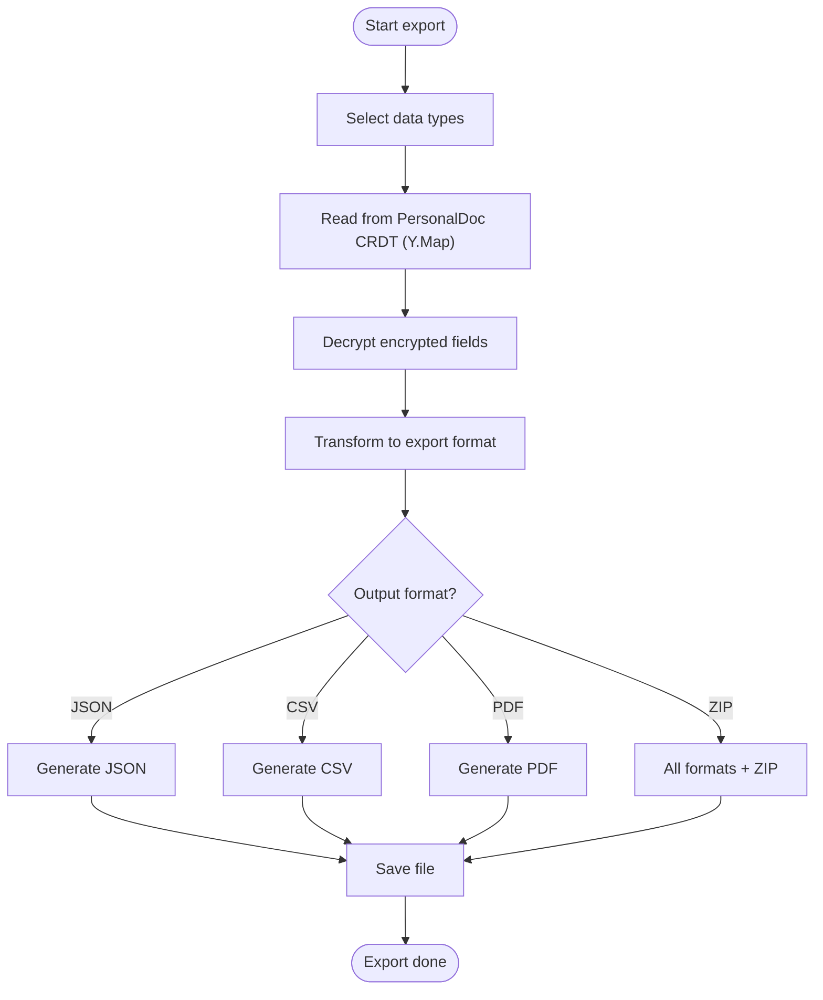
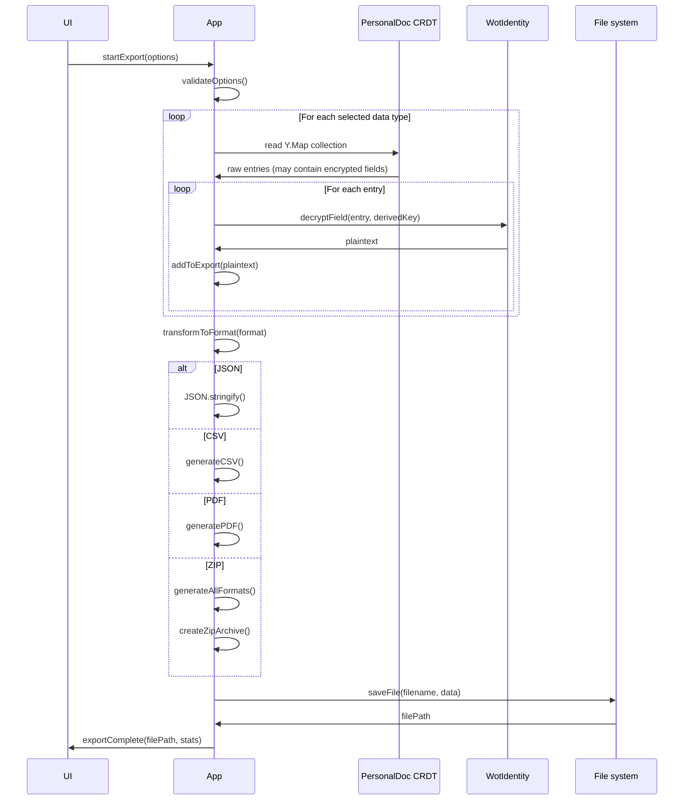

# Export Flow (Technical Perspective)

> **Status: NOT YET IMPLEMENTED**
> This document describes the planned export feature. It has not been built yet.

---

> How data is exported and formatted

## Overview



---

## Export data structure

### Complete export (JSON)

```json
{
  "$schema": "https://web-of-trust.de/schemas/export-v1.json",
  "exportVersion": "1.0",
  "exportedAt": "2026-01-08T15:00:00Z",
  "exportedBy": "did:key:z6MkAnna...",

  "profile": {
    "did": "did:key:z6MkAnna...",
    "name": "Anna Müller",
    "bio": "Active in the community garden Sonnenberg",
    "photo": {
      "format": "jpeg",
      "data": "base64...",
      "hash": "sha256:abc123..."
    },
    "publicKey": {
      "type": "Ed25519VerificationKey2020",
      "publicKeyMultibase": "z6Mk..."
    },
    "createdAt": "2026-01-01T10:00:00Z",
    "updatedAt": "2026-01-08T12:00:00Z"
  },

  "contacts": [
    {
      "did": "did:key:z6MkBen...",
      "name": "Ben Schmidt",
      "status": "active",
      "verifiedAt": "2026-01-05T10:05:00Z",
      "myVerificationId": "urn:uuid:123..."
    }
  ],

  "verifications": [
    {
      "id": "urn:uuid:123...",
      "type": "IdentityVerification",
      "from": "did:key:z6MkAnna...",
      "to": "did:key:z6MkBen...",
      "timestamp": "2026-01-05T10:05:00Z",
      "proof": { }
    }
  ],

  "attestationsReceived": [
    {
      "id": "urn:uuid:456...",
      "from": "did:key:z6MkTom...",
      "claim": "Helped for 3 hours in the garden",
      "tags": ["garden", "helping"],
      "createdAt": "2026-01-08T14:00:00Z",
      "proof": { }
    }
  ],

  "attestationsGiven": [
    {
      "id": "urn:uuid:789...",
      "to": "did:key:z6MkBen...",
      "claim": "Knows a lot about bicycles",
      "tags": ["craft", "bicycle"],
      "createdAt": "2026-01-06T10:00:00Z",
      "proof": { }
    }
  ],

  "items": [
    {
      "id": "urn:uuid:item1...",
      "type": "CalendarItem",
      "title": "Garden meeting",
      "content": {
        "startDate": "2026-01-15T14:00:00Z",
        "location": "Community garden"
      },
      "createdAt": "2026-01-08T10:00:00Z"
    }
  ],

  "spaces": [
    {
      "id": "urn:uuid:space1...",
      "name": "Community garden Sonnenberg",
      "role": "member",
      "joinedAt": "2026-01-02T10:00:00Z"
    }
  ],

  "metadata": {
    "totalContacts": 23,
    "totalVerifications": 23,
    "totalAttestationsReceived": 47,
    "totalAttestationsGiven": 12,
    "totalItems": 34,
    "totalSpaces": 3,
    "exportSizeBytes": 2456789
  }
}
```

---

## Main flow: Export



---

## Data collection from PersonalDoc CRDT

### Export profile

```typescript
async function exportProfile(personalDoc: PersonalDoc): Promise<ExportProfile> {
  const profile = personalDoc.profile.toJSON();

  let photoData = null;
  if (profile.avatarData) {
    photoData = {
      format: 'jpeg',
      data: arrayBufferToBase64(profile.avatarData),
      hash: await sha256hex(profile.avatarData)
    };
  }

  return {
    did: profile.did,
    name: profile.name,
    bio: profile.bio,
    photo: photoData,
    publicKey: profile.publicKey,
    createdAt: profile.createdAt,
    updatedAt: profile.updatedAt
  };
}
```

### Export contacts

```typescript
async function exportContacts(personalDoc: PersonalDoc): Promise<ExportContact[]> {
  const contacts = Object.values(personalDoc.contacts.toJSON());

  return contacts
    .filter(c => c.status !== 'deleted')
    .map(contact => ({
      did: contact.did,
      name: contact.name,
      status: contact.status,
      verifiedAt: contact.verifiedAt,
      myVerificationId: contact.myVerification
    }));
}
```

### Export items

```typescript
async function exportItems(
  personalDoc: PersonalDoc,
  identity: WotIdentity
): Promise<ExportItem[]> {
  const items = Object.values(personalDoc.items?.toJSON() ?? {});
  const myDid = identity.getDid();

  return Promise.all(
    items
      .filter(item => item.ownerDid === myDid && !item.deleted)
      .map(async item => {
        // Decrypt content if encrypted
        let content = item.content;
        if (item.encrypted && item.itemKey) {
          const vaultKey = await identity.deriveFrameworkKey('item-key');
          content = await decryptSymmetric(item.encryptedContent, vaultKey);
        }

        return {
          id: item.id,
          type: item.type,
          title: item.title,
          content,
          visibility: item.visibility,
          createdAt: item.createdAt,
          updatedAt: item.updatedAt
        };
      })
  );
}
```

---

## Format conversion

### JSON

```typescript
function generateJSON(exportData: ExportData): string {
  return JSON.stringify(exportData, null, 2);
}
```

### CSV

```typescript
function generateCSV(data: unknown[], type: 'contacts' | 'attestations' | 'items'): string {
  const configs = {
    contacts: {
      headers: ['Name', 'DID', 'Status', 'Verified on'],
      row: (c: ExportContact) => [c.name, c.did, c.status, c.verifiedAt]
    },
    attestations: {
      headers: ['From', 'To', 'Text', 'Tags', 'Date'],
      row: (a: ExportAttestation) => [
        a.from ?? '-',
        a.to ?? '-',
        `"${a.claim.replace(/"/g, '""')}"`,
        a.tags.join(';'),
        a.createdAt
      ]
    },
    items: {
      headers: ['Type', 'Title', 'Created', 'Updated'],
      row: (i: ExportItem) => [i.type, i.title, i.createdAt, i.updatedAt]
    }
  };

  const config = configs[type];
  const lines = [
    config.headers.join(','),
    ...data.map(item => (config.row as (x: unknown) => unknown[])(item).join(','))
  ];

  return lines.join('\n');
}
```

### PDF

```typescript
async function generatePDF(exportData: ExportData): Promise<Uint8Array> {
  const doc = new PDFDocument();

  // Header
  doc.fontSize(24).text('Web of Trust Export');
  doc.fontSize(12).text(exportData.profile.name);
  doc.text(new Date().toLocaleDateString('en-GB'));
  doc.moveDown();

  // Profile
  doc.fontSize(16).text('Profile');
  doc.fontSize(10)
     .text(`DID: ${exportData.profile.did}`)
     .text(`Name: ${exportData.profile.name}`)
     .text(`Bio: ${exportData.profile.bio ?? '-'}`);
  doc.moveDown();

  // Contacts
  doc.fontSize(16).text(`Contacts (${exportData.contacts.length})`);
  for (const contact of exportData.contacts) {
    doc.fontSize(10).text(`• ${contact.name} — ${contact.status}`);
  }
  doc.moveDown();

  // Attestations
  doc.fontSize(16).text('Attestations');
  doc.fontSize(12).text('Received:');
  for (const att of exportData.attestationsReceived) {
    doc.fontSize(10).text(`• "${att.claim}" — from ${att.fromName ?? att.from}`);
  }

  return doc.getBuffer();
}
```

### ZIP archive

```typescript
async function generateZipArchive(exportData: ExportData): Promise<Blob> {
  const zip = new JSZip();

  zip.file('export.json', generateJSON(exportData));
  zip.file('contacts.csv', generateCSV(exportData.contacts, 'contacts'));
  zip.file('attestations-received.csv',
    generateCSV(exportData.attestationsReceived, 'attestations'));
  zip.file('attestations-given.csv',
    generateCSV(exportData.attestationsGiven, 'attestations'));
  zip.file('items.csv', generateCSV(exportData.items, 'items'));

  const pdf = await generatePDF(exportData);
  zip.file('summary.pdf', pdf);

  if (exportData.profile.photo) {
    const media = zip.folder('media')!;
    media.file(
      `profile-photo.${exportData.profile.photo.format}`,
      exportData.profile.photo.data,
      { base64: true }
    );
  }

  return zip.generateAsync({ type: 'blob' });
}
```

---

## Export options

### Configuration

```typescript
interface ExportOptions {
  // What to export
  includeProfile: boolean;
  includeContacts: boolean;
  includeVerifications: boolean;
  includeAttestationsReceived: boolean;
  includeAttestationsGiven: boolean;
  includeItems: boolean;
  includeSpaces: boolean;
  includeMedia: boolean;

  // Format
  format: 'json' | 'csv' | 'pdf' | 'zip';

  // Filters
  dateFrom?: Date;
  dateTo?: Date;
  contactFilter?: string[]; // DIDs

  // Options
  prettyPrint: boolean;
  includeProofs: boolean;
}
```

### Default options

```typescript
const defaultExportOptions: ExportOptions = {
  includeProfile: true,
  includeContacts: true,
  includeVerifications: true,
  includeAttestationsReceived: true,
  includeAttestationsGiven: true,
  includeItems: true,
  includeSpaces: true,
  includeMedia: true,

  format: 'zip',

  prettyPrint: true,
  includeProofs: false  // Signatures are large
};
```

---

## Security considerations

### What is NEVER exported

```typescript
const NEVER_EXPORT = [
  'privateKey',
  'mnemonic',
  'recoveryPhrase',
  'groupKeys',
  'itemKeys',
  'encryptedBlobs',
  'vaultKey'
];

function sanitizeForExport(data: Record<string, unknown>): Record<string, unknown> {
  const sanitized = { ...data };
  for (const key of NEVER_EXPORT) {
    delete sanitized[key];
  }
  return sanitized;
}
```

### Warning before export

```typescript
function buildExportWarning(): ConfirmDialogOptions {
  return {
    title: 'Export contains personal data',
    message: [
      'The export contains:',
      '• Your name and profile',
      '• All your contacts',
      '• All attestations',
      '',
      'Treat the file confidentially.',
      'Do not share it publicly.'
    ].join('\n'),
    confirmText: 'Understood, export'
  };
}
```

---

## Main API

### Start export

```typescript
async function startExport(
  options: ExportOptions,
  personalDoc: PersonalDoc,
  identity: WotIdentity
): Promise<ExportResult> {
  // 1. Validate options
  validateExportOptions(options);

  // 2. Show warning
  const confirmed = await showExportWarning();
  if (!confirmed) return null;

  // 3. Collect data from PersonalDoc CRDT
  const exportData = await collectExportData(options, personalDoc, identity);

  // 4. Generate format
  let output: string | Blob | Uint8Array;
  switch (options.format) {
    case 'json':
      output = generateJSON(exportData);
      break;
    case 'csv':
      output = generateAllCSV(exportData);
      break;
    case 'pdf':
      output = await generatePDF(exportData);
      break;
    case 'zip':
      output = await generateZipArchive(exportData);
      break;
  }

  // 5. Save file
  const fileName = generateFileName(options.format);
  const filePath = await saveFilePlatform(fileName, output);

  return {
    filePath,
    fileName,
    fileSize: output instanceof Blob ? output.size : (output as string).length,
    stats: exportData.metadata
  };
}
```

### Generate filename

```typescript
function generateFileName(format: ExportOptions['format']): string {
  const date = new Date().toISOString().split('T')[0];
  const ext = format === 'zip' ? 'zip' : format;
  return `wot-export-${date}.${ext}`;
}
```

---

## Platform-specific file saving

### iOS

```typescript
async function saveFileIOS(filename: string, data: Blob): Promise<string> {
  const tempPath = `${RNFS.CachesDirectoryPath}/${filename}`;
  await RNFS.writeFile(tempPath, await blobToBase64(data), 'base64');

  await Share.open({
    url: `file://${tempPath}`,
    type: getMimeType(filename)
  });
  return tempPath;
}
```

### Android

```typescript
async function saveFileAndroid(filename: string, data: Blob): Promise<string> {
  const downloadPath = `${RNFS.DownloadDirectoryPath}/${filename}`;
  await RNFS.writeFile(downloadPath, await blobToBase64(data), 'base64');
  return downloadPath;
}
```

### Web

```typescript
function saveFileWeb(filename: string, data: Blob): void {
  const url = URL.createObjectURL(data);
  const a = document.createElement('a');
  a.href = url;
  a.download = filename;
  a.click();
  URL.revokeObjectURL(url);
}
```

---

## Export JSON Schema

```json
{
  "$schema": "http://json-schema.org/draft-07/schema#",
  "$id": "https://web-of-trust.de/schemas/export-v1.json",
  "title": "Web of Trust Export",
  "type": "object",
  "required": ["exportVersion", "exportedAt", "exportedBy", "profile"],
  "properties": {
    "exportVersion": {
      "type": "string",
      "const": "1.0"
    },
    "exportedAt": {
      "type": "string",
      "format": "date-time"
    },
    "exportedBy": {
      "type": "string",
      "pattern": "^did:key:z6Mk"
    },
    "profile": {
      "$ref": "#/definitions/Profile"
    },
    "contacts": {
      "type": "array",
      "items": { "$ref": "#/definitions/Contact" }
    }
  },
  "definitions": {
    "Profile": { },
    "Contact": { },
    "Attestation": { },
    "Item": { }
  }
}
```
