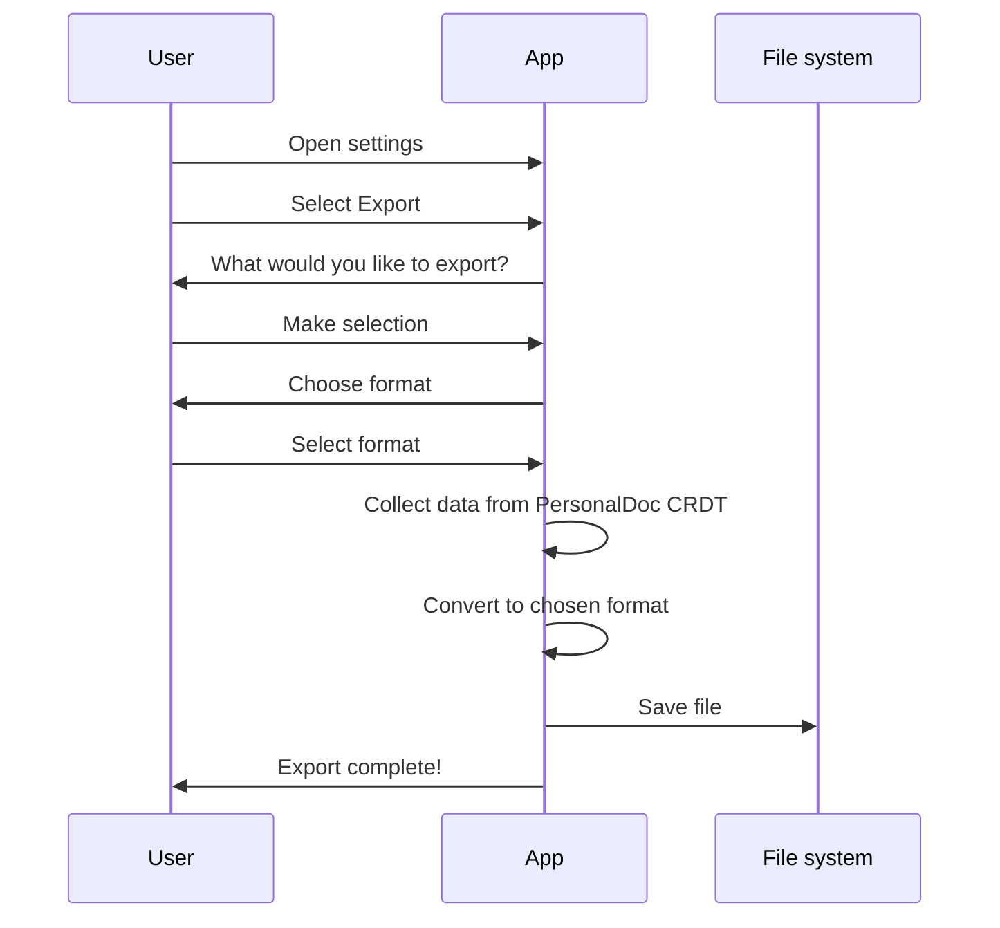
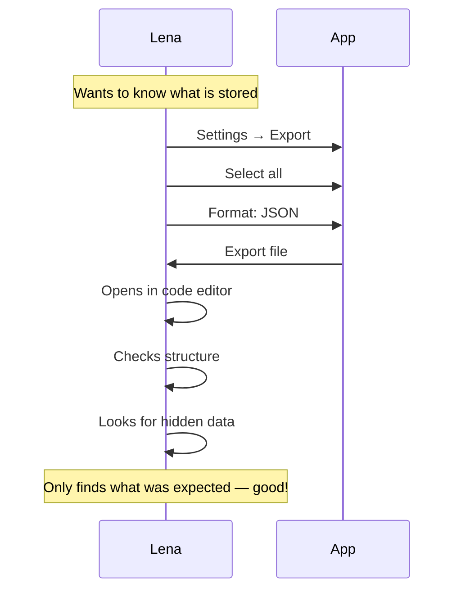
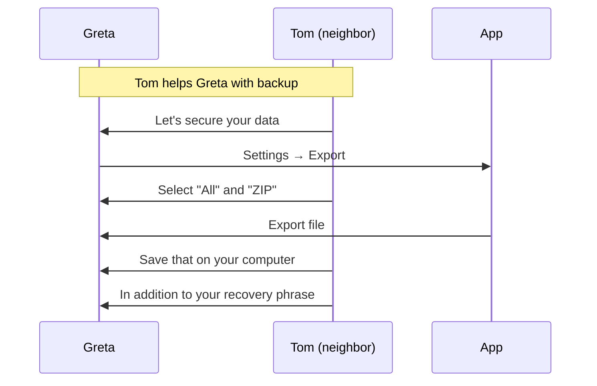
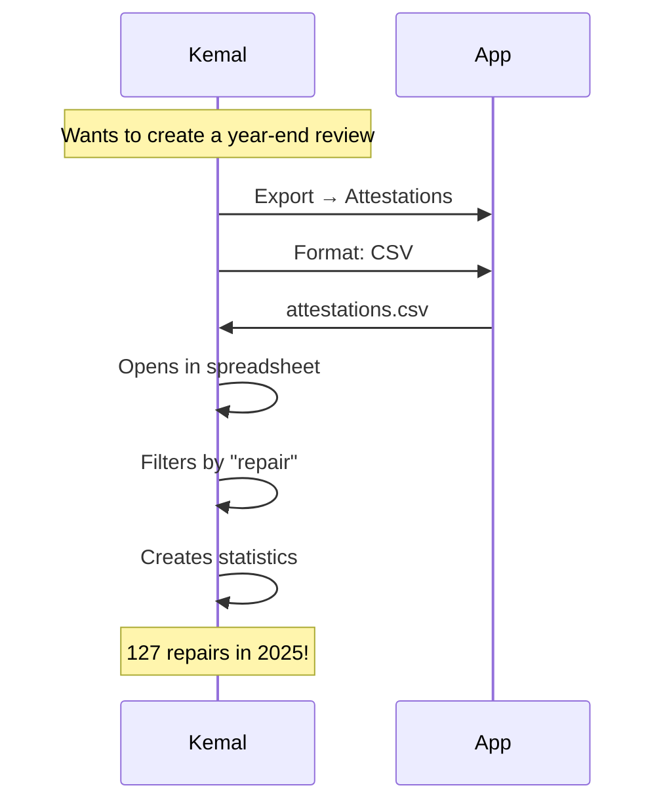

# Export Flow (User Perspective)

> **Status: NOT YET IMPLEMENTED**
> This document describes the planned export feature. It has not been built yet.

---

## Why export?

Web of Trust is **not a vendor lock-in**. Your data belongs to you.

```text
┌─────────────────────────────────┐
│                                 │
│  Your data, your right          │
│                                 │
│  You can export all your data   │
│  at any time:                   │
│                                 │
│  • For backups                  │
│  • For archiving                │
│  • For other tools              │
│  • Out of curiosity             │
│                                 │
└─────────────────────────────────┘
```

---

## Main flow: Export data



---

## What the user sees

### Start export

```text
┌─────────────────────────────────┐
│  Settings                       │
├─────────────────────────────────┤
│                                 │
│  Data & Storage                 │
│                                 │
│  ━━━━━━━━━━━━━━━━━━━━━━━━━━━    │
│                                 │
│  ┌─────────────────────────┐    │
│  │ Export data             │    │
│  │   Download all your     │    │
│  │   data as a file        │    │
│  └─────────────────────────┘    │
│                                 │
│  ┌─────────────────────────┐    │
│  │ Delete data             │    │
│  │   Remove all local data │    │
│  └─────────────────────────┘    │
│                                 │
└─────────────────────────────────┘
```

### Export selection

```text
┌─────────────────────────────────┐
│                                 │
│  Export data                    │
│                                 │
├─────────────────────────────────┤
│                                 │
│  What would you like to export? │
│                                 │
│  [✓] Profile                    │
│      Name, photo, bio           │
│                                 │
│  [✓] Contacts                   │
│      23 contacts                │
│                                 │
│  [✓] Verifications              │
│      23 verifications           │
│                                 │
│  [✓] Attestations               │
│      47 received, 12 given      │
│                                 │
│  [✓] Content                    │
│      34 entries                 │
│                                 │
│  [ ] Groups                     │
│      3 groups                   │
│                                 │
│  ━━━━━━━━━━━━━━━━━━━━━━━━━━━    │
│                                 │
│  [ Select all ]                 │
│                                 │
│  [ Next ]                       │
│                                 │
└─────────────────────────────────┘
```

### Choose format

```text
┌─────────────────────────────────┐
│                                 │
│  Export format                  │
│                                 │
├─────────────────────────────────┤
│                                 │
│  Choose a format:               │
│                                 │
│  ┌─────────────────────────┐    │
│  │ JSON                    │    │
│  │   Machine-readable,     │    │
│  │   for developers        │    │
│  └─────────────────────────┘    │
│                                 │
│  ┌─────────────────────────┐    │
│  │ CSV                     │    │
│  │   For Excel/spreadsheets│    │
│  └─────────────────────────┘    │
│                                 │
│  ┌─────────────────────────┐    │
│  │ PDF                     │    │
│  │   Readable document     │    │
│  └─────────────────────────┘    │
│                                 │
│  ┌─────────────────────────┐    │
│  │ ZIP (all formats)       │    │
│  │   Complete archive      │    │
│  └─────────────────────────┘    │
│                                 │
└─────────────────────────────────┘
```

### Export in progress

```text
┌─────────────────────────────────┐
│                                 │
│  Exporting...                   │
│                                 │
├─────────────────────────────────┤
│                                 │
│  ████████████░░░░░░░ 60%        │
│                                 │
│  ✅ Profile                     │
│  ✅ Contacts                    │
│  ✅ Verifications               │
│  ⏳ Attestations...             │
│  ⬜ Content                     │
│                                 │
└─────────────────────────────────┘
```

### Export complete

```text
┌─────────────────────────────────┐
│                                 │
│  ✅ Export complete!            │
│                                 │
├─────────────────────────────────┤
│                                 │
│  File: wot-export-2026-01-08.zip│
│  Size: 2.3 MB                   │
│                                 │
│  Contains:                      │
│  • 1 profile                    │
│  • 23 contacts                  │
│  • 23 verifications             │
│  • 59 attestations              │
│  • 34 content entries           │
│                                 │
│  ━━━━━━━━━━━━━━━━━━━━━━━━━━━    │
│                                 │
│  [ Share ]                      │
│                                 │
│  [ Open in Files ]              │
│                                 │
│  [ Done ]                       │
│                                 │
└─────────────────────────────────┘
```

---

## What is in the export?

### Profile

```text
┌─────────────────────────────────┐
│  My profile                     │
├─────────────────────────────────┤
│                                 │
│  Name: Anna Müller              │
│  DID: did:key:z6Mk...           │
│  Bio: Active in the community   │
│       garden Sonnenberg         │
│                                 │
│  Created: 01.01.2026            │
│  Photo: [included]              │
│                                 │
└─────────────────────────────────┘
```

### Contacts

```text
┌─────────────────────────────────┐
│  Contacts (23)                  │
├─────────────────────────────────┤
│                                 │
│  1. Ben Schmidt                 │
│     DID: did:key:z6MkBen...     │
│     Status: active              │
│     Verified: 05.01.2026        │
│                                 │
│  2. Carla Braun                 │
│     DID: did:key:z6MkCarla...   │
│     Status: active              │
│     Verified: 03.01.2026        │
│                                 │
│  ...                            │
│                                 │
└─────────────────────────────────┘
```

### Attestations

```text
┌─────────────────────────────────┐
│  Attestations                   │
├─────────────────────────────────┤
│                                 │
│  RECEIVED (47):                 │
│                                 │
│  "Helped for 3 hours in         │
│   the garden"                   │
│  From: Tom Wagner               │
│  Date: 08.01.2026               │
│  Tags: Garden, Helping          │
│                                 │
│  ...                            │
│                                 │
│  GIVEN (12):                    │
│                                 │
│  "Knows a lot about bicycles"   │
│  To: Ben Schmidt                │
│  Date: 06.01.2026               │
│  Tags: Craft, Bicycle           │
│                                 │
│  ...                            │
│                                 │
└─────────────────────────────────┘
```

---

## Export formats

### JSON

Machine-readable format with full structure:

```json
{
  "exportVersion": "1.0",
  "exportedAt": "2026-01-08T15:00:00Z",
  "profile": {
    "did": "did:key:z6MkAnna...",
    "name": "Anna Müller",
    "bio": "..."
  },
  "contacts": [...],
  "verifications": [...],
  "attestations": [...],
  "items": [...]
}
```

### CSV

Table format, one file per type:

```text
contacts.csv:
Name,DID,Status,Verified on
Ben Schmidt,did:key:z6MkBen...,active,2026-01-05
Carla Braun,did:key:z6MkCarla...,active,2026-01-03

attestations.csv:
From,To,Text,Tags,Date
Tom Wagner,Anna Müller,"Helped in garden","Garden,Helping",2026-01-08
```

### PDF

Readable document with formatted overview:

```text
┌─────────────────────────────────┐
│                                 │
│  WEB OF TRUST EXPORT            │
│  Anna Müller                    │
│  08.01.2026                     │
│                                 │
│  ─────────────────────────────  │
│                                 │
│  PROFILE                        │
│  ...                            │
│                                 │
│  CONTACTS                       │
│  ...                            │
│                                 │
│  ATTESTATIONS                   │
│  ...                            │
│                                 │
└─────────────────────────────────┘
```

### ZIP (complete archive)

```text
wot-export-2026-01-08.zip
├── profile.json
├── contacts.json
├── contacts.csv
├── verifications.json
├── attestations.json
├── attestations.csv
├── items.json
├── items.csv
├── media/
│   ├── profile-photo.jpg
│   └── ...
└── summary.pdf
```

---

## Personas

### Lena (skeptic) checks her data



### Greta makes a backup



### Kemal archives repair café data



---

## What is NOT in the export?

| Not included | Reason |
| ------------ | ------ |
| Private key | Security risk |
| Recovery phrase | Security risk |
| Encrypted blobs | Not useful without key |
| Other people's content | Only your own data |
| Group keys | Security risk |

---

## FAQ

**Can I import the export somewhere else?**
That depends on the target system. The JSON format is standardised and can be processed by other tools.

**Does the export contain sensitive data?**
Yes — it contains your contacts, attestations and content. Treat the export file confidentially.

**How often should I export?**
For backups: regularly, e.g. monthly. The recovery phrase is more important than the export.

**Can I export deleted data?**
No. The export only contains current data.

**Is the export encrypted?**
No. The export is plaintext. If you want to store it securely, encrypt the file yourself.
