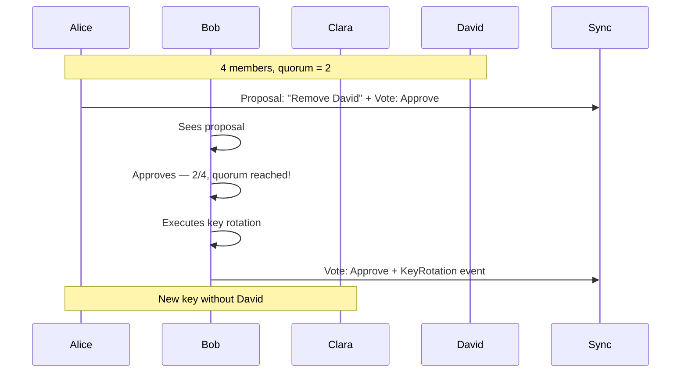
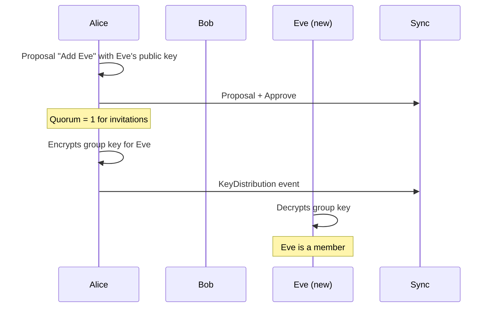

# Quorum Concept for Group Governance

> Alternative to admin roles — for later implementation

**Status:** Concept documented, not implemented
**Priority:** Phase 2
**CRDT framework:** Decided — Yjs is the default CRDT (since 2026-03-15). The conflict resolution details below can now be designed with Yjs semantics in mind, though the quorum logic itself is CRDT-agnostic.

---

## Motivation

The admin model has weaknesses:

- Single point of failure (admin loses their device)
- Concentration of power
- Admin can "hijack" the group

The quorum model solves these problems through democratic decision-making.

---

## Core Principle

**No admin role.** All members are equal.

Critical actions require the consent of multiple members (a quorum).

---

## Quorum Calculation

### Base Quorum

| Members | Quorum |
|---------|--------|
| 2 | 1 |
| 3 | 2 |
| 4 | 2 |
| 5+ | **3** (maximum) |

```javascript
function getBaseQuorum(memberCount) {
  if (memberCount <= 4) return Math.ceil(memberCount / 2);
  return 3;  // Maximum to account for inactivity
}
```

### Rejections Raise the Quorum

Each rejection increases the required quorum by 1.

```javascript
function getQuorum(memberCount, rejectCount) {
  const baseQuorum = getBaseQuorum(memberCount);
  return Math.min(memberCount, baseQuorum + rejectCount);
}
```

**Examples (10 members):**

| Rejects | Effective Quorum |
|---------|-----------------|
| 0 | 3 |
| 2 | 5 |
| 5 | 8 |

---

## Actions and Quorum

| Action | Quorum | Key Operation |
|--------|--------|---------------|
| Create group | — | New key |
| Invite member | **1** | Distribute key |
| Remove member | Base + rejects | Key rotation |
| Leave group | — | Key rotation |
| Rename group | Base + rejects | — |
| Activate module | **1** | — |
| Hide module | **1** | — |

**Principle:** Constructive/reversible actions = 1 person. Destructive actions = quorum.

---

## Proposal Flow

### Process



### Key Point: The Quorum-Completer Executes

Whoever casts the decisive vote immediately executes the action.

- No waiting time
- No separate "executor"
- No offline problem

---

## Proposal Status

```javascript
function getProposalStatus(proposal, memberCount) {
  const approves = proposal.votes.filter(v => v.vote === 'approve').length;
  const rejects = proposal.votes.filter(v => v.vote === 'reject').length;
  const notVoted = memberCount - approves - rejects;

  const quorum = getQuorum(memberCount, rejects);

  // Success: quorum reached
  if (approves >= quorum) {
    return 'approved';
  }

  // Failed: mathematically impossible
  const maxPossibleApproves = approves + notVoted;
  if (maxPossibleApproves < quorum) {
    return 'rejected';
  }

  // Expired: timeout
  const daysSinceCreated = (Date.now() - proposal.createdAt) / 86400000;
  if (daysSinceCreated > 7) {
    return 'expired';
  }

  return 'pending';
}
```

| Status | Condition |
|--------|-----------|
| **approved** | Approves >= quorum |
| **rejected** | Mathematically impossible |
| **expired** | 7 days without result |
| **pending** | Still open |

---

## Data Structures

### Proposal

```json
{
  "id": "urn:uuid:...",
  "type": "group-proposal",
  "groupDid": "did:key:z6Mk...",
  "action": "remove-member",
  "target": "did:key:david...",
  "proposedBy": "did:key:alice...",
  "proposedAt": "2025-01-09T10:00:00Z",
  "expiresAt": "2025-01-16T10:00:00Z",
  "proof": "..."
}
```

### Vote (with optional key operation)

```json
{
  "id": "urn:uuid:...",
  "type": "proposal-vote",
  "proposalId": "urn:uuid:proposal...",
  "voter": "did:key:bob...",
  "vote": "approve",
  "timestamp": "2025-01-09T15:00:00Z",
  "quorumReached": true,
  "keyRotation": {
    "newKeyId": "key-2",
    "previousKeyId": "key-1",
    "encryptedKeys": [
      { "recipient": "did:key:alice...", "encryptedKey": "base64..." },
      { "recipient": "did:key:bob...", "encryptedKey": "base64..." },
      { "recipient": "did:key:clara...", "encryptedKey": "base64..." }
    ]
  },
  "proof": "..."
}
```

---

## Key Operations

### Remove Member — Key Rotation

The removed member still has the old key. Therefore:

1. Generate a new group key
2. Distribute new key to remaining members
3. Encrypt new content with the new key

The removed member can still read old content, but not new content.

### Add Member — Key Distribution

No new key needed. The new member receives the existing key.



---

## CRDT Challenges

### Problem: Parallel Votes

```
Alice: 1 approve
Bob votes (offline)  → 2 approves → key rotation Y1
Clara votes (offline) → 2 approves → key rotation Y2
```

Both independently reached quorum and performed key rotation.

### Solution: Deterministic Winner

```javascript
function resolveKeyRotationConflict(rotation1, rotation2) {
  // Earlier timestamp wins
  if (rotation1.timestamp < rotation2.timestamp) return rotation1;
  if (rotation2.timestamp < rotation1.timestamp) return rotation2;

  // Tie-break: smaller DID wins
  return rotation1.voter < rotation2.voter ? rotation1 : rotation2;
}
```

With Yjs as the CRDT, this deterministic resolution can be implemented as a custom conflict handler on the shared Y.Map for votes. Yjs's last-write-wins semantics for maps pair well with the timestamp-based tie-breaking above.

### Problem: Race Conditions Between Proposals

What if two conflicting proposals appear simultaneously?

```
Alice: "Remove David"
David: "Remove Alice"
```

**Solution:** Proposals block each other, or CRDT conflict resolution (oldest wins).

---

## Why Not Implement Now?

1. **Complexity**
   - The admin model is significantly simpler
   - Solves 90% of cases

2. **UI effort**
   - Proposal list
   - Voting interface
   - Status display

3. **Need validation**
   - Democratic groups need to be validated as a real user requirement before investing the implementation effort

---

## Migration Path

### Phase 1 (current)

Groups have admins (classic model).

### Phase 2 (later)

Optional "democratic mode" per group:

- Admin role is abolished
- Quorum logic takes over
- Existing admins become regular members

```json
{
  "groupDid": "did:key:...",
  "governanceMode": "democratic",
  "admins": []
}
```

---

## Open Questions for Phase 2

1. **Timeout duration:** Is 7 days optimal? Should it be configurable?
2. **Cooldown:** How long to wait after a rejected proposal before a new one?
3. **Proposal conflicts:** How to handle multiple simultaneous proposals?
4. **UI/UX:** How to surface voting prompts without being intrusive?

---

## Conclusion

The quorum concept is well thought-out and solves real problems with the admin model. Implementation should wait until:

- The admin model has been tested in production
- The need for democratic groups has been validated with real users
